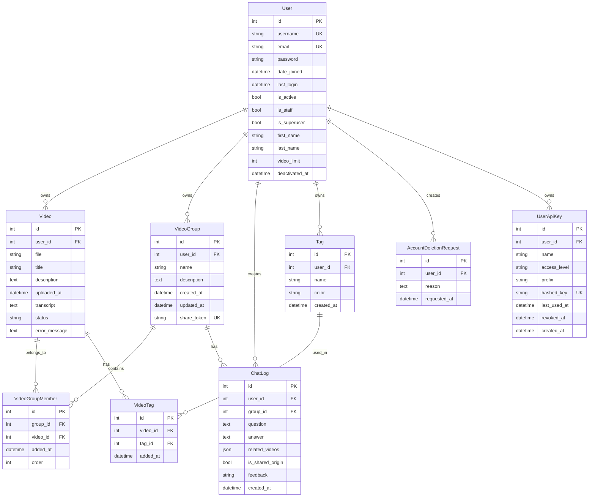

# ER図

## 概要

VideoQシステムの主要な永続化エンティティとリレーションを、現行の Django モデル実装に基づいて示す図です。

## ER図

```mermaid
erDiagram
    User ||--o{ Video : owns
    User ||--o{ VideoGroup : owns
    User ||--o{ ChatLog : creates
    User ||--o{ Tag : owns
    User ||--o{ AccountDeletionRequest : creates
    User ||--o{ UserApiKey : owns
    VideoGroup ||--o{ VideoGroupMember : contains
    Video ||--o{ VideoGroupMember : belongs_to
    Video ||--o{ VideoTag : has
    Tag ||--o{ VideoTag : used_in
    VideoGroup ||--o{ ChatLog : has
    
    User {
        int id PK
        string username UK
        string email UK
        string password
        datetime date_joined
        datetime last_login
        bool is_active
        bool is_staff
        bool is_superuser
        string first_name
        string last_name
        int video_limit
        datetime deactivated_at
    }
    
    Video {
        int id PK
        int user_id FK
        string file
        string title
        text description
        datetime uploaded_at
        text transcript
        string status
        text error_message
    }
    
    VideoGroup {
        int id PK
        int user_id FK
        string name
        text description
        datetime created_at
        datetime updated_at
        string share_token UK
    }
    
    VideoGroupMember {
        int id PK
        int group_id FK
        int video_id FK
        datetime added_at
        int order
    }
    
    ChatLog {
        int id PK
        int user_id FK
        int group_id FK
        text question
        text answer
        json related_videos
        bool is_shared_origin
        string feedback
        datetime created_at
    }

    Tag {
        int id PK
        int user_id FK
        string name
        string color
        datetime created_at
    }

    VideoTag {
        int id PK
        int video_id FK
        int tag_id FK
        datetime added_at
    }

    AccountDeletionRequest {
        int id PK
        int user_id FK
        text reason
        datetime requested_at
    }

    UserApiKey {
        int id PK
        int user_id FK
        string name
        string access_level
        string prefix
        string hashed_key UK
        datetime last_used_at
        datetime revoked_at
        datetime created_at
    }
```

## リレーション詳細

### User - Video（1:N）
- **リレーション**: 1人のユーザーが複数の動画を所有
- **外部キー**: `Video.user_id` → `User.id`
- **削除アクション**: CASCADE（ユーザー削除時に動画も削除）

### User - VideoGroup（1:N）
- **リレーション**: 1人のユーザーが複数の動画グループを所有
- **外部キー**: `VideoGroup.user_id` → `User.id`
- **削除アクション**: CASCADE（ユーザー削除時にグループも削除）

### User - ChatLog（1:N）
- **リレーション**: 1人のユーザーが複数のチャットログを作成
- **外部キー**: `ChatLog.user_id` → `User.id`
- **削除アクション**: CASCADE（ユーザー削除時にチャットログも削除）

### User - Tag（1:N）
- **リレーション**: 1人のユーザーが複数のタグを所有
- **外部キー**: `Tag.user_id` → `User.id`
- **削除アクション**: CASCADE（ユーザー削除時にタグも削除）

### User - AccountDeletionRequest（1:N）
- **リレーション**: 1人のユーザーが複数のアカウント削除リクエストを作成可能
- **外部キー**: `AccountDeletionRequest.user_id` → `User.id`
- **削除アクション**: CASCADE（ユーザー削除時にリクエストも削除）

### User - UserApiKey（1:N）
- **リレーション**: 1人のユーザーが複数のAPIキーを所有可能
- **外部キー**: `UserApiKey.user_id` → `User.id`
- **削除アクション**: CASCADE（ユーザー削除時にAPIキーも削除）

### Video - VideoTag（1:N）
- **リレーション**: 1つの動画に複数のタグを付与可能
- **外部キー**: `VideoTag.video_id` → `Video.id`
- **削除アクション**: CASCADE（動画削除時にタグ付与も削除）

### Tag - VideoTag（1:N）
- **リレーション**: 1つのタグを複数の動画に付与可能
- **外部キー**: `VideoTag.tag_id` → `Tag.id`
- **削除アクション**: CASCADE（タグ削除時にタグ付与も削除）

### VideoGroup - VideoGroupMember（1:N）
- **リレーション**: 1つのグループが複数のメンバーを持つ
- **外部キー**: `VideoGroupMember.group_id` → `VideoGroup.id`
- **削除アクション**: CASCADE（グループ削除時にメンバーも削除）

### Video - VideoGroupMember（1:N）
- **リレーション**: 1つの動画が複数のグループに所属可能
- **外部キー**: `VideoGroupMember.video_id` → `Video.id`
- **削除アクション**: CASCADE（動画削除時にメンバーシップも削除）

### VideoGroup - ChatLog（1:N）
- **リレーション**: 1つのグループが複数のチャットログを持つ
- **外部キー**: `ChatLog.group_id` → `VideoGroup.id`
- **削除アクション**: CASCADE（グループ削除時にチャットログも削除）

### VideoGroup - Video（N:M — VideoGroupMember経由）
- **リレーション**: 多対多のリレーション（中間テーブル経由）
- **中間テーブル**: `VideoGroupMember`
- **追加属性**: `order`（グループ内の順序）

### Video - Tag（N:M — VideoTag経由）
- **リレーション**: 多対多のリレーション（中間テーブル経由）
- **中間テーブル**: `VideoTag`
- **追加属性**: `added_at`（タグ付与日時）

## 制約

### 主キー
- 全テーブルで `id` が主キー

### ユニーク制約
- `User.username`: ユーザー名はユニーク
- `User.email`: メールアドレスはユニーク
- `VideoGroup.share_token`: 共有トークンはユニーク（NULL許容）
- `VideoGroupMember(group_id, video_id)`: 同じ動画を同じグループに複数回追加不可
- `Tag(user_id, name)`: タグ名はユーザーごとにユニーク
- `VideoTag(video_id, tag_id)`: 同じタグを同じ動画に複数回付与不可
- `UserApiKey.hashed_key`: ハッシュ済みAPIキーはユニーク
- `UserApiKey(user, name)` WHERE `revoked_at IS NULL`: アクティブなAPIキー名はユーザーごとにユニーク（部分ユニーク制約）

### 外部キー制約
- 全外部キーにCASCADE削除が設定済み
- 参照整合性を保証

### チェック制約
- `Video.status`: 'pending', 'processing', 'indexing', 'completed', 'error' のいずれか
- `ChatLog.feedback`: 'good', 'bad', または NULL
- `UserApiKey.access_level`: 'all' または 'read_only'

## インデックス

### 自動インデックス
- 主キー: 全 `id` カラム
- 外部キー: 全外部キーカラム
- ユニーク制約: `username`, `email`, `share_token`, `hashed_key`

### カスタムインデックス
- `User(email, is_active)`: ログイン検索用
- `User(date_joined, -id)`: ユーザー一覧用
- `User.deactivated_at`: 無効化アカウントのクエリ用
- `User.video_limit`: 制限クエリ用
- `Video.uploaded_at`: 降順ソート用（Meta.ordering）
- `Video(user, status, -uploaded_at)`: フィルタ付きユーザー動画一覧用
- `Video(user, title)`: タイトル検索用
- `VideoGroup(user, -created_at)`: オーナーのグループ一覧用
- `VideoGroup.share_token`（部分: NOT NULL）: 共有トークン検索用
- `ChatLog.created_at`: 降順ソート用（Meta.ordering）
- `ChatLog(user, -created_at)`: ユーザー別チャット履歴用
- `ChatLog(group, -created_at)`: グループ別チャット履歴用
- `ChatLog.feedback`（部分: NOT NULL）: フィードバック分析用
- `VideoGroupMember(group, order)`: グループの順序読み取り用
- `VideoGroupMember(video, group)`: メンバーシップ検索用
- `Tag(user, name)`: ユーザー別アルファベット順ソート用
- `VideoTag(video, tag)`: タグ付与検索用
- `VideoTag(tag, -added_at)`: 最新タグ使用用
- `UserApiKey.prefix`: APIキープレフィックス検索用
- `UserApiKey.revoked_at`: アクティブ/失効キークエリ用

## pgvector拡張

### ベクトルストレージ
- PostgreSQLのpgvector拡張を使用
- Django ORM モデルではなく、`langchain-postgres` が管理するコレクションに各動画シーンの埋め込みを保存
- `video_id`、`user_id`、`video_title`、`start_time`、`end_time` などのメタデータを保存
- RAG（Retrieval-Augmented Generation）に使用

---

## Related Documentation

- [📖 ドキュメント一覧](../README.md)
- [データ辞書](data-dictionary.md) — テーブル・カラム定義の詳細
- [データフロー図](data-flow-diagram.md) — 機能ごとのデータの流れ
- [クラス図](../design/class-diagram.md) — モデルクラスの詳細
- [システム構成図](../architecture/system-configuration-diagram.md) — 全体アーキテクチャ
