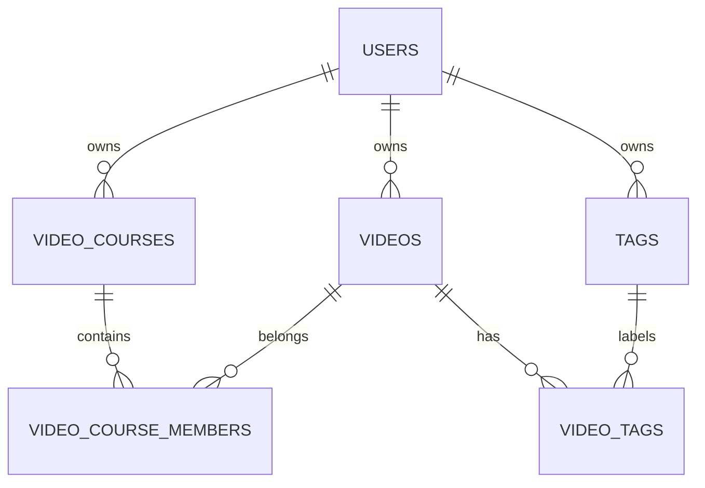
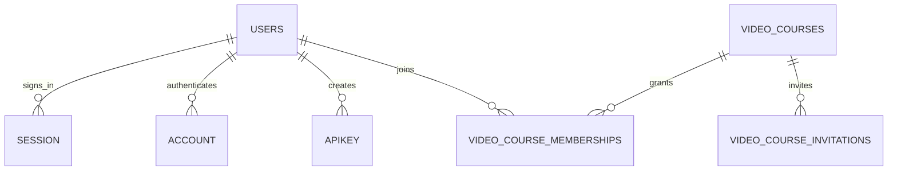
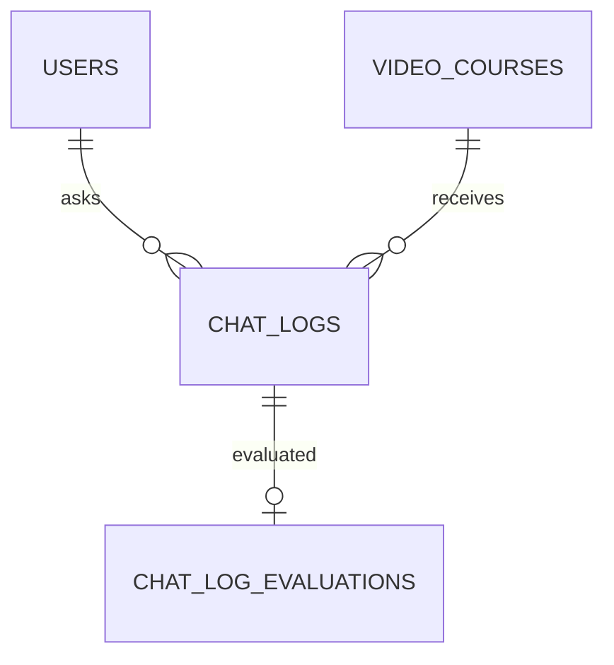
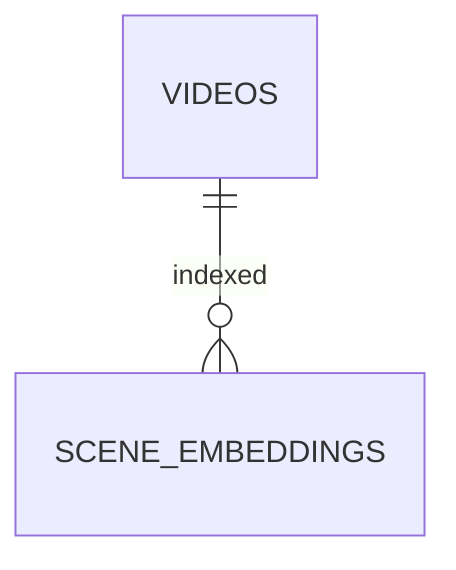

# Reading the ER diagrams

Use this page to understand table relationships. Start with [videos, courses, and scenes](../concepts/domain-model.md) to learn what the entities mean.

## Symbols

`||` means one, `o{` means zero or more, and `o|` means zero or one. For example, `USERS ||--o{ VIDEOS` means one user can own multiple videos.

The diagrams group key relationships by purpose. They do not list every column or constraint. Follow the [data dictionary](data-dictionary.md) to schema definitions for column details.

## Videos and courses

```mermaid
erDiagram
    USERS ||--o{ VIDEOS : owns
    USERS ||--o{ VIDEO_COURSES : owns
    USERS ||--o{ TAGS : owns
    VIDEO_COURSES ||--o{ VIDEO_COURSE_MEMBERS : contains
    VIDEOS ||--o{ VIDEO_COURSE_MEMBERS : belongs
    VIDEOS ||--o{ VIDEO_TAGS : has
    TAGS ||--o{ VIDEO_TAGS : labels
```

`VIDEO_COURSE_MEMBERS` connects courses to videos. Tags connect to videos through `VIDEO_TAGS`. Unique constraints prevent duplicate relationships.

## User participation and authentication

```mermaid
erDiagram
    USERS ||--o{ SESSION : signs_in
    USERS ||--o{ ACCOUNT : authenticates
    USERS ||--o{ APIKEY : creates
    USERS ||--o{ VIDEO_COURSE_MEMBERSHIPS : joins
    VIDEO_COURSES ||--o{ VIDEO_COURSE_MEMBERSHIPS : grants
    VIDEO_COURSES ||--o{ VIDEO_COURSE_INVITATIONS : invites
```

`VIDEO_COURSE_MEMBERSHIPS` stores people's participation. It is distinct from `VIDEO_COURSE_MEMBERS` above, which stores videos' course associations. See [better-auth.ts](https://github.com/yukiharada1228/videoq/blob/main/apps/api/src/db/schema/better-auth.ts) for the full authentication schema.

## Questions and evaluations

```mermaid
erDiagram
    USERS ||--o{ CHAT_LOGS : asks
    VIDEO_COURSES ||--o{ CHAT_LOGS : receives
    CHAT_LOGS ||--o| CHAT_LOG_EVALUATIONS : evaluated
```

Questions, answers, and citations live in chat logs; quality evaluations are separate records. Evaluation may not be complete when the answer is returned.

## Video search data

```mermaid
erDiagram
    VIDEOS ||--o{ SCENE_EMBEDDINGS : indexed
```

## Before changing the schema

[modern.ts](https://github.com/yukiharada1228/videoq/blob/main/apps/api/src/db/schema/modern.ts) is the source of truth for business data. Check related-row handling when users or videos are deleted, duplicate-prevention constraints, and query indexes together.

**Related:** [Change the database](../guides/database.md), [Where data is stored](data-flow-diagram.md).
