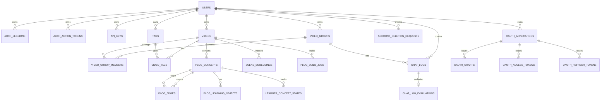

# ER 図

現行 Drizzle schema の主要リレーションを示します。完全な定義は
`apps/api/src/db/schema/modern.ts` を正本とします。

```mermaid
erDiagram
    USERS ||--o{ AUTH_SESSIONS : owns
    USERS ||--o{ AUTH_ACTION_TOKENS : owns
    USERS ||--o{ API_KEYS : owns
    USERS ||--o{ VIDEOS : owns
    USERS ||--o{ VIDEO_GROUPS : owns
    USERS ||--o{ TAGS : owns
    USERS ||--o{ ACCOUNT_DELETION_REQUESTS : creates

    VIDEO_GROUPS ||--o{ VIDEO_GROUP_MEMBERS : contains
    VIDEOS ||--o{ VIDEO_GROUP_MEMBERS : belongs
    VIDEOS ||--o{ VIDEO_TAGS : has
    TAGS ||--o{ VIDEO_TAGS : labels

    USERS ||--o{ CHAT_LOGS : creates
    VIDEO_GROUPS ||--o{ CHAT_LOGS : has
    CHAT_LOGS ||--o| CHAT_LOG_EVALUATIONS : evaluated

    VIDEOS ||--o{ SCENE_EMBEDDINGS : indexed
    VIDEOS ||--o{ PLOG_BUILD_JOBS : builds
    VIDEOS ||--o{ PLOG_CONCEPTS : contains
    PLOG_CONCEPTS ||--o{ PLOG_EDGES : source
    PLOG_CONCEPTS ||--o{ PLOG_EDGES : target
    PLOG_CONCEPTS ||--o{ PLOG_LEARNING_OBJECTS : has
    PLOG_CONCEPTS ||--o{ LEARNER_CONCEPT_STATES : tracks

    USERS ||--o{ OAUTH_APPLICATIONS : owns
    OAUTH_APPLICATIONS ||--o{ OAUTH_GRANTS : issues
    OAUTH_APPLICATIONS ||--o{ OAUTH_ACCESS_TOKENS : issues
    OAUTH_APPLICATIONS ||--o{ OAUTH_REFRESH_TOKENS : issues
```

## 認証テーブル

- `auth_sessions`: refresh token hash、family、期限、revoke / replacement
- `auth_action_tokens`: purpose、opaque token hash、payload、期限、consume 状態
- `api_keys`: `vq_...` の hash、prefix、access level、revoke 状態

## コンテンツテーブル

- `videos`, `video_courses`, `video_course_members`
- `tags`, `video_tags`
- `chat_logs`, `chat_log_evaluations`, `course_evaluation_snapshots`
- `scene_embeddings`
- `plog_*`, `learner_concept_states`

## 制約方針

- 所有関係は FK で表現
- user / parent 削除時の関連行は schema 定義の cascade 方針に従う
- API key hash、session token hash、action token hash は unique
- course member、video tag などの重複関係は複合 unique
- vector 次元は設定した embedding model と一致させる
