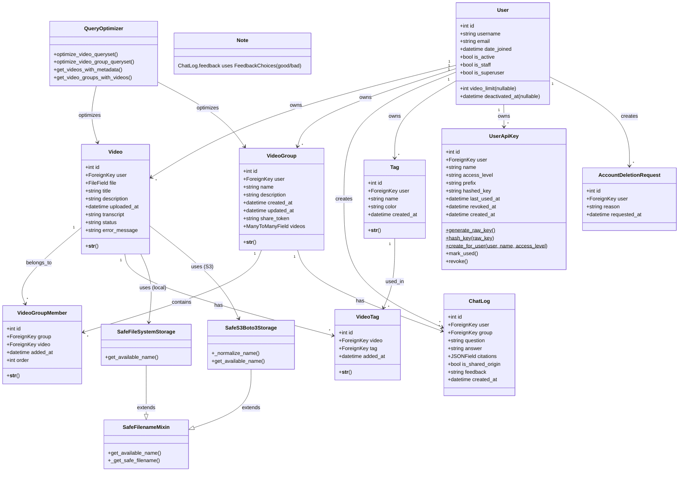
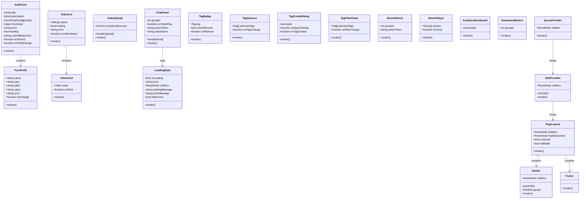

# クラス図

## 概要

VideoQシステムのバックエンドモデルとフロントエンドコンポーネントを示す図です。

## バックエンドモデル（Django）

```mermaid
classDiagram
    class User {
        +int id
        +string username
        +string email
        +datetime date_joined
        +bool is_active
        +bool is_staff
        +bool is_superuser
        +int video_limit (nullable)
        +datetime deactivated_at (nullable)
    }
    
    class Video {
        +int id
        +ForeignKey user
        +FileField file
        +string title
        +string description
        +datetime uploaded_at
        +string transcript
        +string status
        +string error_message
        +__str__()
    }
    
    class VideoGroup {
        +int id
        +ForeignKey user
        +string name
        +string description
        +datetime created_at
        +datetime updated_at
        +string share_token
        +ManyToManyField videos
        +__str__()
    }
    
    class VideoGroupMember {
        +int id
        +ForeignKey group
        +ForeignKey video
        +datetime added_at
        +int order
        +__str__()
    }
    
    class ChatLog {
        +int id
        +ForeignKey user
        +ForeignKey group
        +string question
        +string answer
        +JSONField citations
        +bool is_shared_origin
        +string feedback
        +datetime created_at
    }

    Note: ChatLog.feedback uses FeedbackChoices (good/bad)

    class Tag {
        +int id
        +ForeignKey user
        +string name
        +string color
        +datetime created_at
        +__str__()
    }

    class VideoTag {
        +int id
        +ForeignKey video
        +ForeignKey tag
        +datetime added_at
        +__str__()
    }

    class UserApiKey {
        +int id
        +ForeignKey user
        +string name
        +string access_level
        +string prefix
        +string hashed_key
        +datetime last_used_at
        +datetime revoked_at
        +datetime created_at
        +generate_raw_key()$
        +hash_key(raw_key)$
        +create_for_user(user, name, access_level)$
        +mark_used()
        +revoke()
    }

    class AccountDeletionRequest {
        +int id
        +ForeignKey user
        +string reason
        +datetime requested_at
    }
    
    class SafeFilenameMixin {
        +get_available_name()
        +_get_safe_filename()
    }
    
    class SafeFileSystemStorage {
        +get_available_name()
    }
    
    class SafeS3Boto3Storage {
        +_normalize_name()
        +get_available_name()
    }
    
    User "1" --> "*" Video : owns
    User "1" --> "*" VideoGroup : owns
    User "1" --> "*" ChatLog : creates
    User "1" --> "*" Tag : owns
    User "1" --> "*" UserApiKey : owns
    User "1" --> "*" AccountDeletionRequest : creates
    VideoGroup "1" --> "*" VideoGroupMember : contains
    Video "1" --> "*" VideoGroupMember : belongs_to
    Video "1" --> "*" VideoTag : has
    Tag "1" --> "*" VideoTag : used_in
    VideoGroup "1" --> "*" ChatLog : has
    SafeFileSystemStorage --|> SafeFilenameMixin : extends
    SafeS3Boto3Storage --|> SafeFilenameMixin : extends
    Video --> SafeFileSystemStorage : uses (local)
    Video --> SafeS3Boto3Storage : uses (S3)
    
    class QueryOptimizer {
        +optimize_video_queryset()
        +optimize_video_group_queryset()
        +get_videos_with_metadata()
        +get_video_groups_with_videos()
    }
    
    QueryOptimizer --> Video : optimizes
    QueryOptimizer --> VideoGroup : optimizes
```

## フロントエンドコンポーネント（React/TypeScript）

```mermaid
classDiagram
    class PageLayout {
        +ReactNode children
        +ReactNode headerContent
        +bool centered
        +bool fullWidth
        +render()
    }
    
    class Header {
        +ReactNode children
        +useAuth()
        +handleLogout()
        +render()
    }
    
    class Footer {
        +render()
    }
    
    class AuthForm {
        +string title
        +string description
        +FormFieldConfig[] fields
        +object formData
        +string error
        +bool loading
        +string submitButtonText
        +function onSubmit
        +function onFieldChange
        +render()
    }
    
    class FormField {
        +string name
        +string type
        +string label
        +string value
        +string error
        +function onChange
        +render()
    }
    
    class VideoList {
        +Video[] videos
        +bool loading
        +string error
        +function onVideoSelect
        +render()
    }
    
    class VideoCard {
        +Video video
        +function onClick
        +render()
    }
    
    class VideoUpload {
        +function onUploadSuccess
        +handleUpload()
        +render()
    }
    
    class ChatPanel {
        +int groupId
        +function onVideoPlay
        +string shareToken
        +string className
        +handleSend()
        +render()
    }

    class TagBadge {
        +Tag tag
        +bool showRemove
        +function onRemove
        +render()
    }

    class TagSelector {
        +Tag[] selectedTags
        +function onTagsChange
        +render()
    }

    class TagCreateDialog {
        +bool open
        +function onOpenChange
        +function onTagCreated
        +render()
    }

    class TagFilterPanel {
        +Tag[] selectedTags
        +function onFilterChange
        +render()
    }

    class ShortsButton {
        +int groupId
        +string shareToken
        +render()
    }

    class ShortsPlayer {
        +Scene[] scenes
        +function onClose
        +render()
    }

    class AnalyticsDashboard {
        +int groupId
        +render()
    }

    class DashboardButton {
        +int groupId
        +render()
    }
    
    class LoadingState {
        +bool isLoading
        +string error
        +ReactNode children
        +string loadingMessage
        +string errorMessage
        +bool fullScreen
        +render()
    }
    
    class I18nProvider {
        +ReactNode children
        +initI18n()
        +render()
    }
    
    class QueryProvider {
        +ReactNode children
        +render()
    }
    
    PageLayout "1" --> "1" Header : contains
    PageLayout "1" --> "1" Footer : contains
    AuthForm "1" --> "*" FormField : contains
    VideoList "1" --> "*" VideoCard : contains
    ChatPanel --> LoadingState : uses
    I18nProvider --> PageLayout : wraps
    QueryProvider --> I18nProvider : wraps
```

## バックエンドドメイン層（クリーンアーキテクチャ）

### ドメイン抽象

```mermaid
classDiagram
    class VideoQueryRepository {
        <<abstract>>
        +get_by_id(video_id, user_id) VideoEntity
        +list_for_user(user_id, criteria) list~VideoEntity~
        +count_for_user(user_id) int
        +get_file_keys_for_ids(video_ids, user_id) Dict
    }
    class VideoCommandRepository {
        <<abstract>>
        +create(user_id, params) VideoEntity
        +update(video, params) VideoEntity
        +delete(video) None
    }
    class VideoTranscriptionRepository {
        <<abstract>>
        +list_completed_with_transcript() list~VideoEntity~
        +get_by_id_for_task(video_id) VideoEntity
        +transition_status(video_id, from, to, error) None
        +save_transcript(video_id, transcript) None
    }
    class VideoRepository {
        <<abstract>>
    }
    class VideoGroupRepository {
        <<abstract>>
        +get_by_id(group_id, user_id, include_videos) VideoGroupEntity
        +list_for_user(user_id, include_videos) list~VideoGroupEntity~
        +create(user_id, params) VideoGroupEntity
        +update(group, params) VideoGroupEntity
        +delete(group) None
        +get_by_share_token(token) VideoGroupEntity
        +add_video(group, video) VideoGroupMemberEntity
        +add_videos_bulk(group, video_ids, user_id) tuple
        +remove_video(group, video) None
        +reorder_videos(group, video_ids) None
        +update_share_token(group, token) None
    }
    class TagRepository {
        <<abstract>>
        +list_for_user(user_id) list~TagEntity~
        +get_by_id(tag_id, user_id) TagEntity
        +create(user_id, params) TagEntity
        +update(tag, params) TagEntity
        +delete(tag) None
        +add_tags_to_video(video, tag_ids) tuple
        +remove_tag_from_video(video, tag) None
        +get_with_videos(tag_id, user_id) TagEntity
    }
    class ChatRepository {
        <<abstract>>
        +get_logs_for_group(group_id, ascending) list~ChatLogEntity~
        +create_log(user_id, group_id, question, answer, citations, is_shared) ChatLogEntity
        +get_log_by_id(log_id) ChatLogEntity
        +update_feedback(log, feedback) ChatLogEntity
        +get_logs_values_for_group(group_id) list~ChatSceneLog~
        +get_analytics_raw(group_id) ChatAnalyticsRaw
    }
    class ApiKeyRepository {
        <<abstract>>
        +list_for_user(user_id) list~ApiKeyEntity~
        +create_for_user(user_id, name, access_level) ApiKeyCreateResult
        +get_active_by_id(key_id, user_id) ApiKeyEntity
        +revoke(key_id, user_id) bool
        +exists_active_with_name(user_id, name) bool
    }
    class RagGateway {
        <<abstract>>
        +generate_reply(messages, user_id, video_ids, locale) RagResult
    }
    class KeywordExtractor {
        <<abstract>>
        +extract(questions, limit) list~KeywordCount~
    }
    class SceneVideoInfoProvider {
        <<abstract>>
        +get_file_urls_for_ids(video_ids, user_id) Dict
    }

    VideoRepository --|> VideoQueryRepository
    VideoRepository --|> VideoCommandRepository
    VideoRepository --|> VideoTranscriptionRepository
```

### ユースケースインターフェース

```mermaid
classDiagram
    class CreateVideoUseCase {
        +execute(user_id, input) VideoOutputDTO
    }
    class GetVideoDetailUseCase {
        +execute(video_id, user_id) VideoOutputDTO
    }
    class ListVideosUseCase {
        +execute(user_id, input) list~VideoOutputDTO~
    }
    class UpdateVideoUseCase {
        +execute(video_id, user_id, input) VideoOutputDTO
    }
    class DeleteVideoUseCase {
        +execute(video_id, user_id) None
    }
    class GetVideoGroupUseCase {
        +execute(group_id, user_id, include_videos) GroupOutputDTO
    }
    class GetSharedGroupUseCase {
        +execute(share_token) GroupOutputDTO
    }
    class ListVideoGroupsUseCase {
        +execute(user_id, include_videos) list~GroupOutputDTO~
    }
    class CreateVideoGroupUseCase {
        +execute(user_id, input) GroupOutputDTO
    }
    class CreateVideoGroupWithDetailUseCase {
        +execute(user_id, input) GroupOutputDTO
    }
    class UpdateVideoGroupUseCase {
        +execute(group_id, user_id, input) GroupOutputDTO
    }
    class UpdateVideoGroupWithDetailUseCase {
        +execute(group_id, user_id, input) GroupOutputDTO
    }
    class DeleteVideoGroupUseCase {
        +execute(group_id, user_id) None
    }
    class AddVideoToGroupUseCase {
        +execute(group_id, video_id, user_id) MemberOutputDTO
    }
    class AddVideosToGroupUseCase {
        +execute(group_id, video_ids, user_id) tuple~int,int~
    }
    class RemoveVideoFromGroupUseCase {
        +execute(group_id, video_id, user_id) None
    }
    class ReorderVideosInGroupUseCase {
        +execute(group_id, video_ids, user_id) None
    }
    class CreateShareLinkUseCase {
        +execute(group_id, user_id) str
    }
    class DeleteShareLinkUseCase {
        +execute(group_id, user_id) None
    }
    class GetTagDetailUseCase {
        +execute(tag_id, user_id) TagOutputDTO
    }
    class ListTagsUseCase {
        +execute(user_id) list~TagOutputDTO~
    }
    class CreateTagUseCase {
        +execute(user_id, input) TagOutputDTO
    }
    class UpdateTagUseCase {
        +execute(tag_id, user_id, input) TagOutputDTO
    }
    class UpdateTagWithDetailUseCase {
        +execute(tag_id, user_id, input) TagOutputDTO
    }
    class DeleteTagUseCase {
        +execute(tag_id, user_id) None
    }
    class AddTagsToVideoUseCase {
        +execute(video_id, tag_ids, user_id) tuple~int,int~
    }
    class RemoveTagFromVideoUseCase {
        +execute(video_id, tag_id, user_id) None
    }
    class SendMessageUseCase {
        +execute(user_id, messages, group_id, share_token, is_shared, locale) ChatOutputDTO
    }
    class GetChatHistoryUseCase {
        +execute(group_id, user_id, ascending) list~ChatLogDTO~
    }
    class ExportChatHistoryUseCase {
        +execute(group_id, user_id) tuple~int,list~
    }
    class SubmitFeedbackUseCase {
        +execute(chat_log_id, feedback, user_id, share_token) ChatLogDTO
    }
    class GetChatAnalyticsUseCase {
        +execute(group_id, user_id) AnalyticsDTO
    }
    class GetPopularScenesUseCase {
        +execute(group_id, limit, user_id, share_token) list~PopularSceneDTO~
    }
    class LoginUseCase {
        +execute(username, password) TokenPairDto
    }
    class SignupUserUseCase {
        +execute(username, email, password) None
    }
    class VerifyEmailUseCase {
        +execute(uidb64, token) None
    }
    class RequestPasswordResetUseCase {
        +execute(email) None
    }
    class ConfirmPasswordResetUseCase {
        +execute(uidb64, token, new_password) None
    }
    class GetCurrentUserUseCase {
        +execute(user_id) UserEntity
    }
    class AccountDeletionUseCase {
        +execute(user_id, reason) None
    }
    class DeleteAccountDataUseCase {
        +execute(user_id) None
    }
    class ListApiKeysUseCase {
        +execute(user_id) list~ApiKeyEntity~
    }
    class CreateApiKeyUseCase {
        +execute(user_id, name, access_level) ApiKeyCreateResult
    }
    class RevokeApiKeyUseCase {
        +execute(key_id, user_id) None
    }
    class RefreshTokenUseCase {
        +execute(refresh_token) TokenPairDto
    }
    class ResolveApiKeyUseCase {
        +execute(raw_key) ApiKeyResolution
    }
    class ResolveShareTokenUseCase {
        +execute(share_token) ShareTokenResolution
    }
    class AuthorizeApiKeyUseCase {
        +execute(access_level, required_scope) bool
    }
    class ResolveProtectedMediaUseCase {
        +execute(path, user) str
    }
    class RunTranscriptionUseCase {
        +execute(video_id) None
    }
    class IndexVideoTranscriptUseCase {
        +execute(video_id) None
    }
    class EnforceVideoLimitUseCase {
        +execute(user_id) None
    }
    class ReindexAllVideosUseCase {
        +execute() None
    }
```

### プレゼンテーションビュー（薄い層 — コンテナ経由でユースケースに委譲）

```mermaid
classDiagram
    class VideoListView {
        +get() list response
        +post() created response
    }
    class VideoDetailView {
        +get() detail response
        +patch() updated response
        +delete() success response
    }
    class VideoGroupListView {
        +get() list response
        +post() created response
    }
    class VideoGroupDetailView {
        +get() detail response
        +patch() updated response
        +delete() success response
    }
    class ChatView {
        +post() answer response
    }
    class ChatHistoryView {
        +get() history list response
    }
    class ChatHistoryExportView {
        +get() CSV response
    }
    class ChatFeedbackView {
        +post() feedback response
    }
    class ChatAnalyticsView {
        +get() analytics response
    }
    class PopularScenesView {
        +get() scenes response
    }
    class LoginView {
        +post() sets JWT cookies
    }
    class LogoutView {
        +post() clears JWT cookies
    }
    class RefreshView {
        +post() refreshes JWT cookies
    }
    class UserSignupView {
        +post() created response
    }
    class EmailVerificationView {
        +post() verification response
    }
    class PasswordResetRequestView {
        +post() email dispatch response
    }
    class PasswordResetConfirmView {
        +post() password updated response
    }
    class AccountDeleteView {
        +delete() deactivates account, clears cookies
    }
    class MeView {
        +get() user detail response
    }
    class ApiKeyListCreateView {
        +get() list response
        +post() created response
    }
    class ApiKeyDetailView {
        +delete() revokes API key
    }
    class ProtectedMediaView {
        +get() redirects to signed media URL
    }

    VideoListView ..> CreateVideoUseCase : delegates
    VideoListView ..> ListVideosUseCase : delegates
    VideoDetailView ..> GetVideoDetailUseCase : delegates
    VideoDetailView ..> UpdateVideoUseCase : delegates
    VideoDetailView ..> DeleteVideoUseCase : delegates
    ChatView ..> SendMessageUseCase : delegates
    ChatHistoryView ..> GetChatHistoryUseCase : delegates
    ChatFeedbackView ..> SubmitFeedbackUseCase : delegates
    ChatAnalyticsView ..> GetChatAnalyticsUseCase : delegates
    PopularScenesView ..> GetPopularScenesUseCase : delegates
    ChatHistoryExportView ..> ExportChatHistoryUseCase : delegates
    LoginView ..> LoginUseCase : delegates
    AccountDeleteView ..> AccountDeletionUseCase : delegates
    MeView ..> GetCurrentUserUseCase : delegates
    ApiKeyListCreateView ..> ListApiKeysUseCase : delegates
    ApiKeyListCreateView ..> CreateApiKeyUseCase : delegates
    ApiKeyDetailView ..> RevokeApiKeyUseCase : delegates
    ProtectedMediaView ..> ResolveProtectedMediaUseCase : delegates
```

## 主要なリレーション

### バックエンド
- **User** は複数の **Video** インスタンスを所有
- **User** は複数の **VideoGroup** インスタンスを所有
- **User** は複数の **UserApiKey** インスタンスを所有
- **VideoGroup** は **VideoGroupMember** を通じて複数の **Video** に関連
- **ChatLog** は **User** と **VideoGroup** に関連付け
- **Video** は **SafeFileSystemStorage** または **SafeS3Boto3Storage** を使用
- **Presentation views** は `DependencyResolverMixin` 経由で **Use Cases** に委譲（infrastructureを直接インポートしない）
- **Use Cases** は **Domain** の抽象（ABCs / ports）のみに依存
- **Infrastructure** は **Domain** のポートを実装（リポジトリ、ゲートウェイ）
- **Entrypoints**（Celeryタスク）はcomposition root経由で **Use Cases** に委譲

### フロントエンド
- **PageLayout** は **Header** と **Footer** を含む
- **AuthForm** は複数の **FormField** インスタンスを含む
- **VideoList** は複数の **VideoCard** インスタンスを含む
- **AnalyticsDashboard** はチャートコンポーネント（FeedbackDonut, KeywordCloud, QuestionTimeSeries, SceneDistribution）を含む
- **I18nProvider** がアプリケーション全体をラップ

---

## Related Documentation

- [📖 ドキュメント一覧](../README.md)
- [コンポーネント図](component-diagram.md) — フロントエンド・バックエンドのコンポーネント構成
- [ER図](../database/er-diagram.md) — エンティティ関連図
- [データ辞書](../database/data-dictionary.md) — テーブル・カラム定義
- [シーケンス図](sequence-diagram.md) — 処理シーケンスの詳細
