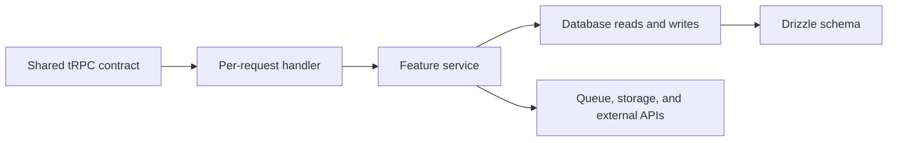

# Module responsibilities and dependencies

Use this diagram to decide where an API change belongs. VideoQ combines functions and modules by feature. The boxes below represent responsibilities; they do not imply that a class with each name exists.

```mermaid
flowchart LR
    Contract[Shared tRPC contract] --> Handler[Per-request handler]
    Handler --> Service[Feature service]
    Service --> Repository[Database reads and writes]
    Repository --> Schema[Drizzle schema]
    Service --> External[Queue, storage, and external APIs]
```

## What belongs where

| Layer | Responsibility | Example |
|---|---|---|
| Shared contract | Operation names, inputs, outputs, and authentication requirements | Name and color required to create a tag |
| Handler | Connects the Hono request to a service | Passing the authenticated user ID |
| Service | Coordinates business operations | Registering a video and requesting processing |
| Repository | Reads and writes data within the permitted scope | Fetching the owner's tags |
| Schema | Defines tables, types, constraints, and indexes | Preventing duplicate relationships |

Keep Hono-specific values and DB connections out of shared contracts. Connect implementations through the API context. See [tRPC API design](../architecture/trpc-api.md).

## Authentication and business data

Authentication accounts, sessions, and verification tokens use the Better Auth schema. Video, course, and tag owners are associated with `users`. This setup does not add a custom `AuthSession` class or legacy `auth_sessions` table.

See the [data dictionary](../database/data-dictionary.md) and [ER diagrams](../database/er-diagram.md) for current tables and relationships.

## Practice reading the implementation

The [tag list walkthrough](../getting-started/codebase.md) follows actual files in this order. When adding functionality, choose a similar existing feature and follow its division of responsibilities.
