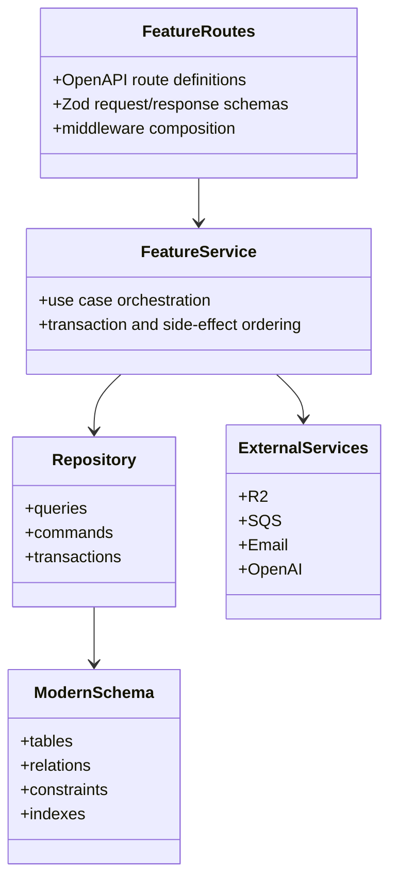
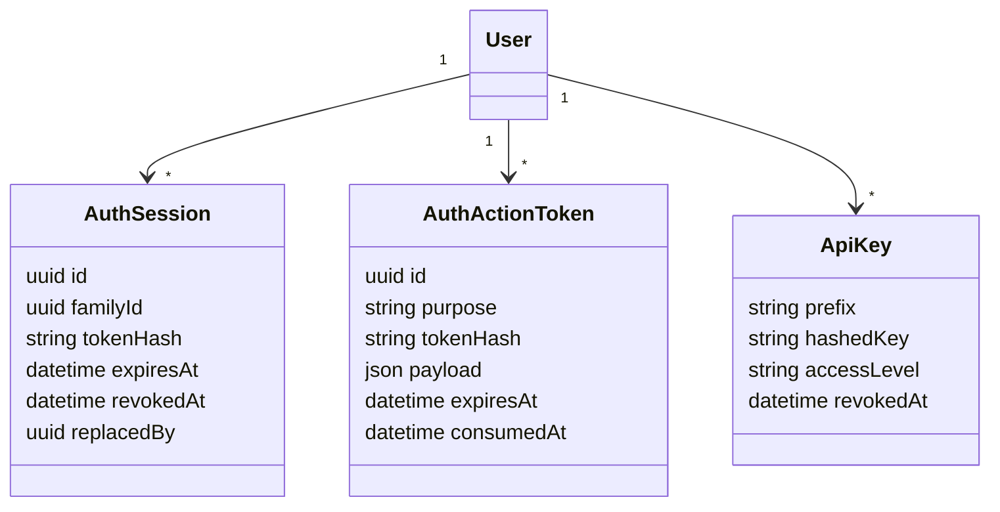
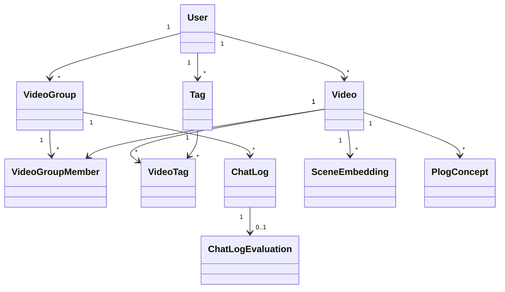

# クラス・モジュール関係

VideoQ API はフレームワーク固有の controller class 階層ではなく、
feature module と明示的な依存方向で構成します。

```mermaid
classDiagram
    class FeatureRoutes {
      +OpenAPI route definitions
      +Zod request/response schemas
      +middleware composition
    }
    class FeatureService {
      +use case orchestration
      +transaction and side-effect ordering
    }
    class Repository {
      +queries
      +commands
      +transactions
    }
    class ModernSchema {
      +tables
      +relations
      +constraints
      +indexes
    }
    class ExternalServices {
      +R2
      +SQS
      +Email
      +OpenAI
    }

    FeatureRoutes --> FeatureService
    FeatureService --> Repository
    Repository --> ModernSchema
    FeatureService --> ExternalServices
```

## 認証モデル

```mermaid
classDiagram
    class User
    class AuthSession {
      uuid id
      uuid familyId
      string tokenHash
      datetime expiresAt
      datetime revokedAt
      uuid replacedBy
    }
    class AuthActionToken {
      uuid id
      string purpose
      string tokenHash
      json payload
      datetime expiresAt
      datetime consumedAt
    }
    class ApiKey {
      string prefix
      string hashedKey
      string accessLevel
      datetime revokedAt
    }

    User "1" --> "*" AuthSession
    User "1" --> "*" AuthActionToken
    User "1" --> "*" ApiKey
```

## コンテンツモデル

```mermaid
classDiagram
    User "1" --> "*" Video
    User "1" --> "*" VideoGroup
    User "1" --> "*" Tag
    VideoGroup "1" --> "*" VideoGroupMember
    Video "1" --> "*" VideoGroupMember
    Video "1" --> "*" VideoTag
    Tag "1" --> "*" VideoTag
    VideoGroup "1" --> "*" ChatLog
    ChatLog "1" --> "0..1" ChatLogEvaluation
    Video "1" --> "*" SceneEmbedding
    Video "1" --> "*" PlogConcept
```
