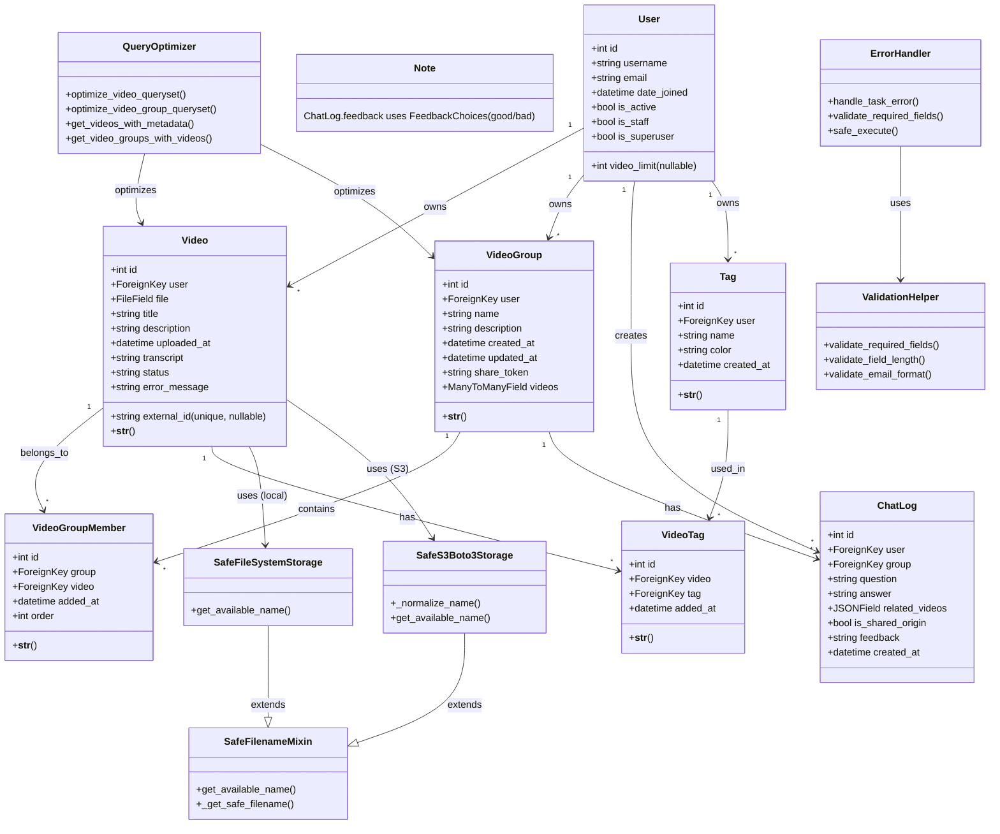
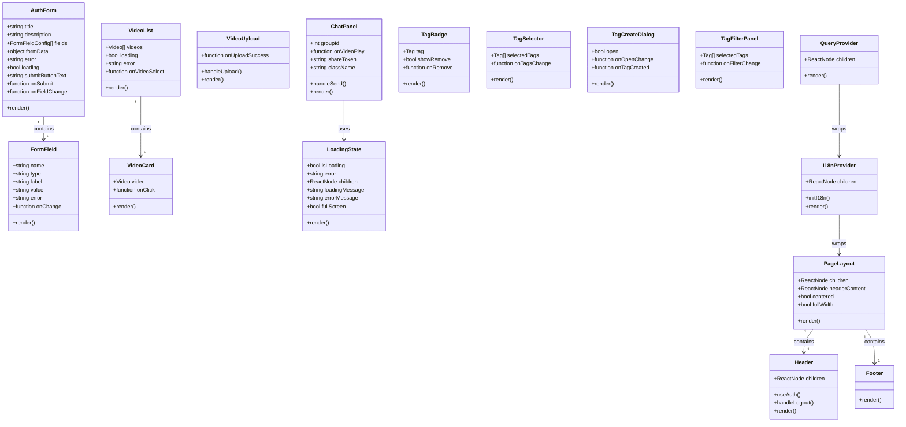

# Class Diagram

## Overview

This diagram shows the backend models and frontend components of the VideoQ system.

## Backend Models (Django)

## Frontend Components (React/TypeScript)

## Backend Views (Django REST Framework)

## Key Relationships

### Backend
- **User** owns multiple **Video** instances
- **User** owns multiple **VideoGroup** instances
- **VideoGroup** relates to multiple **Video** instances through **VideoGroupMember**
- **ChatLog** is associated with **User** and **VideoGroup**
- **Video** uses **SafeFileSystemStorage** or **SafeS3Boto3Storage**

### Frontend
- **PageLayout** contains **Header** and **Footer**
- **AuthForm** contains multiple **FormField** instances
- **VideoList** contains multiple **VideoCard** instances
- **I18nProvider** wraps the entire application
