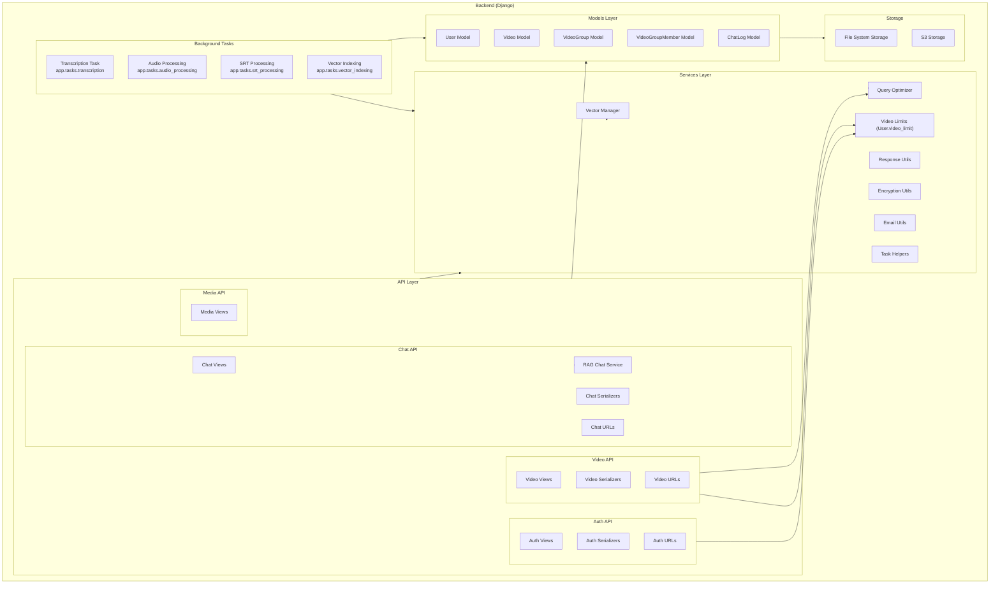
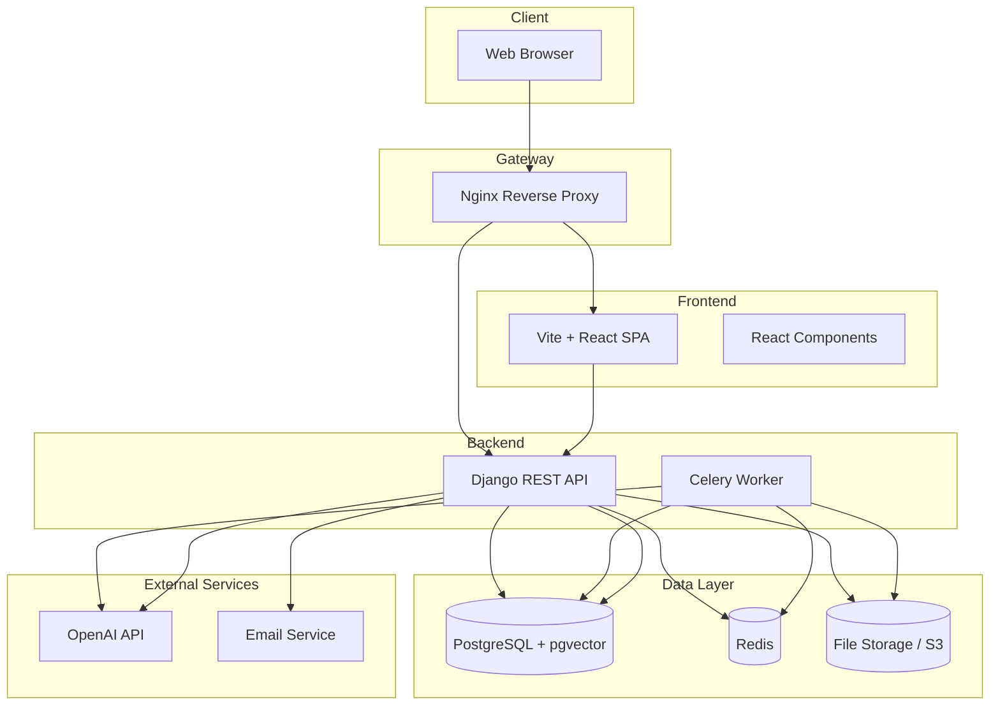

# Component Diagram

## Overview

This diagram shows the major components of VideoQ's frontend and backend.

## Frontend Component Structure

```mermaid
graph TB
    subgraph Frontend["Frontend (Vite + React SPA)"]
        subgraph Pages["Pages (React Router Routes)"]
            Home[Home Page]
            Login[Login Page]
            Signup[Signup Page]
            Videos[Video List Page]
            VideoDetail[Video Detail Page]
            Groups[Group List Page]
            GroupDetail[Group Detail Page]
            Share[Share Page]
            Settings[Settings Page]
        end
        
        subgraph Components["Components"]
            subgraph Auth["Auth Components"]
                AuthForm[AuthForm]
                FormField[FormField]
                ErrorMessage[ErrorMessage]
            end
            
            subgraph Video["Video Components"]
                VideoList[VideoList]
                VideoCard[VideoCard]
                VideoUpload[VideoUpload]
                VideoUploadModal[VideoUploadModal]
            end
            
            subgraph Chat["Chat Components"]
                ChatPanel[ChatPanel]
            end
            
            subgraph Layout["Layout Components"]
                PageLayout[PageLayout]
                Header[Header]
                Footer[Footer]
            end
            
            subgraph Common["Common Components"]
                LoadingState[LoadingState]
                LoadingSpinner[LoadingSpinner]
                MessageAlert[MessageAlert]
            end
            
            subgraph UI["UI Components (shadcn/ui)"]
                Button[Button]
                Input[Input]
                Card[Card]
                Dialog[Dialog]
                Form[Form]
            end
        end
        
        subgraph Hooks["Custom Hooks"]
            useAuth[useAuth]
            useVideos[useVideos]
            useVideoUpload[useVideoUpload]
            useAsyncState[useAsyncState]
        end
        
        subgraph Lib["Libraries"]
            apiClient[apiClient]
            errorUtils[errorUtils]
            formUtils[formUtils]
        end
        
        subgraph Providers["Providers"]
            I18nProvider[I18nProvider]
        end
    end
    
    Pages --> Components
    Components --> Hooks
    Components --> Lib
    Components --> Providers
    Hooks --> Lib
    Lib --> apiClient
```

## Backend Component Structure

## System-Wide Component Structure

## Component Dependencies

### Frontend
- **Pages** → **Components**: Pages use components
- **Components** → **Hooks**: Components use custom hooks
- **Hooks** → **Lib**: Hooks use libraries
- **Components** → **UI Components**: Use common UI components

### Backend
- **API Layer** → **Models**: API uses models
- **API Layer** → **Services**: API uses service layer
- **Tasks** → **Models**: Tasks use models
- **Tasks** → **Services**: Tasks use service layer
- **Models** → **Storage**: Models use storage

### System-Wide
- **Client** → **Gateway**: Client accesses via gateway
- **Gateway** → **Frontend/Backend**: Gateway routes requests
- **Backend** → **Data**: Backend uses data layer
- **Backend** → **External**: Backend uses external services
