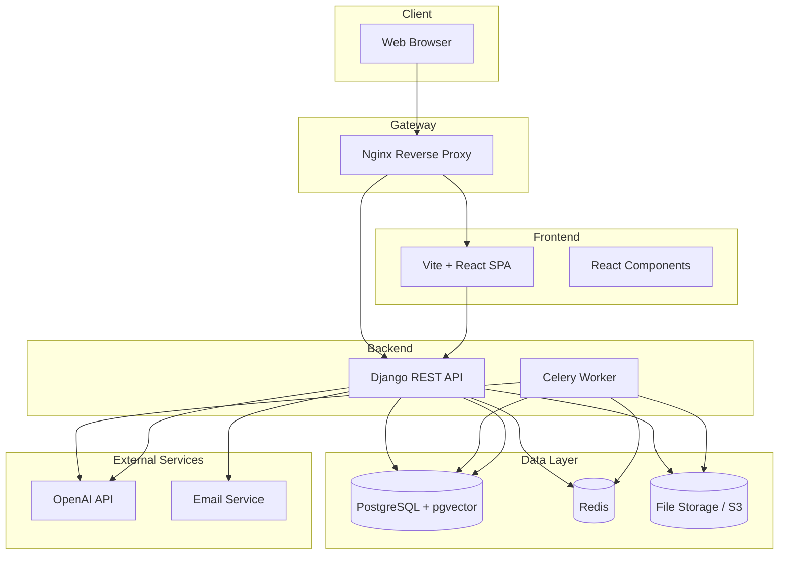

# Component Diagram

## Overview

This diagram shows the major components of VideoQ's frontend and backend.

## Frontend Component Structure

```mermaid
graph TB
    subgraph Frontend["Frontend (Vite + React SPA)"]
        subgraph Pages["Pages (React Router Routes)"]
            Home[Home Page]
            Login[Login Page]
            Signup[Signup Page]
            Videos[Video List Page]
            VideoDetail[Video Detail Page]
            Groups[Group List Page]
            GroupDetail[Group Detail Page]
            Share[Share Page]
            Settings[Settings Page]
        end
        
        subgraph Components["Components"]
            subgraph Auth["Auth Components"]
                AuthForm[AuthForm]
                FormField[FormField]
                AuthFormFooter[AuthFormFooter]
                ErrorMessage[ErrorMessage]
            end
            
            subgraph Video["Video Components"]
                VideoList[VideoList]
                VideoCard[VideoCard]
                VideoUpload[VideoUpload]
                VideoUploadButton[VideoUploadButton]
                VideoUploadFormFields[VideoUploadFormFields]
                VideoUploadModal[VideoUploadModal]
                VideoNavBar[VideoNavBar]
                AddToGroupModal[AddToGroupModal]
            end

            subgraph Tag["Tag Components"]
                TagBadge[TagBadge]
                TagSelector[TagSelector]
                TagCreateDialog[TagCreateDialog]
                TagFilterPanel[TagFilterPanel]
                TagManagementModal[TagManagementModal]
            end
            
            subgraph Chat["Chat Components"]
                ChatPanel[ChatPanel]
            end

            subgraph Shorts["Shorts Components"]
                ShortsButton[ShortsButton]
                ShortsPlayer[ShortsPlayer]
            end

            subgraph Dashboard["Dashboard Components"]
                AnalyticsDashboard[AnalyticsDashboard]
                DashboardButton[DashboardButton]
                DashboardEmptyState[DashboardEmptyState]
                FeedbackDonutChart[FeedbackDonutChart]
                KeywordCloudChart[KeywordCloudChart]
                QuestionTimeSeriesChart[QuestionTimeSeriesChart]
                SceneDistributionChart[SceneDistributionChart]
            end
            
            subgraph Layout["Layout Components"]
                PageLayout[PageLayout]
                Header[Header]
                Footer[Footer]
            end
            
            subgraph Common["Common Components"]
                LoadingState[LoadingState]
                LoadingSpinner[LoadingSpinner]
                InlineSpinner[InlineSpinner]
                MessageAlert[MessageAlert]
            end
            
            subgraph UI["UI Components (shadcn/ui)"]
                Button[Button]
                Input[Input]
                Card[Card]
                Dialog[Dialog]
                Form[Form]
            end
        end
        
        subgraph Hooks["Custom Hooks"]
            useAuth[useAuth]
            useVideos[useVideos]
            useVideoUpload[useVideoUpload]
            useTags[useTags]
            useChatMessages[useChatMessages]
            useChatHistory[useChatHistory]
            useChatAnalytics[useChatAnalytics]
            useVideoGroups[useVideoGroups]
            useShareLink[useShareLink]
            useVideoEditing[useVideoEditing]
            useVideoPlayback[useVideoPlayback]
            useVideoStats[useVideoStats]
            QueryHooks[TanStack Query Hooks]
        end
        
        subgraph Lib["Libraries"]
            apiClient[apiClient]
            errorUtils[errorUtils]
            formUtils[formUtils]
        end
        
        subgraph Providers["Providers"]
            I18nProvider[I18nProvider]
            QueryProvider[QueryClientProvider]
        end
    end
    
    Pages --> Components
    Components --> Hooks
    Components --> Lib
    Components --> Providers
    Hooks --> Lib
    Lib --> apiClient
```

## Backend Component Structure (Clean Architecture)

```mermaid
graph TB
    subgraph Backend["Backend (Django - Clean Architecture)"]
        subgraph PresentationLayer["presentation/ — Thin HTTP layer"]
            subgraph AuthPres["auth/"]
                AuthViews["Views - Login, Signup, VerifyEmail,
                PasswordReset, CurrentUser, DeleteAccount,
                APIKeys, Refresh, Logout"]
                AuthSer[Serializers]
            end
            subgraph VideoPres["video/"]
                VideoViews["Views - VideoList, VideoDetail,
                VideoGroup, Tag, ManageGroups, ManageTags"]
                VideoSer[Serializers]
            end
            subgraph ChatPres["chat/"]
                ChatViews["Views - ChatView, ChatHistoryView,
                ChatFeedbackView, ChatAnalyticsView,
                PopularScenesView, ExportHistoryView"]
                ChatSer[Serializers]
            end
            subgraph MediaPres["media/"]
                MediaViews[ProtectedMediaView]
            end
            CommonPres["common/ - auth (CookieJWTAuthentication,
            ApiKeyAuthentication, ShareTokenAuthentication),
            permissions, throttles"]
            AdminPres[admin.py - operational privileged path]
        end

        subgraph UseCasesLayer["use_cases/ — Business logic"]
            subgraph VideoUC["video/"]
                CreateVideo[CreateVideoUseCase]
                GetVideo[GetVideoUseCase]
                ListVideos[ListVideosUseCase]
                UpdateVideo[UpdateVideoUseCase]
                DeleteVideo[DeleteVideoUseCase]
                FileUrl[GetVideoFileUrlUseCase]
                EnforceLimit[EnforceVideoLimitUseCase]
                CreateGroup[CreateGroup / CreateGroupWithDetail]
                GetGroup[GetGroupUseCase]
                ListGroups[ListGroupsUseCase]
                UpdateGroup[UpdateGroup / UpdateGroupWithDetail]
                DeleteGroup[DeleteGroupUseCase]
                ManageGroups[ManageGroupsUseCase]
                CreateTag[CreateTagUseCase]
                GetTag[GetTagUseCase]
                ListTags[ListTagsUseCase]
                UpdateTag[UpdateTag / UpdateTagWithDetail]
                DeleteTag[DeleteTagUseCase]
                ManageTags[ManageTagsUseCase]
                RunTrans[RunTranscriptionUseCase]
                ReindexAll[ReindexAllVideosUseCase]
            end
            subgraph ChatUC["chat/"]
                SendMsg[SendMessageUseCase]
                GetHistory[GetHistoryUseCase]
                ExportHistory[ExportHistoryUseCase]
                SubmitFeedback[SubmitFeedbackUseCase]
                GetAnalytics[GetAnalyticsUseCase]
                GetPopularScenes[GetPopularScenesUseCase]
            end
            subgraph AuthUC["auth/"]
                LoginUC[LoginUseCase]
                SignupUC[SignupUserUseCase]
                VerifyEmailUC[VerifyEmailUseCase]
                ResetPassUC[ConfirmPasswordResetUseCase]
                GetUserUC[GetCurrentUserUseCase]
                DeleteAccUC[AccountDeletionUseCase]
                DeleteAccDataUC[DeleteAccountDataUseCase]
                ManageApiKeysUC[ManageApiKeysUseCase]
                AuthorizeApiKeyUC[AuthorizeApiKeyUseCase]
                ResolveApiKeyUC[ResolveApiKeyUseCase]
                ResolveShareUC[ResolveShareTokenUseCase]
                RefreshTokenUC[RefreshTokenUseCase]
            end
            subgraph MediaUC["media/"]
                ResolveMedia[ResolveProtectedMediaUseCase]
            end
            SharedExc["shared/exceptions - ResourceNotFound, PermissionDenied"]
        end

        subgraph DomainLayer["domain/ — Abstract interfaces & entities"]
            subgraph VideoDomain["video/"]
                VideoEntity[VideoEntity, VideoGroupEntity, TagEntity]
                VideoRepo["VideoRepository ABC
                (VideoQueryRepository,
                VideoCommandRepository,
                VideoTranscriptionRepository)"]
                VideoGroupRepo[VideoGroupRepository ABC]
                TagRepo[TagRepository ABC]
                VideoGateways["VectorStoreGateway,
                VideoTaskGateway,
                VectorIndexingGateway,
                TranscriptionGateway"]
                VideoPorts[FileUrlResolver]
            end
            subgraph ChatDomain["chat/"]
                ChatRepo[ChatRepository ABC]
                ChatGroupRepo[VideoGroupQueryRepository ABC]
                RagGateway[RagGateway ABC]
                ChatPorts["KeywordExtractor,
                SceneVideoInfoProvider"]
                ChatServices["services - aggregate_scenes,
                filter_group_scenes"]
                ChatVOs["value_objects - ChatSceneLog, KeywordCount"]
            end
            subgraph AuthDomain["auth/"]
                ApiKeyRepo[ApiKeyRepository ABC]
                AuthGateways["AccountDeletionGateway,
                UserManagementGateway,
                UserDataDeletionGateway,
                EmailSenderGateway,
                AuthTaskGateway"]
                AuthPorts["TokenGateway, UserAuthGateway,
                ShareTokenResolverPort,
                ApiKeyResolverPort"]
            end
            subgraph MediaDomain["media/"]
                MediaRepo[ProtectedMediaRepository ABC]
            end
            UserEntity["user/ - UserEntity, UserRepository ABC"]
            SharedDomain["shared/ - ResourceNotFound, PermissionDenied"]
        end

        subgraph InfraLayer["infrastructure/ — Implementations"]
            subgraph Repos["repositories/"]
                DjangoVideoRepo[DjangoVideoRepository]
                DjangoChatRepo[DjangoChatRepository]
                DjangoUserRepo[DjangoUserRepository]
                DjangoMediaRepo[DjangoMediaRepository]
                DjangoAccDeleteRepo[DjangoAccountDeletionRepository]
                DjangoApiKeyRepo[DjangoApiKeyRepository]
                DjangoUserAuthGW[DjangoUserAuthGateway]
                DjangoUserDataGW[DjangoUserDataDeletionGateway]
            end
            subgraph ExtGateways["external/"]
                RagChatGW[RagChatGateway]
                VectorGW[DjangoVectorIndexingGateway]
                TransGW[WhisperTranscriptionGateway]
                SceneIdx[scene_indexer]
                VectorStore[PGVector / vector_store]
                RagSvc[rag_service / LangChain]
                LlmModule[llm - LLM provider factory]
                PromptsModule[prompts/ - RAG prompt templates]
            end
            subgraph TranscriptionInfra["transcription/"]
                AudioProc[audio_processing - ffmpeg/Whisper]
                SRTProc[srt_processing - SRT parsing]
                VideoAccessor[DjangoVideoFileAccessor]
            end
            subgraph AuthInfra["auth/"]
                SimpleJWT[SimpleJWTGateway]
                DjangoAuthGW[DjangoAuthGateway]
                CookieJWT[CookieJWTValidator]
                ApiKeyResolver[ApiKeyResolver]
                ShareTokenResolver[ShareTokenResolver]
            end
            subgraph TasksInfra["tasks/"]
                CeleryTaskGW[CeleryTaskGateway]
            end
            subgraph ChatInfra["chat/"]
                KwExtractor[JanomeNltkKeywordExtractor]
                SceneInfoProvider[SceneVideoInfoProvider]
            end
            subgraph CommonInfra["common/"]
                EmailModule[email - SMTP sender]
                EmbeddingsModule[embeddings - embedding factory]
                WhisperClient[whisper_client]
                QueryOptimizer[query_optimizer]
                PerfUtils[performance_utils]
                TaskHelpers[task_helpers]
            end
            subgraph SceneOtsu["scene_otsu/"]
                Splitter[splitter - scene splitting]
                Parsers[parsers - SRT/transcript parsing]
                Embedders[embedders - embedding generation]
            end
            StorageInfra[storage/ - LocalMediaStorage]
        end

        subgraph Models["models/ — Django ORM"]
            UserModel[User]
            VideoModel[Video]
            GroupModel[VideoGroup / VideoGroupMember]
            ChatLogModel[ChatLog]
            TagModel[Tag / VideoTag]
            AccDeleteModel[AccountDeletionRequest]
            ApiKeyModel[UserApiKey]
            StorageModel["SafeFileSystemStorage /
            SafeS3Boto3Storage"]
        end

        subgraph Tasks["entrypoints/tasks/ (Celery entrypoints - thin triggers)"]
            TranscribeTask[transcription.py]
            DeleteAccTask[account_deletion.py]
            ReindexTask[reindexing.py]
        end

        subgraph Container["Dependency Providers / Composition Root"]
            Dependencies[dependencies/*.py - provider functions]
            CompRoot[composition_root/*.py - wiring and assembly]
            Contracts[contracts/ - task name constants]
        end
    end

    PresentationLayer --> Container
    AdminPres --> Container
    Container --> UseCasesLayer
    Container --> InfraLayer
    UseCasesLayer --> DomainLayer
    InfraLayer --> DomainLayer
    InfraLayer --> Models
    Tasks --> UseCasesLayer
    Tasks --> Contracts
```

## System-Wide Component Structure

```mermaid
graph TB
    subgraph Client["Client"]
        Browser[Web Browser]
    end
    
    subgraph Frontend["Frontend"]
        FrontendSPA[Vite + React SPA]
        ReactComponents[React Components]
    end
    
    subgraph Gateway["Gateway"]
        Nginx[Nginx Reverse Proxy]
    end
    
    subgraph Backend["Backend"]
        DjangoAPI[Django REST API]
        CeleryWorker[Celery Worker]
    end
    
    subgraph Data["Data Layer"]
        PostgreSQL[(PostgreSQL + pgvector)]
        Redis[(Redis)]
        FileStorage[(File Storage / S3)]
    end
    
    subgraph External["External Services"]
        OpenAI[OpenAI API]
        EmailService[Email Service]
    end
    
    Browser --> Nginx
    Nginx --> FrontendSPA
    Nginx --> DjangoAPI
    FrontendSPA --> DjangoAPI
    DjangoAPI --> PostgreSQL
    DjangoAPI --> Redis
    DjangoAPI --> FileStorage
    CeleryWorker --> Redis
    CeleryWorker --> PostgreSQL
    CeleryWorker --> FileStorage
    CeleryWorker --> OpenAI
    DjangoAPI --> OpenAI
    DjangoAPI --> EmailService
    DjangoAPI --> PostgreSQL
```

## Component Dependencies

### Frontend
- **Pages** → **Components**: Pages use components
- **Components** → **Hooks**: Components use custom hooks
- **Hooks** → **Lib**: Hooks use libraries
- **Components** → **UI Components**: Use common UI components

### Backend
- **Presentation (`presentation/*`, `admin.py`)** → **Dependencies (`dependencies/*.py`)**: framework entrypoints resolve providers only via dependencies
- **Dependencies** → **Composition Root (`composition_root/*.py`)**: provider functions delegate 1:1 to wiring functions
- **Composition Root** → **Use Cases / Infrastructure**: assembles concrete adapters and use case instances
- **Use Cases** → **Domain ports/entities**: business logic depends only on domain abstractions
- **Infrastructure** → **Domain + ORM/External**: adapter implementations bridge domain ports to Django ORM and external services
- **Entrypoints (`entrypoints/tasks/`)** → **Use Cases**: Celery task entrypoints delegate to use cases via composition root

### System-Wide
- **Client** → **Gateway**: Client accesses via gateway
- **Gateway** → **Frontend/Backend**: Gateway routes requests
- **Backend** → **Data**: Backend uses data layer
- **Backend** → **External**: Backend uses external services
