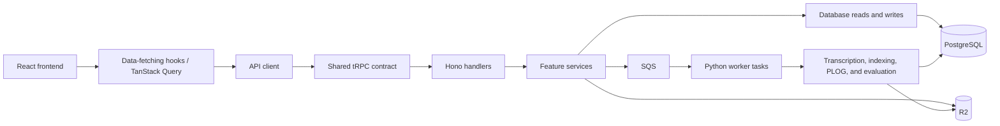
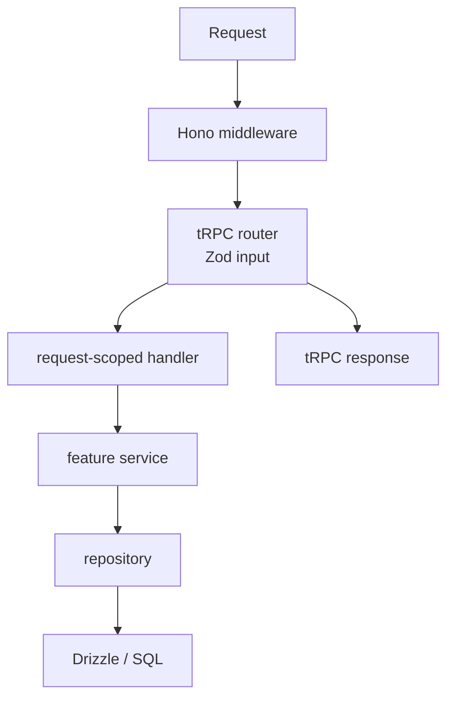
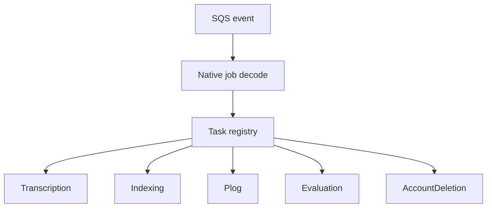

# Component diagrams

These diagrams show which components are called from UI interactions through database access and video processing.
See [Find your way around the code](../getting-started/codebase.md) for implementation locations,
and [Module responsibilities](class-diagram.md) for how responsibilities are divided.

Arrows show the main dependency direction, combining HTTP communication, shared types, and function calls.

## Overview

```mermaid
flowchart LR
    UI[React frontend] --> Hooks[Data-fetching hooks / TanStack Query]
    Hooks --> Client[API client]
    Client --> Contract[Shared tRPC contract]
    Contract --> Adapter[Hono handlers]
    Adapter --> Services[Feature services]
    Services --> Repositories[Database reads and writes]
    Repositories --> DB[(PostgreSQL)]
    Services --> R2[(R2)]
    Services --> SQS[SQS]
    SQS --> Tasks[Python worker tasks]
    Tasks --> Pipelines[Transcription, indexing, PLOG, and evaluation]
    Pipelines --> DB
    Pipelines --> R2
```

## API features

Regular JSON APIs go through the shared tRPC router and API adapter.

```mermaid
flowchart TD
    Request --> Hono[Hono middleware]
    Hono --> Router[tRPC router<br/>Zod input]
    Router --> Adapter[request-scoped handler]
    Adapter --> Service[feature service]
    Service --> Repository[repository]
    Repository --> Drizzle[Drizzle / SQL]
    Router --> Response[tRPC response]
```

Main features:

- auth
- videos / courses / tags
- chat / evaluation / plog
- oauth / mcp
- membership / media
- health

OAuth, webhooks, SSE, multipart, CSV, and media binaries are separated into Hono routes
because they depend on specific HTTP protocol behavior.

## Worker

```mermaid
flowchart TD
    Event[SQS event] --> Decode[Native job decode]
    Decode --> Registry[Task registry]
    Registry --> Transcription
    Registry --> Indexing
    Registry --> Plog
    Registry --> Evaluation
    Registry --> AccountDeletion
```

The API handles HTTP responsibilities; the worker handles CPU-intensive or time-consuming processing.

**Related:** [Change the API](../guides/api.md), [Change asynchronous video processing](../guides/worker.md).
