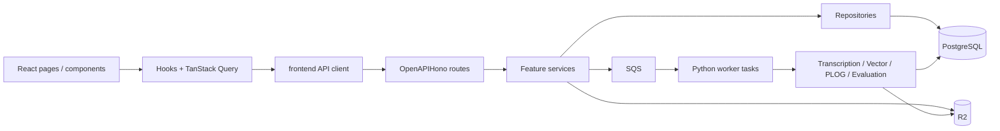
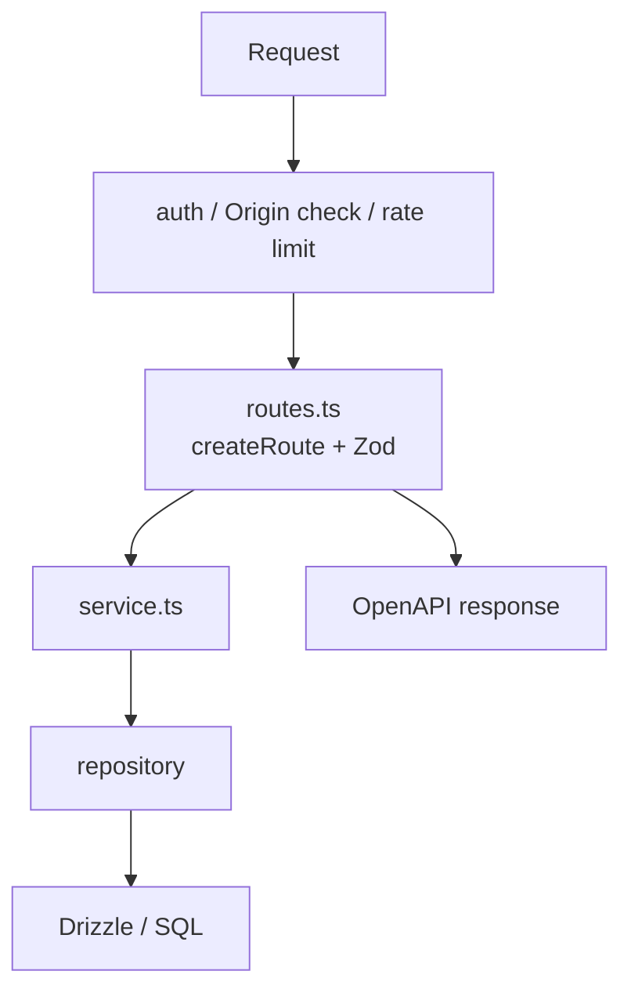
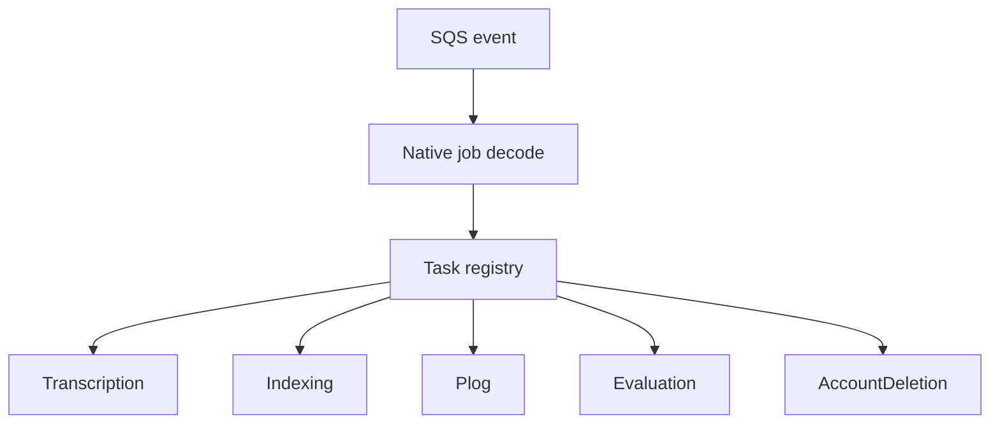

# コンポーネント図

## 全体

```mermaid
flowchart LR
    UI[React pages / components] --> Hooks[Hooks + TanStack Query]
    Hooks --> Client[frontend API client]
    Client --> Routes[OpenAPIHono routes]
    Routes --> Services[Feature services]
    Services --> Repositories[Repositories]
    Repositories --> DB[(PostgreSQL)]
    Services --> R2[(R2)]
    Services --> SQS[SQS]
    SQS --> Tasks[Python worker tasks]
    Tasks --> Pipelines[Transcription / Vector / PLOG / Evaluation]
    Pipelines --> DB
    Pipelines --> R2
```

## API feature

各ドメインは同じ構造を使います。

```mermaid
flowchart TD
    Request --> Middleware[auth / Origin check / rate limit]
    Middleware --> Route[routes.ts<br/>createRoute + Zod]
    Route --> Service[service.ts]
    Service --> Repository[repository]
    Repository --> Drizzle[Drizzle / SQL]
    Route --> Response[OpenAPI response]
```

主な feature:

- auth
- videos / courses / tags
- chat / evaluation / plog
- oauth / mcp
- membership / ops / media
- schema / health

## Worker

```mermaid
flowchart TD
    Event[SQS event] --> Decode[Native job decode]
    Decode --> Registry[Task registry]
    Registry --> Transcription
    Registry --> Indexing
    Registry --> Plog
    Registry --> Evaluation
    Registry --> AccountDeletion
```

HTTP の責務は API、CPU・時間を要する処理は worker に分離します。
