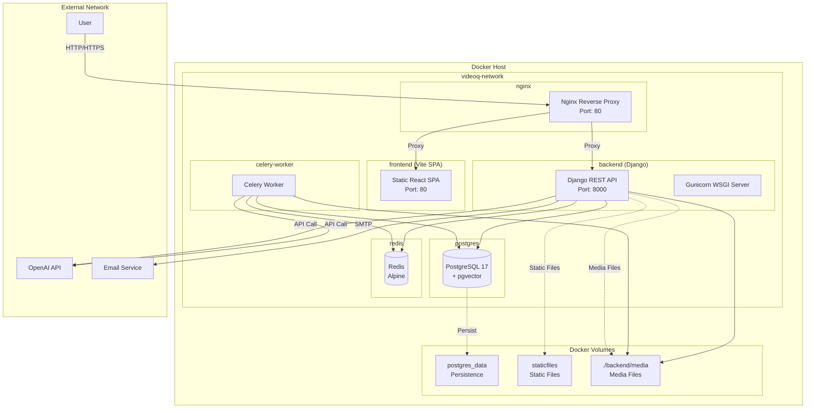
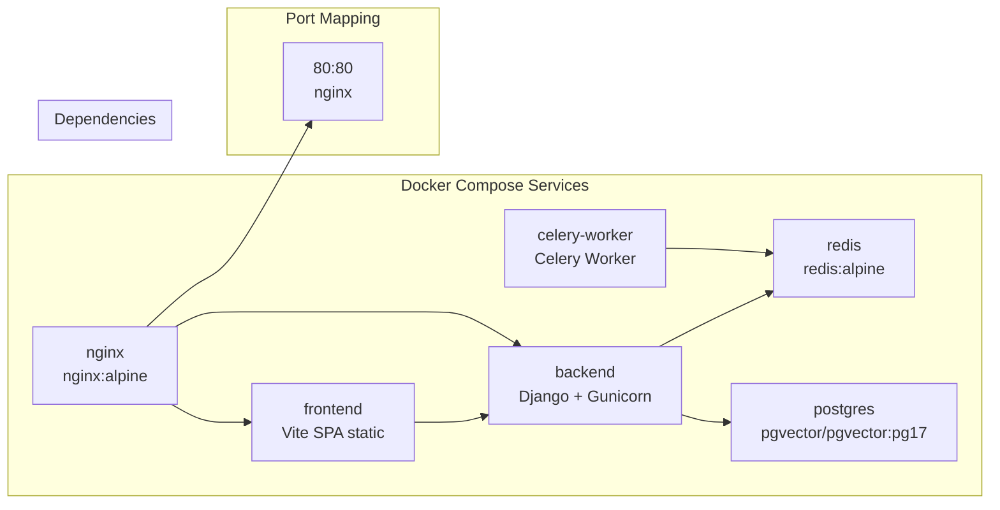
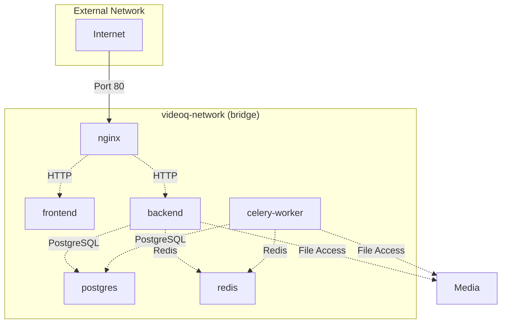
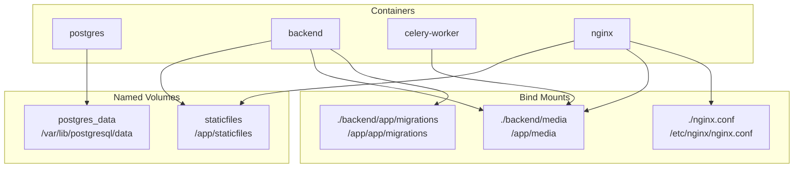
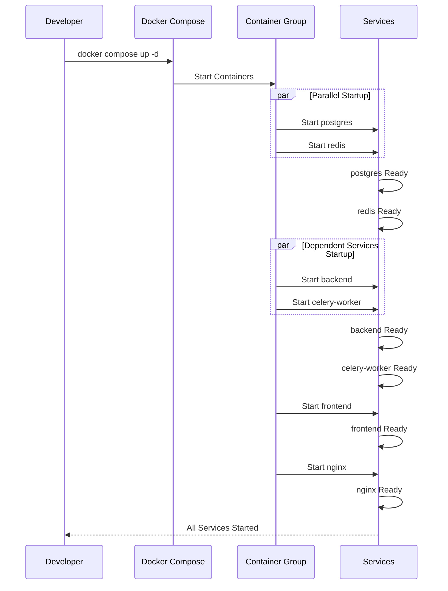
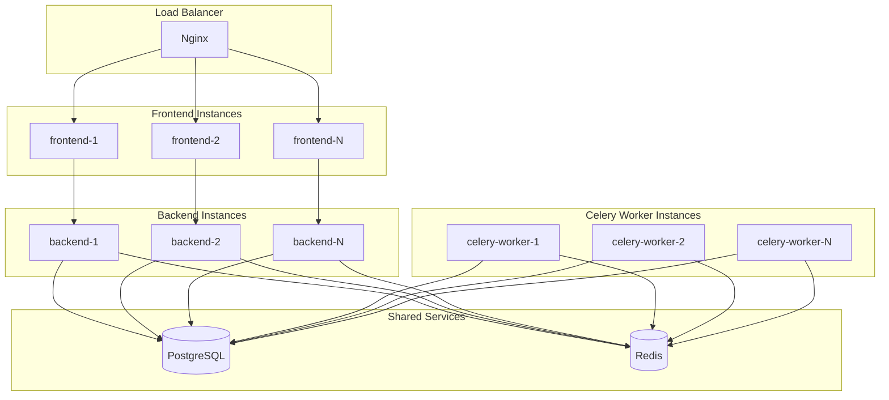

# Deployment Diagram

## Overview

This diagram shows VideoQ's default deployment (Docker Compose).

## Docker Compose Configuration

## Service Details Configuration

## Network Configuration

## Volume Configuration

## Deployment Flow

## Environment Variables Configuration

```mermaid
graph TB
    subgraph EnvFile[".env File"]
        E1[POSTGRES_DB]
        E2[POSTGRES_USER]
        E3[POSTGRES_PASSWORD]
        E4["SECRET_KEY<br/>(recommended; required for production)"]
        E5[DATABASE_URL]
        E6[CELERY_BROKER_URL]
        E6b[CELERY_RESULT_BACKEND]
        E7[ENABLE_SIGNUP]
        E8[ALLOWED_HOSTS]
        E9[CORS_ALLOWED_ORIGINS]
        E10[SECURE_COOKIES]
        E11[FRONTEND_URL]
        E12[USE_S3_STORAGE]
        E13[AWS_*]
        E14["OPENAI_API_KEY<br/>(optional / not used in standard flow)"]
        E15[VITE_API_URL]
    end
    
    subgraph Containers["Containers"]
        C1[postgres]
        C2[backend]
        C3[celery-worker]
        C4[frontend]
    end
    
    E1 --> C1
    E2 --> C1
    E3 --> C1
    E4 --> C2
    E5 --> C2
    E6 --> C2
    E6b --> C2
    E6 --> C3
    E6b --> C3
    E7 --> C2
    E8 --> C2
    E9 --> C2
    E10 --> C2
    E11 --> C2
    E12 --> C2
    E13 --> C2
    E14 --> C2
    E14 --> C3
    E15 --> C4
```

## Optional: Scaling Configuration (production example)

> Note: The default `docker-compose.yml` runs a single instance per service.
> The diagram below is an example of how you might scale in production.

