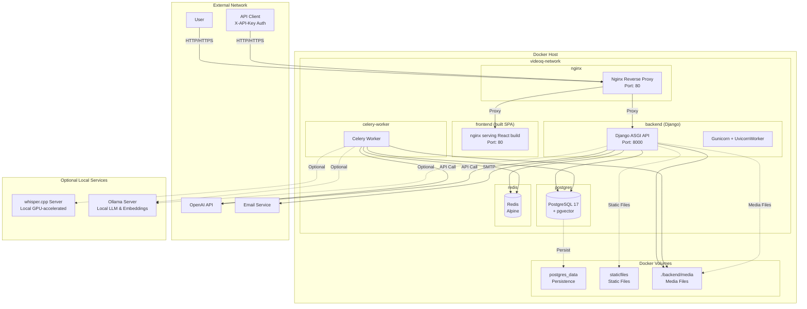
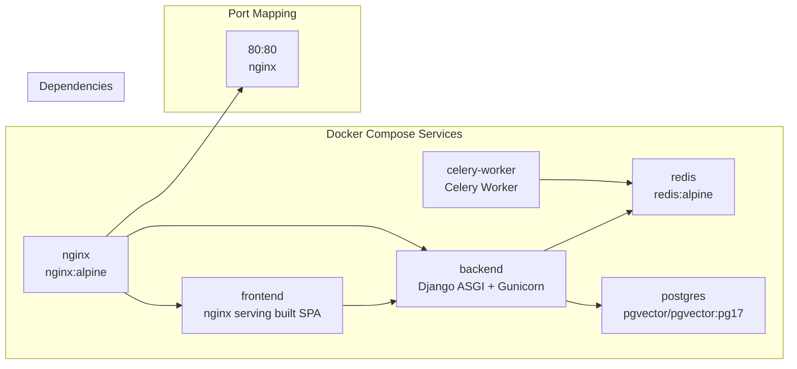
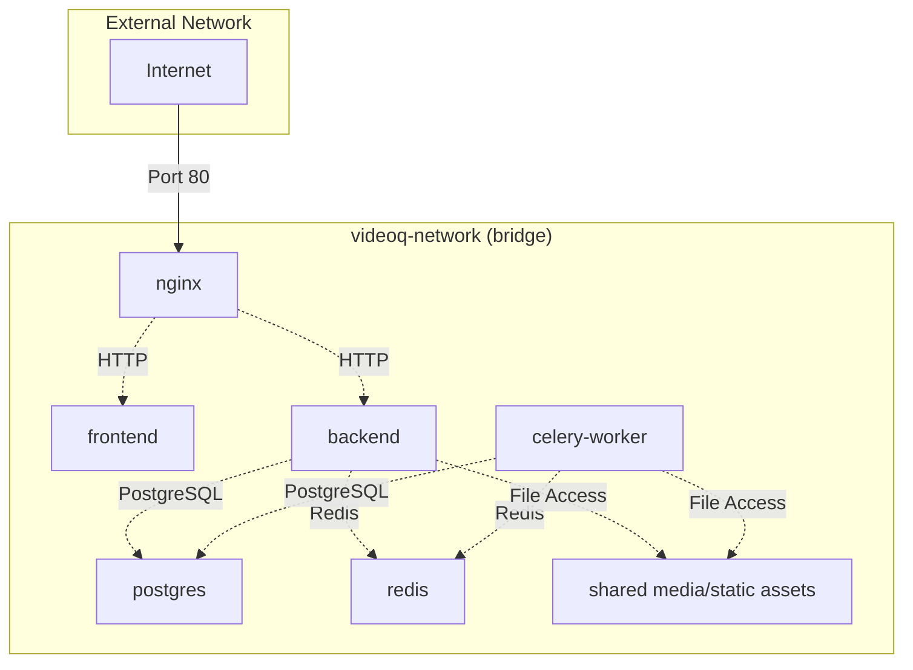
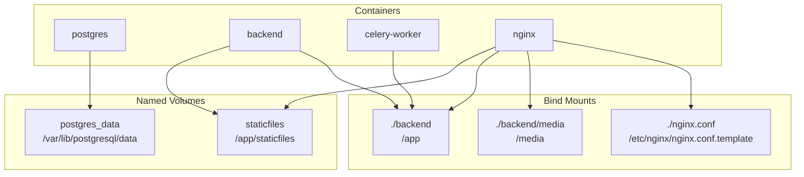
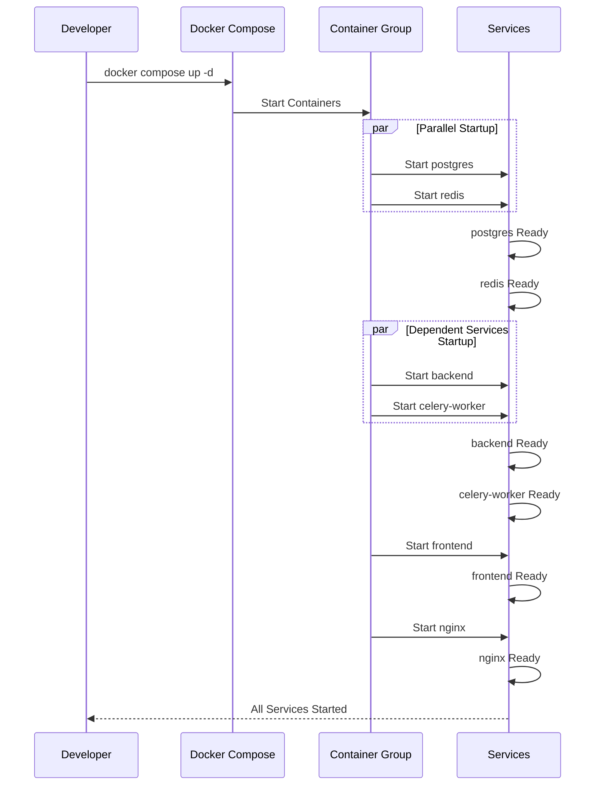
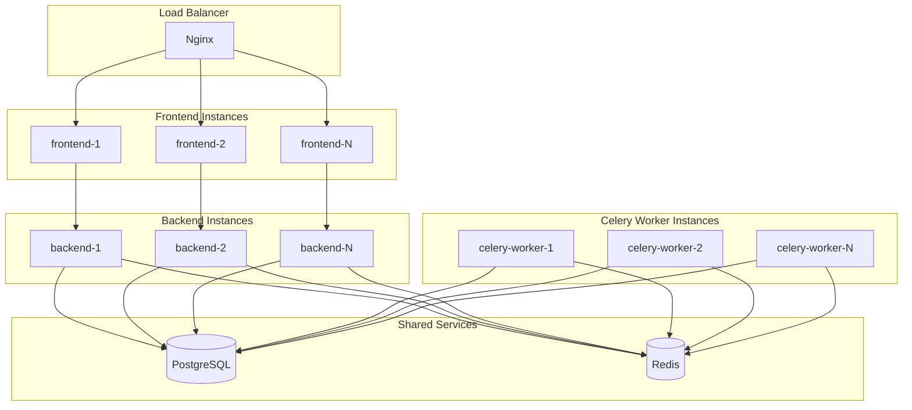

# デプロイメント図

## 概要

VideoQの現行 `docker-compose.yml` に基づくデフォルトデプロイを示す図です。

## Docker Compose構成

```mermaid
graph TB
    subgraph DockerHost["Docker Host"]
        subgraph Network["videoq-network"]
            subgraph FrontendContainer["frontend (built SPA)"]
                FrontendSPA[nginx serving React build<br/>Port: 80]
            end
            
            subgraph BackendContainer["backend (Django)"]
                Django[Django ASGI API<br/>Port: 8000]
                Gunicorn[Gunicorn + UvicornWorker]
            end
            
            subgraph CeleryContainer["celery-worker"]
                CeleryWorker[Celery Worker]
            end
            
            subgraph NginxContainer["nginx"]
                Nginx[Nginx Reverse Proxy<br/>Port: 80]
            end
            
            subgraph PostgresContainer["postgres"]
                PostgreSQL[(PostgreSQL 17<br/>+ pgvector)]
            end
            
            subgraph RedisContainer["redis"]
                Redis[(Redis<br/>Alpine)]
            end
        end
        
        subgraph Volumes["Docker Volumes"]
            PostgresData[postgres_data<br/>Persistence]
            StaticFiles[staticfiles<br/>Static Files]
            MediaFiles[./backend/media<br/>Media Files]
        end
    end
    
    subgraph External["External Network"]
        User[User]
        ApiClient[API Client<br/>X-API-Key Auth]
        OpenAI[OpenAI API]
        EmailService[Email Service]
    end

    subgraph LocalServices["Optional Local Services"]
        WhisperLocal[whisper.cpp Server<br/>Local GPU-accelerated]
        OllamaLocal[Ollama Server<br/>Local LLM & Embeddings]
    end

    User -->|HTTP/HTTPS| Nginx
    Nginx -->|Proxy| FrontendSPA
    Nginx -->|Proxy| Django
    Django --> PostgreSQL
    Django --> Redis
    Django --> MediaFiles
    CeleryWorker --> Redis
    CeleryWorker --> PostgreSQL
    CeleryWorker --> MediaFiles
    CeleryWorker -->|API Call| OpenAI
    CeleryWorker -.->|Optional| WhisperLocal
    CeleryWorker -.->|Optional| OllamaLocal
    Django -->|API Call| OpenAI
    Django -.->|Optional| OllamaLocal
    Django -->|SMTP| EmailService
    ApiClient -->|HTTP/HTTPS| Nginx
    
    PostgreSQL -.->|Persist| PostgresData
    Django -.->|Static Files| StaticFiles
    Django -.->|Media Files| MediaFiles
```

## サービス詳細構成

```mermaid
graph LR
    subgraph Services["Docker Compose Services"]
        S1["redis
        redis:alpine"]
        S2["postgres
        pgvector/pgvector:pg17"]
        S3["backend
        Django ASGI + Gunicorn"]
        S4["celery-worker
        Celery Worker"]
        S5["frontend
        nginx serving built SPA"]
        S6["nginx
        nginx:alpine"]
    end

    subgraph Dependencies["Dependencies"]
        S3 --> S2
        S3 --> S1
        S4 --> S1
        S5 --> S3
        S6 --> S3
        S6 --> S5
    end

    subgraph Ports["Port Mapping"]
        P1["80:80
        nginx"]
    end

    S6 --> P1
```

## ネットワーク構成

```mermaid
graph TB
    subgraph Network["videoq-network (bridge)"]
        N1[nginx]
        N2[frontend]
        N3[backend]
        N4[celery-worker]
        N5[postgres]
        N6[redis]
        M1[shared media/static assets]
    end
    
    N1 -.->|HTTP| N2
    N1 -.->|HTTP| N3
    N3 -.->|PostgreSQL| N5
    N3 -.->|Redis| N6
    N4 -.->|Redis| N6
    N4 -.->|PostgreSQL| N5
    N3 -.->|File Access| M1
    N4 -.->|File Access| M1
    
    subgraph ExternalNetwork["External Network"]
        Internet[Internet]
    end
    
    Internet -->|Port 80| N1
```

## ボリューム構成

```mermaid
graph TB
    subgraph NamedVolumes["Named Volumes"]
        V1[postgres_data<br/>/var/lib/postgresql/data]
        V2[staticfiles<br/>/app/staticfiles]
    end
    
    subgraph BindMounts["Bind Mounts"]
        V3[./backend<br/>/app]
        V4[./backend/media<br/>/media]
        V5[./nginx.conf<br/>/etc/nginx/nginx.conf.template]
    end
    
    subgraph Containers["Containers"]
        C1[postgres]
        C2[backend]
        C3[celery-worker]
        C4[nginx]
    end
    
    C1 --> V1
    C2 --> V2
    C2 --> V3
    C3 --> V3
    C4 --> V2
    C4 --> V3
    C4 --> V4
    C4 --> V5
```

## デプロイフロー

```mermaid
sequenceDiagram
    participant Dev as Developer
    participant Docker as Docker Compose
    participant Containers as Container Group
    participant Services as Services

    Dev->>Docker: docker compose up -d
    Docker->>Containers: Start Containers
    
    par Parallel Startup
        Containers->>Services: Start postgres
        Containers->>Services: Start redis
    end
    
    Services->>Services: postgres Ready
    Services->>Services: redis Ready
    
    par Dependent Services Startup
        Containers->>Services: Start backend
        Containers->>Services: Start celery-worker
    end
    
    Services->>Services: backend Ready
    Services->>Services: celery-worker Ready
    
    Containers->>Services: Start frontend
    Services->>Services: frontend Ready
    
    Containers->>Services: Start nginx
    Services->>Services: nginx Ready
    
    Services-->>Dev: All Services Started
```

## 環境変数構成

```mermaid
graph TB
    subgraph EnvFile[".env File"]
        E1[POSTGRES_DB]
        E2[POSTGRES_USER]
        E3[POSTGRES_PASSWORD]
        E4["SECRET_KEY<br/>(required in production)"]
        E5[DATABASE_URL]
        E6[CELERY_BROKER_URL]
        E6b[CELERY_RESULT_BACKEND]
        E6c[CACHE_URL]
        E7[ENABLE_SIGNUP]
        E8[ALLOWED_HOSTS]
        E9[CORS_ALLOWED_ORIGINS]
        E10[SECURE_COOKIES]
        E11[FRONTEND_URL]
        E12[USE_S3_STORAGE]
        E13[AWS_*]
        E14["OPENAI_API_KEY<br/>(required when using OpenAI services)"]
        E15[VITE_API_URL]
        E16["WHISPER_BACKEND<br/>(openai or whisper.cpp)"]
        E17["WHISPER_LOCAL_URL<br/>(local whisper.cpp server URL)"]
        E18["EMBEDDING_PROVIDER<br/>(openai or ollama)"]
        E19["EMBEDDING_MODEL<br/>(embedding model for selected provider)"]
        E20["LLM_PROVIDER<br/>(openai or ollama)"]
        E21["LLM_MODEL<br/>(LLM model for selected provider)"]
        E22["OLLAMA_BASE_URL<br/>(Ollama server URL)"]
        E23["EMBEDDING_VECTOR_SIZE<br/>(must match EMBEDDING_MODEL)"]
        E24["PGVECTOR_COLLECTION_NAME<br/>(vector storage table name)"]
    end
    
    subgraph Containers["Containers"]
        C1[postgres]
        C2[backend]
        C3[celery-worker]
        C4[frontend]
    end
    
    E1 --> C1
    E2 --> C1
    E3 --> C1
    E4 --> C2
    E5 --> C2
    E6 --> C2
    E6b --> C2
    E6c --> C2
    E6 --> C3
    E6b --> C3
    E7 --> C2
    E8 --> C2
    E9 --> C2
    E10 --> C2
    E11 --> C2
    E12 --> C2
    E13 --> C2
    E14 --> C2
    E14 --> C3
    E15 --> C4
    E16 --> C3
    E17 --> C3
    E18 --> C2
    E18 --> C3
    E19 --> C2
    E19 --> C3
    E20 --> C2
    E21 --> C2
    E22 --> C2
    E22 --> C3
    E23 --> C2
    E23 --> C3
    E24 --> C2
    E24 --> C3
```

## オプション: スケーリング構成（本番環境例）

> 注記: デフォルトの `docker-compose.yml` はサービスごとに単一インスタンスで実行されます。
> 以下の図は、本番環境でスケーリングする場合の例です。

```mermaid
graph TB
    subgraph LoadBalancer["Load Balancer"]
        LB[Nginx]
    end
    
    subgraph FrontendInstances["Frontend Instances"]
        F1[frontend-1]
        F2[frontend-2]
        F3[frontend-N]
    end
    
    subgraph BackendInstances["Backend Instances"]
        B1[backend-1]
        B2[backend-2]
        B3[backend-N]
    end
    
    subgraph CeleryInstances["Celery Worker Instances"]
        C1[celery-worker-1]
        C2[celery-worker-2]
        C3[celery-worker-N]
    end
    
    subgraph SharedServices["Shared Services"]
        DB[(PostgreSQL)]
        Cache[(Redis)]
    end
    
    LB --> F1
    LB --> F2
    LB --> F3
    F1 --> B1
    F2 --> B2
    F3 --> B3
    B1 --> DB
    B2 --> DB
    B3 --> DB
    B1 --> Cache
    B2 --> Cache
    B3 --> Cache
    C1 --> Cache
    C2 --> Cache
    C3 --> Cache
    C1 --> DB
    C2 --> DB
    C3 --> DB
```

---

## Related Documentation

- [📖 ドキュメント一覧](../README.md)
- [システム構成図](../architecture/system-configuration-diagram.md) — 全体アーキテクチャ
- [コンポーネント図](component-diagram.md) — フロントエンド・バックエンドのコンポーネント構成
- [データフロー図](../database/data-flow-diagram.md) — データの流れ
- [シーケンス図](sequence-diagram.md) — 処理シーケンスの詳細
