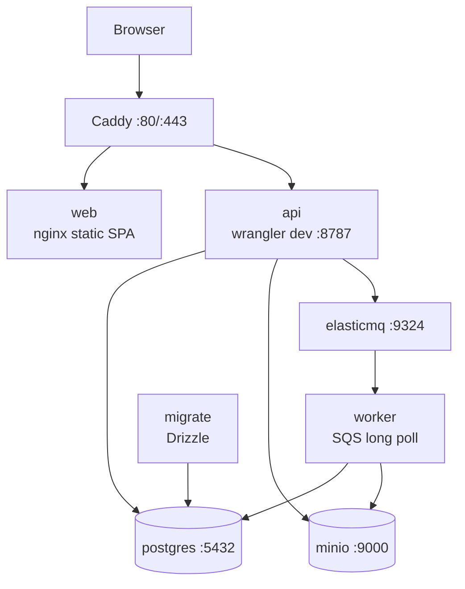
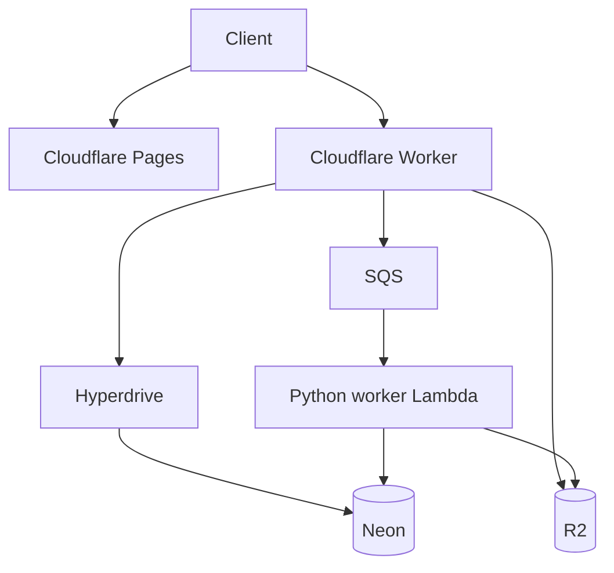

# デプロイメント図

## ローカル Docker Compose

```mermaid
flowchart TB
    Browser --> Gateway[Caddy :80/:443]
    Gateway --> Web[web<br/>nginx static SPA]
    Gateway --> API[api<br/>wrangler dev :8787]
    API --> DB[(postgres :5432)]
    API --> Object[(minio :9000)]
    API --> Queue[elasticmq :9324]
    Queue --> Worker[worker<br/>SQS long poll]
    Worker --> DB
    Worker --> Object
    Migrate[migrate<br/>Drizzle] --> DB
```

`migrate` が完了してから API と worker が起動します。`web-dev` profile は
Vite HMR を追加しますが、API・DB・queue の構成は変わりません。

## 本番

```mermaid
flowchart TB
    Client --> Pages[Cloudflare Pages]
    Client --> API[Cloudflare Worker]
    API --> HD[Hyperdrive] --> Neon[(Neon)]
    API --> R2[(R2)]
    API --> SQS[SQS]
    SQS --> Lambda[Python worker Lambda]
    Lambda --> Neon
    Lambda --> R2
```

## デプロイ単位

| 対象 | 方法 |
|---|---|
| frontend | Cloudflare Pages の Git 連携 |
| API | `cd apps/api && npm run deploy` |
| DB | `DATABASE_URL=... npm run db:migrate` |
| worker | container image を ECR へ push し Lambda image を更新 |
| Cloudflare binding | Wrangler / Cloudflare dashboard |
| AWS worker infrastructure | Terraform |

詳細は [`infra/DEPLOY.md`](../../infra/DEPLOY.md) を参照してください。
