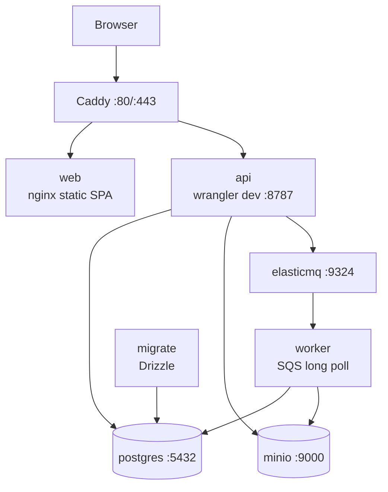
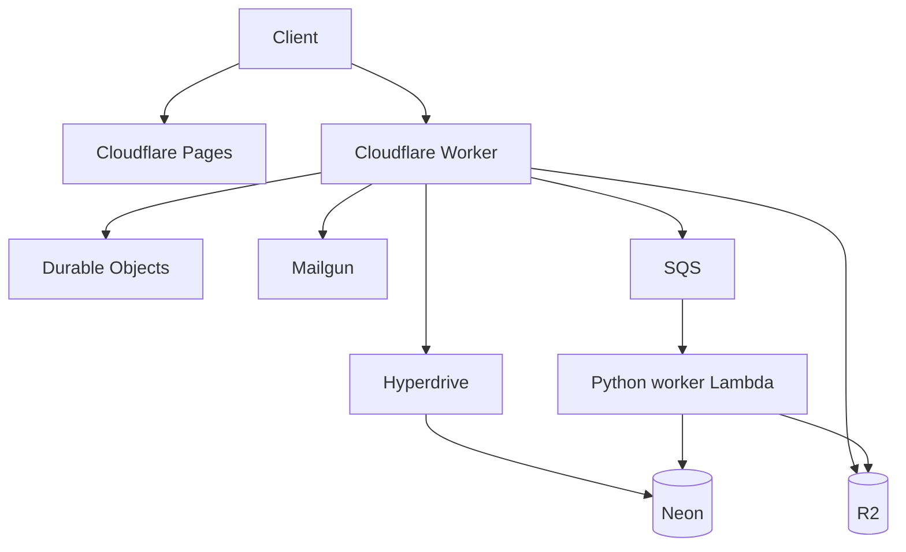

# Runtime environments and deployment units

This reference maps local services to their production counterparts.
New contributors should start with [Run the development environment](../getting-started/local-setup.md).
For production changes, check both this layout and the operational guide linked below.

## Local Docker Compose

```mermaid
flowchart TB
    Browser --> Gateway[Caddy :80/:443]
    Gateway --> Web[web<br/>nginx static SPA]
    Gateway --> API[api<br/>wrangler dev :8787]
    API --> DB[(postgres :5432)]
    API --> Object[(minio :9000)]
    API --> Queue[elasticmq :9324]
    Queue --> Worker[worker<br/>SQS long poll]
    Worker --> DB
    Worker --> Object
    Migrate[migrate<br/>Drizzle] --> DB
```

The API and worker start after `migrate` completes. The `web-dev` profile adds
Vite HMR without changing the API, database, or queue setup.

## Production

```mermaid
flowchart TB
    Client --> Pages[Cloudflare Pages]
    Client --> API[Cloudflare Worker]
    API --> HD[Hyperdrive] --> Neon[(Neon)]
    API --> R2[(R2)]
    API --> DO[Durable Objects]
    API --> Mailgun[Mailgun]
    API --> SQS[SQS]
    SQS --> Lambda[Python worker Lambda]
    Lambda --> Neon
    Lambda --> R2
```

## Deployment units

| Target | Method |
|---|---|
| Frontend | Cloudflare Pages Git integration |
| API | `cd apps/api && npm run deploy` |
| Database | `DATABASE_URL=... npm run db:migrate` |
| Worker | Push a container image to ECR and update the Lambda image |
| Cloudflare bindings | Wrangler (`wrangler.jsonc`) |
| Hyperdrive cache / R2 CORS | `cloudflare-resources.yml` with manual approval |
| AWS worker infrastructure | Terraform |
| Documentation | GitHub Actions CD publishes both languages to Cloudflare Worker `videoq-docs` after relevant changes reach `main` and CI succeeds |

These commands are entry points for each task. Also check the steps and ordering in `.github/workflows/cd.yml`
for the production API, worker, and database. Publishing code that uses a new column before migrating
can cause failures against the old database.

See [`infra/DEPLOY.md`](https://github.com/yukiharada1228/videoq/blob/main/infra/DEPLOY.md) for details.
The documentation site uses a dedicated Worker at [docs.videoq.jp](https://docs.videoq.jp/), with Japanese at [/ja/](https://docs.videoq.jp/ja/). Changes to the documentation, translations, or site configuration are published automatically after CI succeeds on `main`. You can also publish the current working tree manually with `npm run deploy:docs`. See the [docs deployment instructions](https://github.com/yukiharada1228/videoq/blob/main/apps/docs/README.md).
