# シーケンス図

## 概要

VideoQシステムの主要な処理フローを示す図です。

## 1. 動画アップロードと文字起こし処理

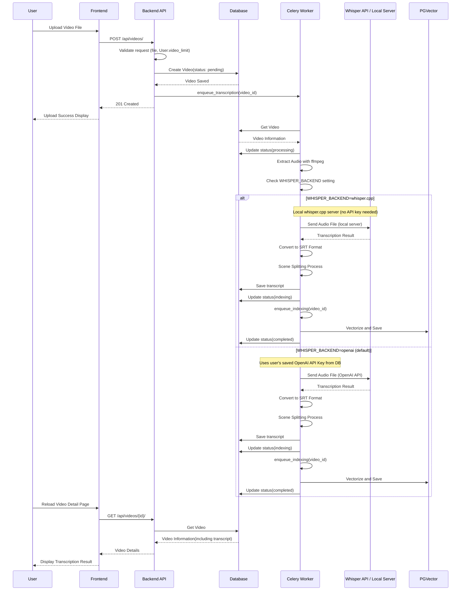
```mermaid
sequenceDiagram
    participant User as User
    participant Frontend as Frontend
    participant Backend as Backend API
    participant DB as Database
    participant Celery as Celery Worker
    participant Whisper as Whisper API / Local Server
    participant PGVector as PGVector

    User->>Frontend: Upload Video File
    Frontend->>Backend: POST /api/videos/
    Backend->>Backend: Validate request (file, User.video_limit)
    Backend->>DB: Create Video(status: pending)
    DB-->>Backend: Video Saved
    Backend->>Celery: enqueue_transcription(video_id)
    Backend-->>Frontend: 201 Created
    Frontend-->>User: Upload Success Display

    Celery->>DB: Get Video
    DB-->>Celery: Video Information
    Celery->>DB: Update status(processing)
    Celery->>Celery: Extract Audio with ffmpeg
    Celery->>Celery: Check WHISPER_BACKEND setting
    alt WHISPER_BACKEND=whisper.cpp
        Note over Celery,Whisper: Local whisper.cpp server (no API key needed)
        Celery->>Whisper: Send Audio File (local server)
        Whisper-->>Celery: Transcription Result
        Celery->>Celery: Convert to SRT Format
        Celery->>Celery: Scene Splitting Process
        Celery->>DB: Save transcript
        Celery->>DB: Update status(indexing)
        Celery->>Celery: enqueue_indexing(video_id)
        Celery->>PGVector: Vectorize and Save
        Celery->>DB: Update status(completed)
    else WHISPER_BACKEND=openai (default)
        Note over Celery: Uses user's saved OpenAI API Key from DB
        Celery->>Whisper: Send Audio File (OpenAI API)
        Whisper-->>Celery: Transcription Result
        Celery->>Celery: Convert to SRT Format
        Celery->>Celery: Scene Splitting Process
        Celery->>DB: Save transcript
        Celery->>DB: Update status(indexing)
        Celery->>Celery: enqueue_indexing(video_id)
        Celery->>PGVector: Vectorize and Save
        Celery->>DB: Update status(completed)
    end
    
    User->>Frontend: Reload Video Detail Page
    Frontend->>Backend: GET /api/videos/{id}/
    Backend->>DB: Get Video
    DB-->>Backend: Video Information(including transcript)
    Backend-->>Frontend: Video Details
    Frontend-->>User: Display Transcription Result
```

## 2. チャット処理（RAG）

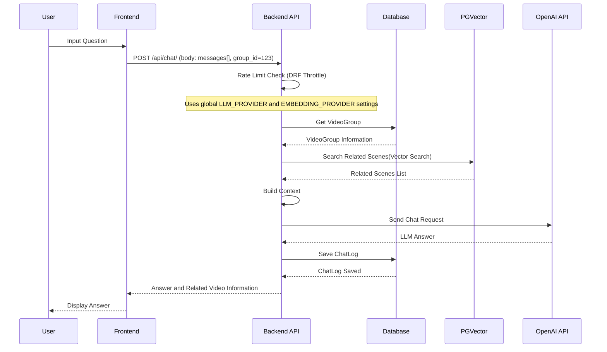
```mermaid
sequenceDiagram
    participant User as User
    participant Frontend as Frontend
    participant Backend as Backend API
    participant DB as Database
    participant PGVector as PGVector
    participant OpenAI as OpenAI API

    User->>Frontend: Input Question
    Frontend->>Backend: POST /api/chat/ (body: messages[], group_id=123)
    Backend->>Backend: Rate Limit Check (DRF Throttle)
    Note over Backend: Uses global LLM_PROVIDER and EMBEDDING_PROVIDER settings
    Backend->>DB: Get VideoGroup
    DB-->>Backend: VideoGroup Information
    Backend->>PGVector: Search Related Scenes(Vector Search)
    PGVector-->>Backend: Related Scenes List
    Backend->>Backend: Build Context
    Backend->>OpenAI: Send Chat Request
    OpenAI-->>Backend: LLM Answer
    Backend->>DB: Save ChatLog
    DB-->>Backend: ChatLog Saved
    Backend-->>Frontend: Answer and Related Video Information
    Frontend-->>User: Display Answer
```

## 3. ユーザー認証フロー

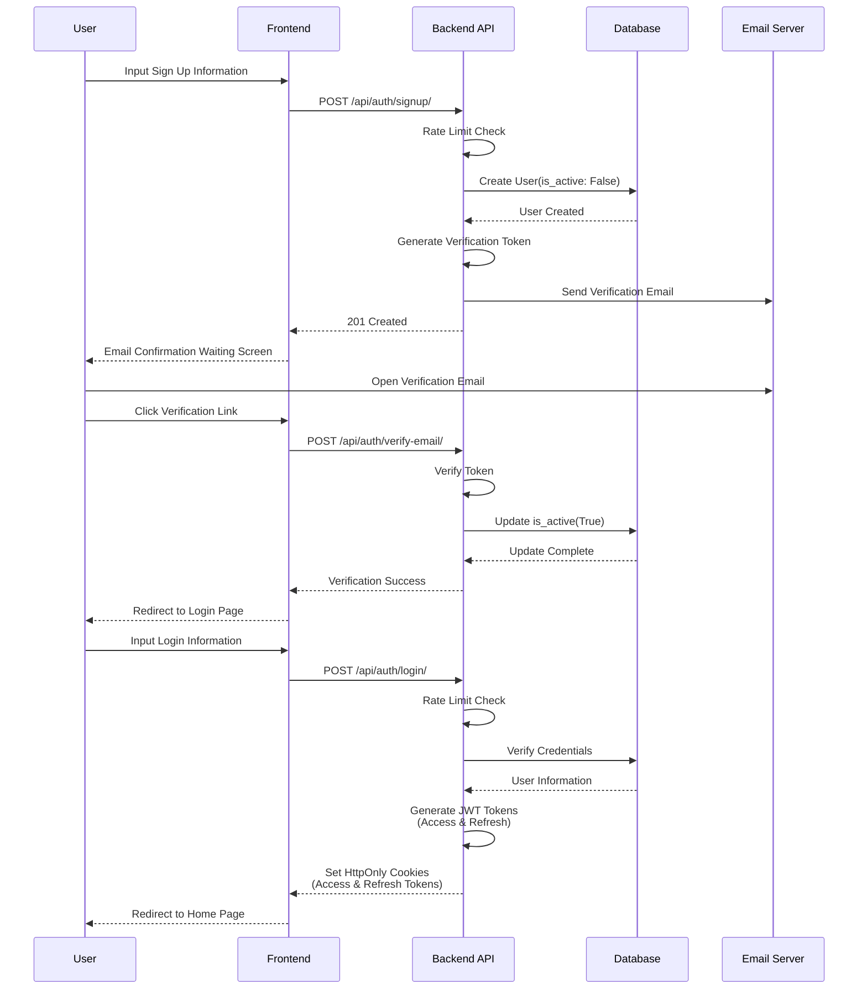
```mermaid
sequenceDiagram
    participant User as User
    participant Frontend as Frontend
    participant Backend as Backend API
    participant DB as Database
    participant Email as Email Server

    User->>Frontend: Input Sign Up Information
    Frontend->>Backend: POST /api/auth/signup/
    Backend->>Backend: Rate Limit Check
    Backend->>DB: Create User(is_active: False)
    DB-->>Backend: User Created
    Backend->>Backend: Generate Verification Token
    Backend->>Email: Send Verification Email
    Backend-->>Frontend: 201 Created
    Frontend-->>User: Email Confirmation Waiting Screen
    
    User->>Email: Open Verification Email
    User->>Frontend: Click Verification Link
    Frontend->>Backend: POST /api/auth/verify-email/
    Backend->>Backend: Verify Token
    Backend->>DB: Update is_active(True)
    DB-->>Backend: Update Complete
    Backend-->>Frontend: Verification Success
    Frontend-->>User: Redirect to Login Page
    
    User->>Frontend: Input Login Information
    Frontend->>Backend: POST /api/auth/login/
    Backend->>Backend: Rate Limit Check
    Backend->>DB: Verify Credentials
    DB-->>Backend: User Information
    Backend->>Backend: Generate JWT Tokens<br/>(Access & Refresh)
    Backend-->>Frontend: Set HttpOnly Cookies<br/>(Access & Refresh Tokens)
    Frontend-->>User: Redirect to Home Page
```

## 4. グループ共有フロー

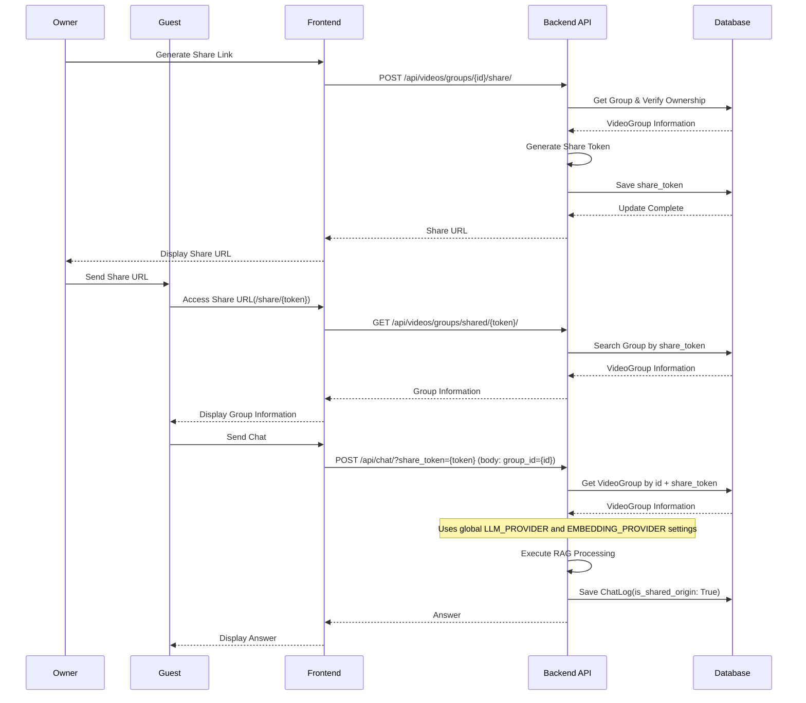
```mermaid
sequenceDiagram
    participant Owner as Owner
    participant Guest as Guest
    participant Frontend as Frontend
    participant Backend as Backend API
    participant DB as Database

    Owner->>Frontend: Generate Share Link
    Frontend->>Backend: POST /api/videos/groups/{id}/share/
    Backend->>DB: Get Group & Verify Ownership
    DB-->>Backend: VideoGroup Information
    Backend->>Backend: Generate Share Token
    Backend->>DB: Save share_token
    DB-->>Backend: Update Complete
    Backend-->>Frontend: Share URL
    Frontend-->>Owner: Display Share URL
    
    Owner->>Guest: Send Share URL
    Guest->>Frontend: Access Share URL(/share/{token})
    Frontend->>Backend: GET /api/videos/groups/shared/{token}/
    Backend->>DB: Search Group by share_token
    DB-->>Backend: VideoGroup Information
    Backend-->>Frontend: Group Information
    Frontend-->>Guest: Display Group Information
    
    Guest->>Frontend: Send Chat
    Frontend->>Backend: POST /api/chat/?share_token={token} (body: group_id={id})
    Backend->>DB: Get VideoGroup by id + share_token
    DB-->>Backend: VideoGroup Information
    Note over Backend: Uses global LLM_PROVIDER and EMBEDDING_PROVIDER settings
    Backend->>Backend: Execute RAG Processing
    Backend->>DB: Save ChatLog(is_shared_origin: True)
    Backend-->>Frontend: Answer
    Frontend-->>Guest: Display Answer
```

## 5. 動画グループ管理

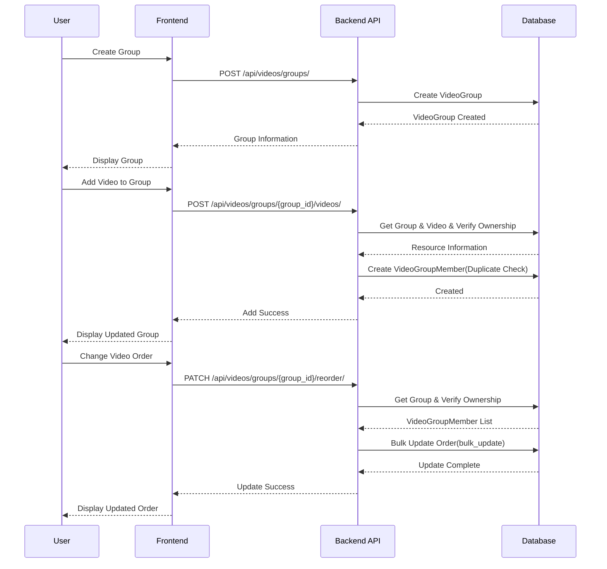
```mermaid
sequenceDiagram
    participant User as User
    participant Frontend as Frontend
    participant Backend as Backend API
    participant DB as Database

    User->>Frontend: Create Group
    Frontend->>Backend: POST /api/videos/groups/
    Backend->>DB: Create VideoGroup
    DB-->>Backend: VideoGroup Created
    Backend-->>Frontend: Group Information
    Frontend-->>User: Display Group
    
    User->>Frontend: Add Video to Group
    Frontend->>Backend: POST /api/videos/groups/{group_id}/videos/
    Backend->>DB: Get Group & Video & Verify Ownership
    DB-->>Backend: Resource Information
    Backend->>DB: Create VideoGroupMember(Duplicate Check)
    DB-->>Backend: Created
    Backend-->>Frontend: Add Success
    Frontend-->>User: Display Updated Group
    
    User->>Frontend: Change Video Order
    Frontend->>Backend: PATCH /api/videos/groups/{group_id}/reorder/
    Backend->>DB: Get Group & Verify Ownership
    DB-->>Backend: VideoGroupMember List
    Backend->>DB: Bulk Update Order(bulk_update)
    DB-->>Backend: Update Complete
    Backend-->>Frontend: Update Success
    Frontend-->>User: Display Updated Order
```

## 6. パスワードリセットフロー

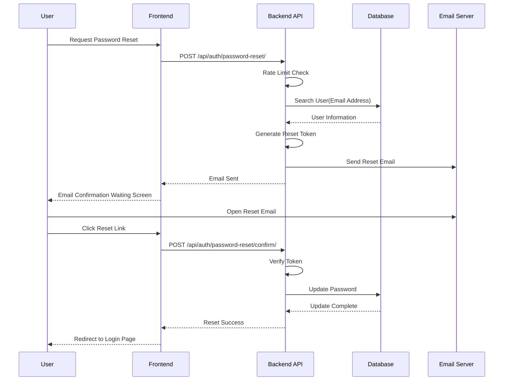
```mermaid
sequenceDiagram
    participant User as User
    participant Frontend as Frontend
    participant Backend as Backend API
    participant DB as Database
    participant Email as Email Server

    User->>Frontend: Request Password Reset
    Frontend->>Backend: POST /api/auth/password-reset/
    Backend->>Backend: Rate Limit Check
    Backend->>DB: Search User(Email Address)
    DB-->>Backend: User Information
    Backend->>Backend: Generate Reset Token
    Backend->>Email: Send Reset Email
    Backend-->>Frontend: Email Sent
    Frontend-->>User: Email Confirmation Waiting Screen
    
    User->>Email: Open Reset Email
    User->>Frontend: Click Reset Link
    Frontend->>Backend: POST /api/auth/password-reset/confirm/
    Backend->>Backend: Verify Token
    Backend->>DB: Update Password
    DB-->>Backend: Update Complete
    Backend-->>Frontend: Reset Success
    Frontend-->>User: Redirect to Login Page
```

## 7. 動画エンベディング再インデックス（管理者）

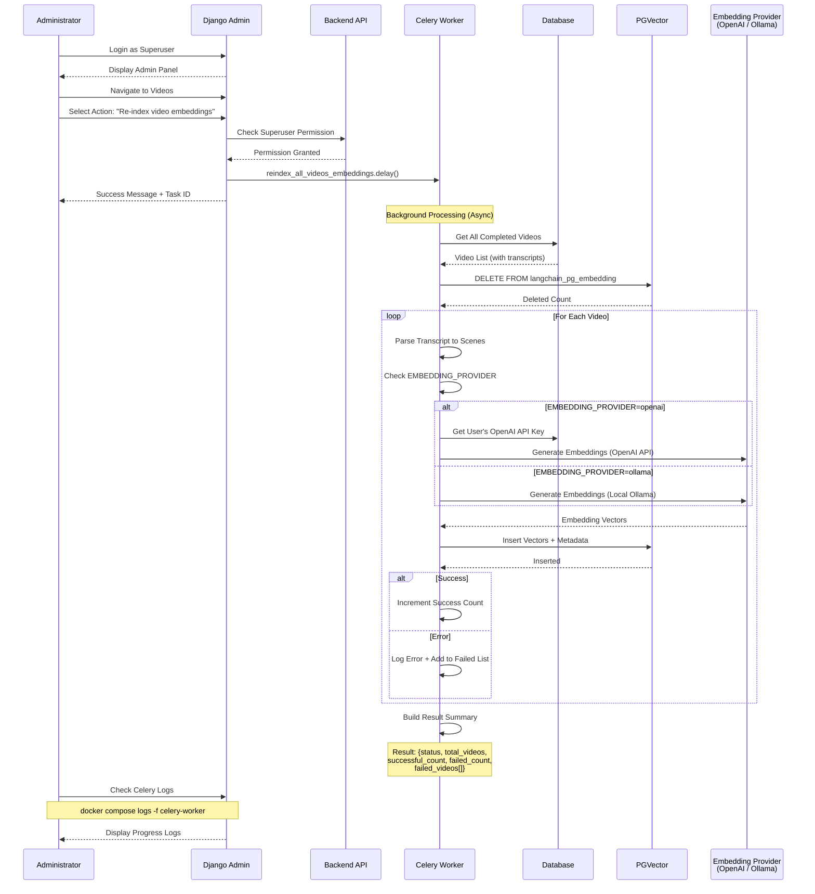
```mermaid
sequenceDiagram
    participant Admin as Administrator
    participant DjangoAdmin as Django Admin
    participant Backend as Backend API
    participant Celery as Celery Worker
    participant DB as Database
    participant PGVector as PGVector
    participant Embeddings as Embedding Provider<br/>(OpenAI / Ollama)

    Admin->>DjangoAdmin: Login as Superuser
    DjangoAdmin-->>Admin: Display Admin Panel

    Admin->>DjangoAdmin: Navigate to Videos
    Admin->>DjangoAdmin: Select Action: "Re-index video embeddings"
    DjangoAdmin->>Backend: Check Superuser Permission
    Backend-->>DjangoAdmin: Permission Granted

    DjangoAdmin->>Celery: reindex_all_videos_embeddings.delay()
    DjangoAdmin-->>Admin: Success Message + Task ID

    Note over Celery: Background Processing (Async)

    Celery->>DB: Get All Completed Videos
    DB-->>Celery: Video List (with transcripts)

    Celery->>PGVector: DELETE FROM langchain_pg_embedding
    PGVector-->>Celery: Deleted Count

    loop For Each Video
        Celery->>Celery: Parse Transcript to Scenes
        Celery->>Celery: Check EMBEDDING_PROVIDER

        alt EMBEDDING_PROVIDER=openai
            Celery->>DB: Get User's OpenAI API Key
            Celery->>Embeddings: Generate Embeddings (OpenAI API)
        else EMBEDDING_PROVIDER=ollama
            Celery->>Embeddings: Generate Embeddings (Local Ollama)
        end

        Embeddings-->>Celery: Embedding Vectors
        Celery->>PGVector: Insert Vectors + Metadata
        PGVector-->>Celery: Inserted

        alt Success
            Celery->>Celery: Increment Success Count
        else Error
            Celery->>Celery: Log Error + Add to Failed List
        end
    end

    Celery->>Celery: Build Result Summary
    Note over Celery: Result: {status, total_videos,<br/>successful_count, failed_count,<br/>failed_videos[]}

    Admin->>DjangoAdmin: Check Celery Logs
    Note over Admin,DjangoAdmin: docker compose logs -f celery-worker
    DjangoAdmin-->>Admin: Display Progress Logs
```

## 8. アカウント無効化フロー

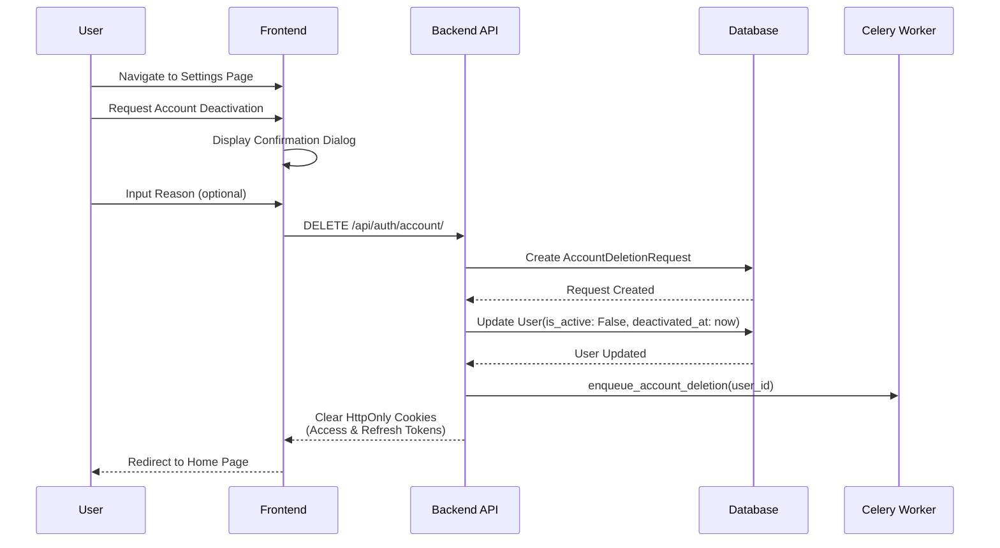
```mermaid
sequenceDiagram
    participant User as User
    participant Frontend as Frontend
    participant Backend as Backend API
    participant DB as Database
    participant Celery as Celery Worker

    User->>Frontend: Navigate to Settings Page
    User->>Frontend: Request Account Deactivation
    Frontend->>Frontend: Display Confirmation Dialog
    User->>Frontend: Input Reason (optional)
    Frontend->>Backend: DELETE /api/auth/account/
    Backend->>DB: Create AccountDeletionRequest
    DB-->>Backend: Request Created
    Backend->>DB: Update User(is_active: False, deactivated_at: now)
    DB-->>Backend: User Updated
    Backend->>Celery: enqueue_account_deletion(user_id)
    Backend-->>Frontend: Clear HttpOnly Cookies<br/>(Access & Refresh Tokens)
    Frontend-->>User: Redirect to Home Page
```

## 9. APIキー管理フロー

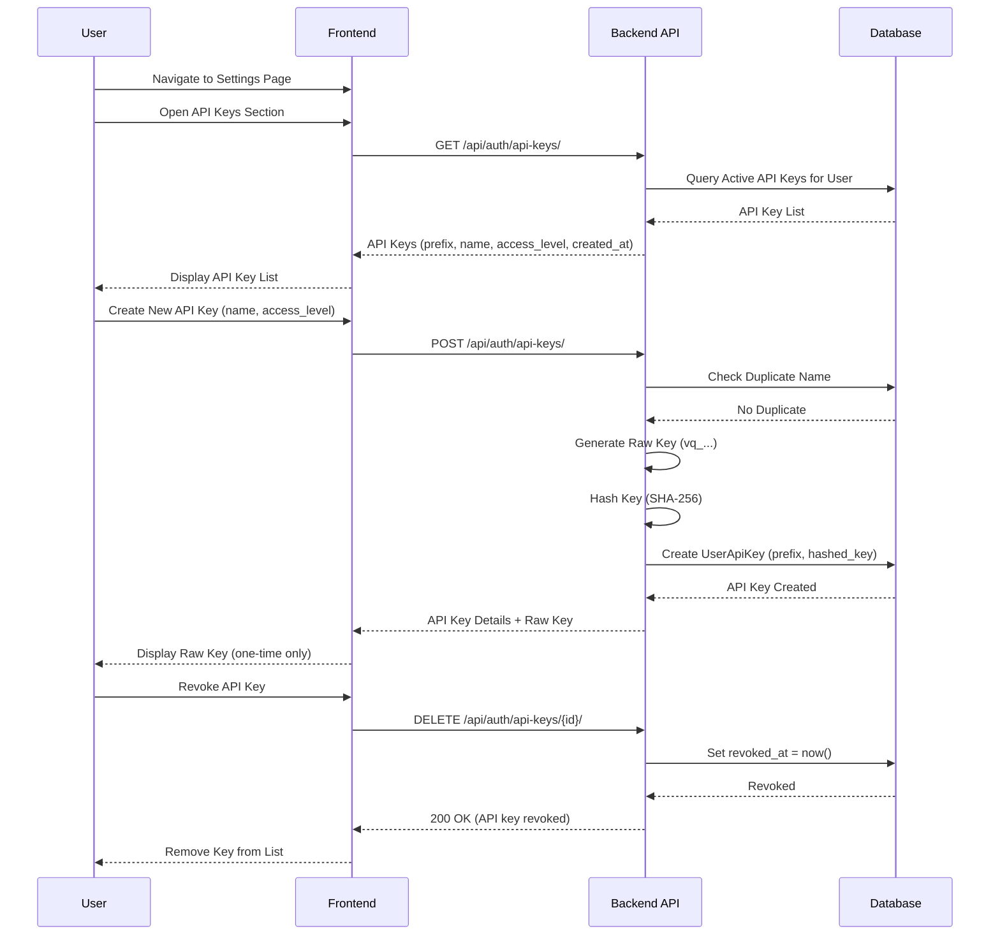
```mermaid
sequenceDiagram
    participant User as User
    participant Frontend as Frontend
    participant Backend as Backend API
    participant DB as Database

    User->>Frontend: Navigate to Settings Page
    User->>Frontend: Open API Keys Section

    %% List API Keys
    Frontend->>Backend: GET /api/auth/api-keys/
    Backend->>DB: Query Active API Keys for User
    DB-->>Backend: API Key List
    Backend-->>Frontend: API Keys (prefix, name, access_level, created_at)
    Frontend-->>User: Display API Key List

    %% Create API Key
    User->>Frontend: Create New API Key (name, access_level)
    Frontend->>Backend: POST /api/auth/api-keys/
    Backend->>DB: Check Duplicate Name
    DB-->>Backend: No Duplicate
    Backend->>Backend: Generate Raw Key (vq_...)
    Backend->>Backend: Hash Key (SHA-256)
    Backend->>DB: Create UserApiKey (prefix, hashed_key)
    DB-->>Backend: API Key Created
    Backend-->>Frontend: API Key Details + Raw Key
    Frontend-->>User: Display Raw Key (one-time only)

    %% Revoke API Key
    User->>Frontend: Revoke API Key
    Frontend->>Backend: DELETE /api/auth/api-keys/{id}/
    Backend->>DB: Set revoked_at = now()
    DB-->>Backend: Revoked
    Backend-->>Frontend: 200 OK (API key revoked)
    Frontend-->>User: Remove Key from List
```

## 10. APIキー認証フロー

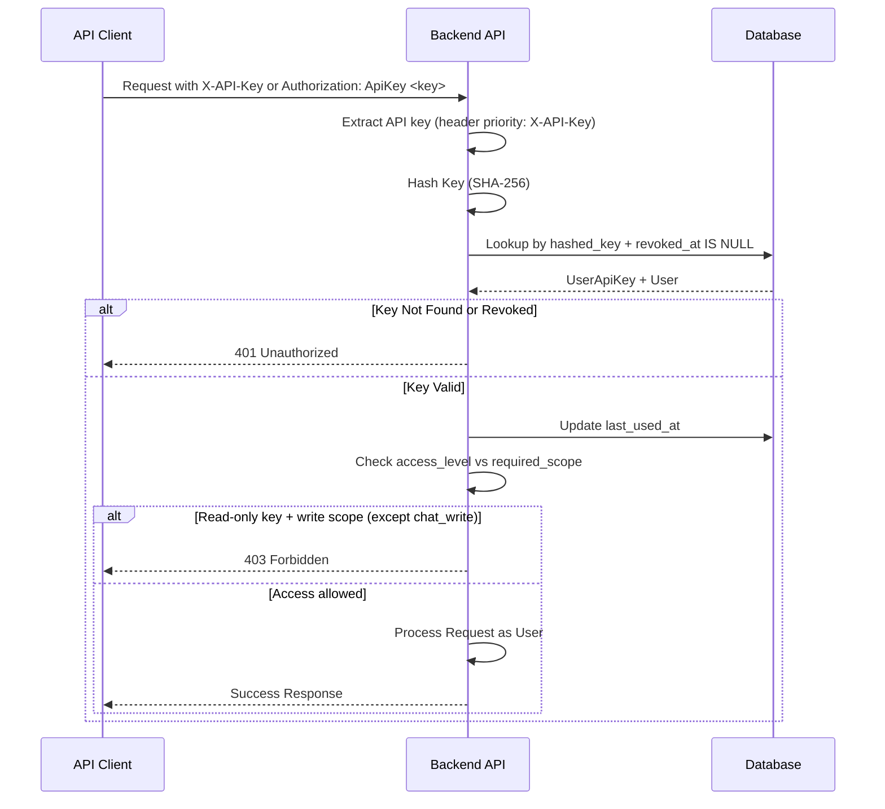
```mermaid
sequenceDiagram
    participant Client as API Client
    participant Backend as Backend API
    participant DB as Database

    Client->>Backend: Request with X-API-Key or Authorization: ApiKey <key>
    Backend->>Backend: Extract API key (header priority: X-API-Key)
    Backend->>Backend: Hash Key (SHA-256)
    Backend->>DB: Lookup by hashed_key + revoked_at IS NULL
    DB-->>Backend: UserApiKey + User

    alt Key Not Found or Revoked
        Backend-->>Client: 401 Unauthorized
    else Key Valid
        Backend->>DB: Update last_used_at
        Backend->>Backend: Check access_level vs required_scope
        alt Read-only key + write scope (except chat_write)
            Backend-->>Client: 403 Forbidden
        else Access allowed
            Backend->>Backend: Process Request as User
            Backend-->>Client: Success Response
        end
    end
```

## 11. チャット分析・フィードバックフロー

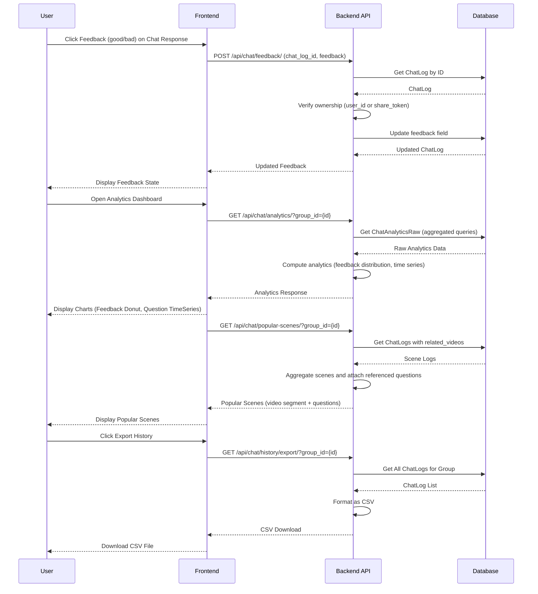
```mermaid
sequenceDiagram
    participant User as User
    participant Frontend as Frontend
    participant Backend as Backend API
    participant DB as Database

    %% Submit Feedback
    User->>Frontend: Click Feedback (good/bad) on Chat Response
    Frontend->>Backend: POST /api/chat/feedback/ (chat_log_id, feedback)
    Backend->>DB: Get ChatLog by ID
    DB-->>Backend: ChatLog
    Backend->>Backend: Verify ownership (user_id or share_token)
    Backend->>DB: Update feedback field
    DB-->>Backend: Updated ChatLog
    Backend-->>Frontend: Updated Feedback
    Frontend-->>User: Display Feedback State

    %% View Analytics
    User->>Frontend: Open Analytics Dashboard
    Frontend->>Backend: GET /api/chat/analytics/?group_id={id}
    Backend->>DB: Get ChatAnalyticsRaw (aggregated queries)
    DB-->>Backend: Raw Analytics Data
    Backend->>Backend: Compute analytics (feedback distribution, time series)
    Backend-->>Frontend: Analytics Response
    Frontend-->>User: Display Charts (Feedback Donut, Question TimeSeries)

    %% View Popular Scenes
    Frontend->>Backend: GET /api/chat/popular-scenes/?group_id={id}
    Backend->>DB: Get ChatLogs with related_videos
    DB-->>Backend: Scene Logs
    Backend->>Backend: Aggregate scenes and attach referenced questions
    Backend-->>Frontend: Popular Scenes (video segment + questions)
    Frontend-->>User: Display Popular Scenes

    %% Export History
    User->>Frontend: Click Export History
    Frontend->>Backend: GET /api/chat/history/export/?group_id={id}
    Backend->>DB: Get All ChatLogs for Group
    DB-->>Backend: ChatLog List
    Backend->>Backend: Format as CSV
    Backend-->>Frontend: CSV Download
    Frontend-->>User: Download CSV File
```

---

## Related Documentation

- [📖 ドキュメント一覧](../README.md)
- [フローチャート](../architecture/flowchart.md) — 処理フローの概要
- [データフロー図](../database/data-flow-diagram.md) — データの流れ
- [アクティビティ図](../requirements/activity-diagram.md) — 業務フロー
- [状態遷移図](state-diagram.md) — 状態遷移の詳細
