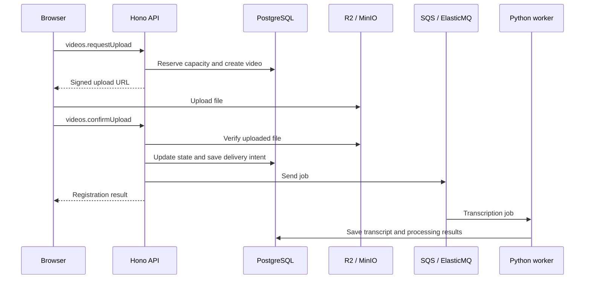
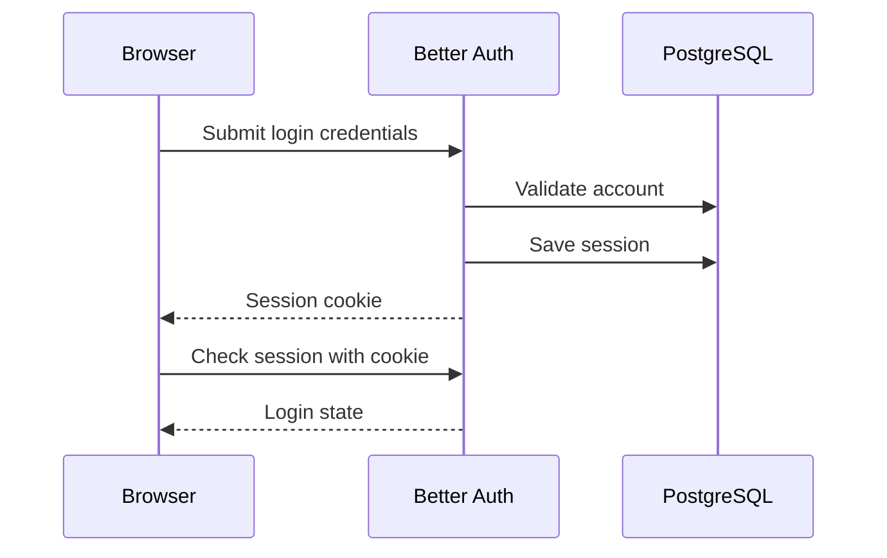
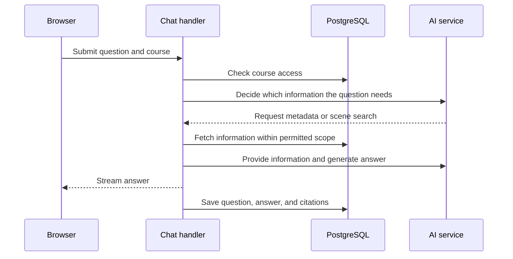

# Key request sequences

Time moves from top to bottom. Vertical lines represent participants; arrows represent calls or responses. Use these diagrams when following network logs or API code.

## File upload

```mermaid
sequenceDiagram
    participant User as Browser
    participant API as Hono API
    participant DB as PostgreSQL
    participant Store as R2 / MinIO
    participant Queue as SQS / ElasticMQ
    participant Worker as Python worker
    User->>API: videos.requestUpload
    API->>DB: Reserve capacity and create video
    API-->>User: Signed upload URL
    User->>Store: Upload file
    User->>API: videos.confirmUpload
    API->>Store: Verify uploaded file
    API->>DB: Update state and save delivery intent
    API->>Queue: Send job
    API-->>User: Registration result
    Queue->>Worker: Transcription job
    Worker->>DB: Save transcript and processing results
```

The API's registration response and video processing completion are separate events. See [state transitions](state-diagram.md) for subsequent indexing and PLOG generation.

## Browser login

```mermaid
sequenceDiagram
    participant User as Browser
    participant Auth as Better Auth
    participant DB as PostgreSQL
    User->>Auth: Submit login credentials
    Auth->>DB: Validate account
    Auth->>DB: Save session
    Auth-->>User: Session cookie
    User->>Auth: Check session with cookie
    Auth-->>User: Login state
```

Better Auth runs at the API's `/api/auth/*`. This is separate from issuing and refreshing OAuth tokens for MCP.

## Asking about a course

```mermaid
sequenceDiagram
    participant User as Browser
    participant API as Chat handler
    participant DB as PostgreSQL
    participant AI as AI service
    User->>API: Submit question and course
    API->>DB: Check course access
    API->>AI: Decide which information the question needs
    AI-->>API: Request metadata or scene search
    API->>DB: Fetch information within permitted scope
    API->>AI: Provide information and generate answer
    API-->>User: Stream answer
    API->>DB: Save question, answer, and citations
```

Information retrieval repeats as needed. This is a Q&A overview; there are also metadata-only paths and non-streaming responses.

**Related:** [Authentication and access control](../concepts/auth.md), [Prompt design](../architecture/prompt-engineering.md).
