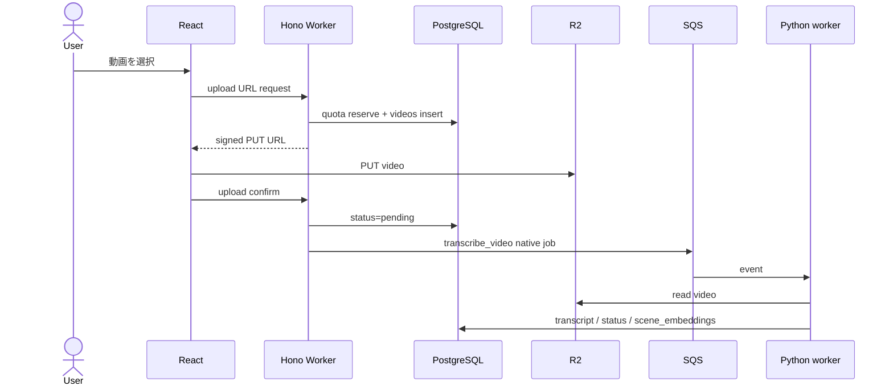
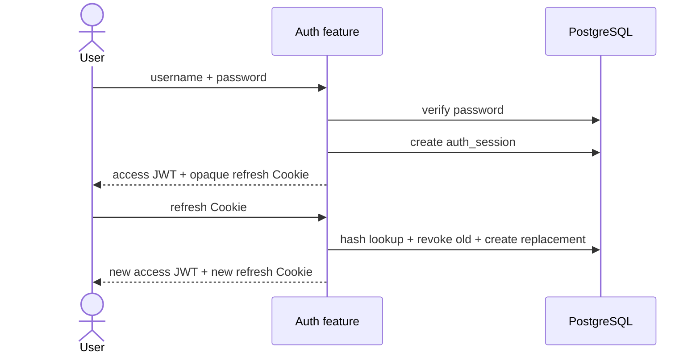
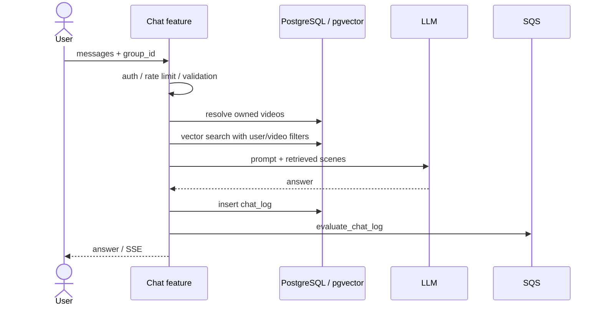

# シーケンス図

## 動画 upload

```mermaid
sequenceDiagram
    actor User
    participant UI as React
    participant API as Hono Worker
    participant DB as PostgreSQL
    participant R2
    participant SQS
    participant Worker as Python worker

    User->>UI: 動画を選択
    UI->>API: upload URL request
    API->>DB: quota reserve + videos insert
    API-->>UI: signed PUT URL
    UI->>R2: PUT video
    UI->>API: upload confirm
    API->>DB: status=pending
    API->>SQS: transcribe_video native job
    SQS->>Worker: event
    Worker->>R2: read video
    Worker->>DB: transcript / status / scene_embeddings
```

## Login と refresh rotation

```mermaid
sequenceDiagram
    actor User
    participant API as Auth feature
    participant DB as PostgreSQL

    User->>API: username + password
    API->>DB: verify password
    API->>DB: create auth_session
    API-->>User: access JWT + opaque refresh Cookie
    User->>API: refresh Cookie
    API->>DB: hash lookup + revoke old + create replacement
    API-->>User: new access JWT + new refresh Cookie
```

## RAG chat

```mermaid
sequenceDiagram
    actor User
    participant API as Chat feature
    participant DB as PostgreSQL / pgvector
    participant LLM
    participant SQS

    User->>API: messages + group_id
    API->>API: auth / rate limit / validation
    API->>DB: resolve owned videos
    API->>DB: vector search with user/video filters
    API->>LLM: prompt + retrieved scenes
    LLM-->>API: answer
    API->>DB: insert chat_log
    API->>SQS: evaluate_chat_log
    API-->>User: answer / SSE
```
