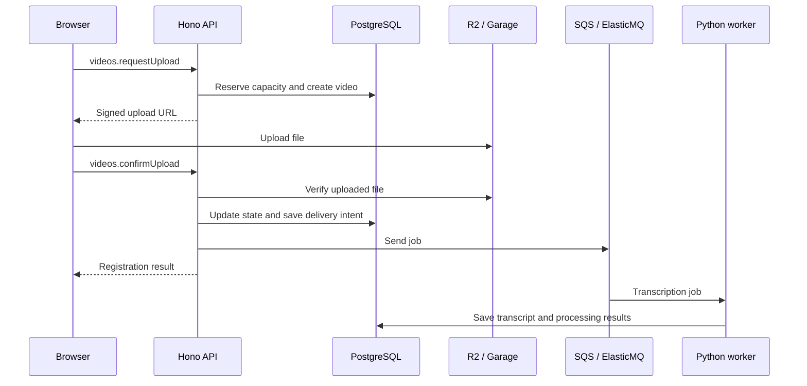
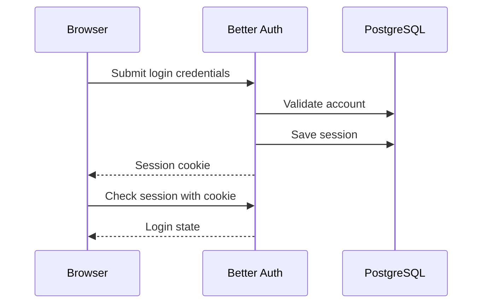
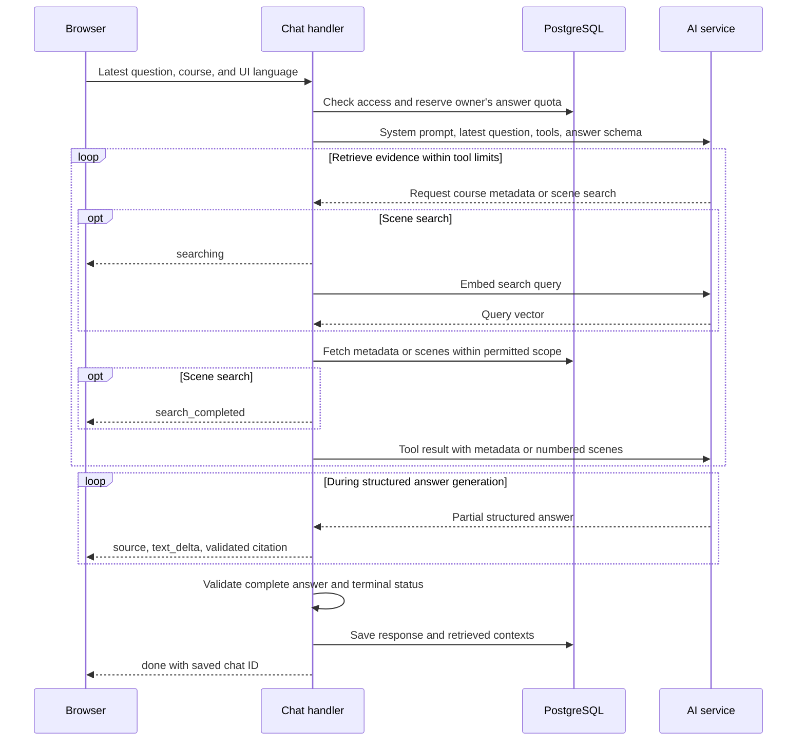

# Key request sequences

Time moves from top to bottom. Vertical lines represent participants; arrows represent calls or responses. Use these diagrams when following network logs or API code.

## File upload

```mermaid
sequenceDiagram
    participant User as Browser
    participant API as Hono API
    participant DB as PostgreSQL
    participant Store as R2 / Garage
    participant Queue as SQS / ElasticMQ
    participant Worker as Python worker
    User->>API: videos.requestUpload
    API->>DB: Reserve capacity and create video
    API-->>User: Signed upload URL
    User->>Store: Upload file
    User->>API: videos.confirmUpload
    API->>Store: Verify uploaded file
    API->>DB: Update state and save delivery intent
    API->>Queue: Send job
    API-->>User: Registration result
    Queue->>Worker: Transcription job
    Worker->>DB: Save transcript and processing results
```

The API's registration response and video processing completion are separate events. See [state transitions](state-diagram.md) for subsequent indexing.

## Browser login

```mermaid
sequenceDiagram
    participant User as Browser
    participant Auth as Better Auth
    participant DB as PostgreSQL
    User->>Auth: Submit login credentials
    Auth->>DB: Validate account
    Auth->>DB: Save session
    Auth-->>User: Session cookie
    User->>Auth: Check session with cookie
    Auth-->>User: Login state
```

Better Auth runs at the API's `/api/auth/*`. This is separate from issuing and refreshing OAuth tokens for MCP.

## Asking about a course

```mermaid
sequenceDiagram
    participant User as Browser
    participant API as Chat handler
    participant DB as PostgreSQL
    participant AI as AI service
    User->>API: Latest question, course, and UI language
    API->>DB: Check access and reserve owner's answer quota
    API->>AI: System prompt, latest question, tools, answer schema
    loop Retrieve evidence within tool limits
        AI-->>API: Request course metadata or scene search
        opt Scene search
            API-->>User: searching
            API->>AI: Embed search query
            AI-->>API: Query vector
        end
        API->>DB: Fetch metadata or scenes within permitted scope
        opt Scene search
            API-->>User: search_completed
        end
        API->>AI: Tool result with metadata or numbered scenes
    end
    loop During structured answer generation
        AI-->>API: Partial structured answer
        API-->>User: source, text_delta, validated citation
    end
    API->>API: Validate complete answer and terminal status
    API->>DB: Save response and retrieved contexts
    API-->>User: done with saved chat ID
```

Text and citations can arrive before generation finishes; `done` follows answer persistence. The browser applies queued content on animation frames and enables feedback after completion. Metadata-only answers skip scene embeddings and have no scene citations. Non-streaming `chat.send` returns the same structured answer after saving. Without a course, the response has no tools or course history record.

**Related:** [Authentication and access control](../concepts/auth.md), [Prompt design](../architecture/prompt-engineering.md).
