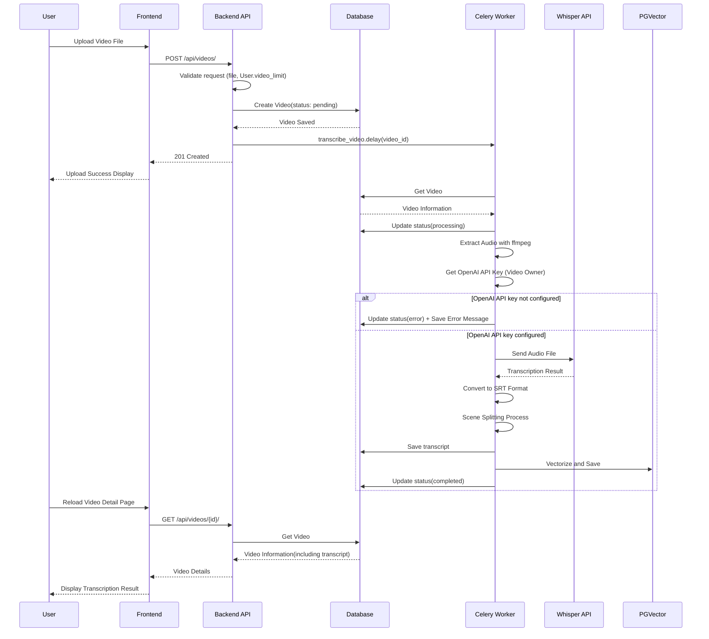
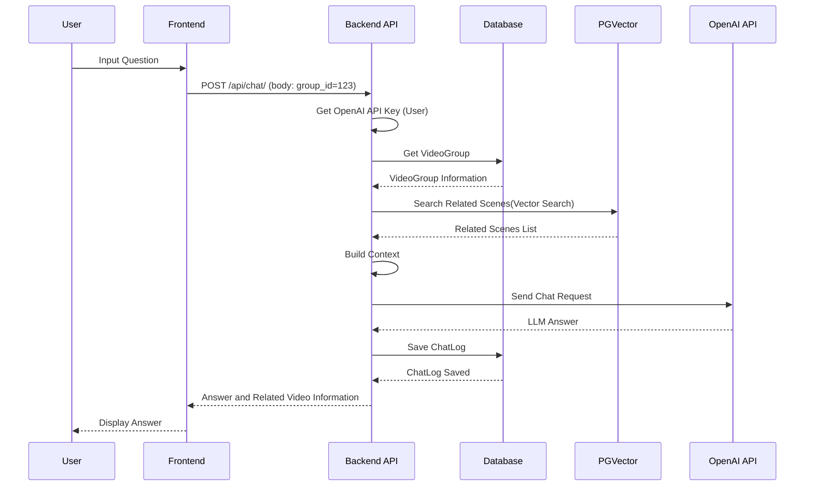
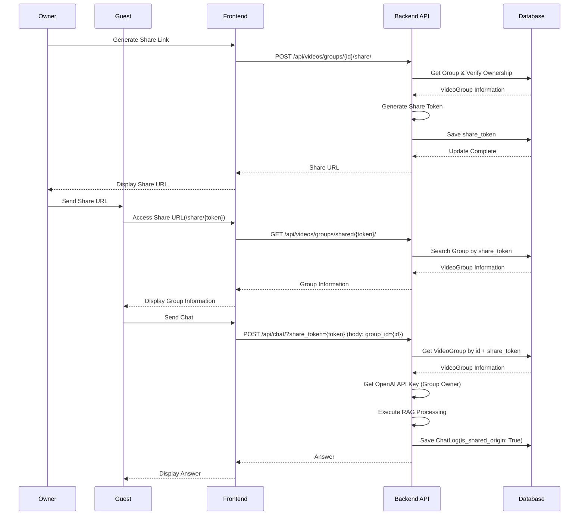

# Sequence Diagram

## Overview

This diagram represents the main processing flows of the VideoQ system.

## 1. Video Upload and Transcription Processing

## 2. Chat Processing (RAG)

## 3. User Authentication Flow

## 4. Group Sharing Flow

## 5. Video Group Management

## 6. Password Reset Flow

