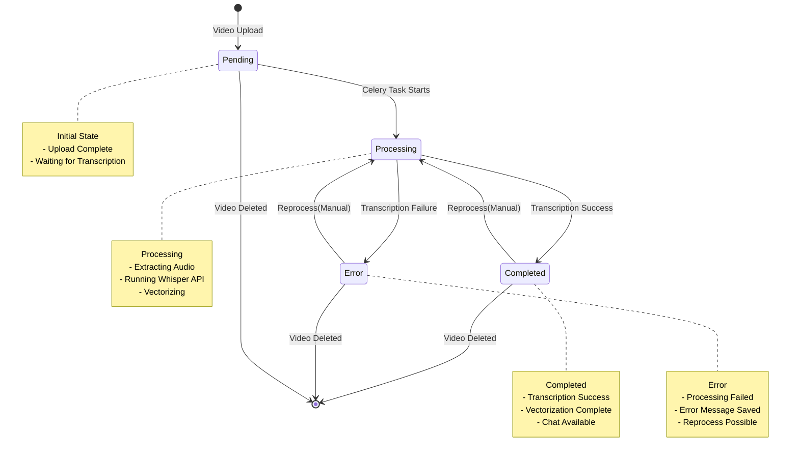
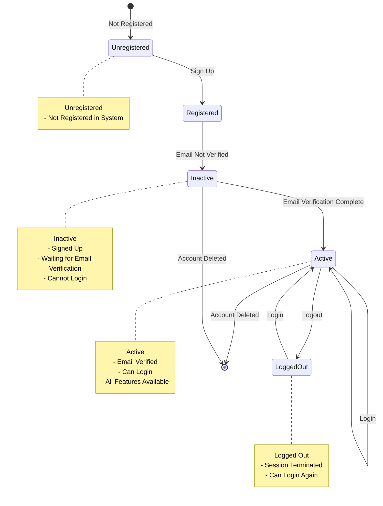
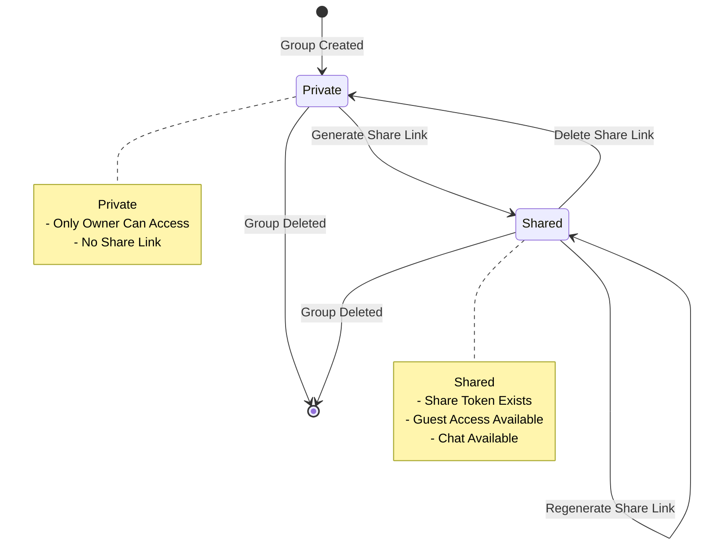
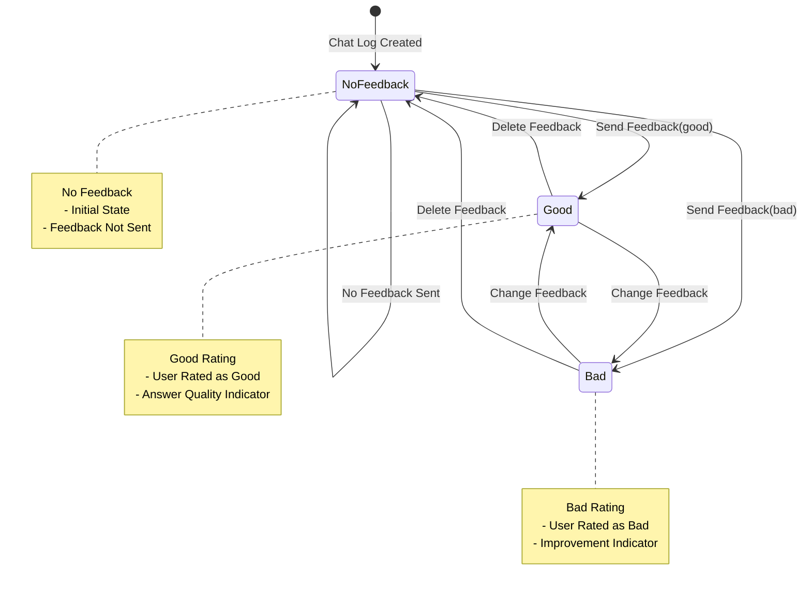
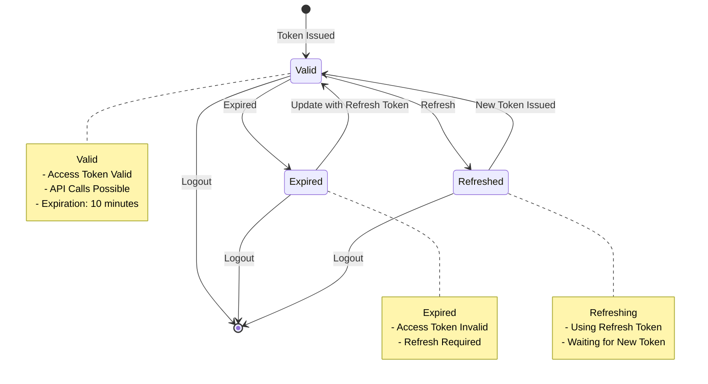

# State Diagram

## Overview

This diagram represents the state transitions of the main objects in the VideoQ system.

## Video State Transition

## User State Transition

## Video Group Sharing State Transition

## Chat Log Feedback State Transition

## Authentication Token State Transition

