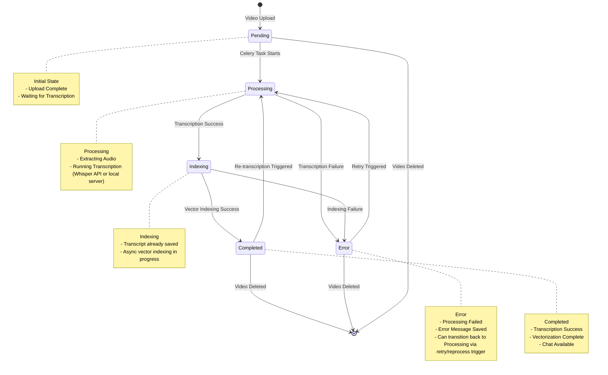
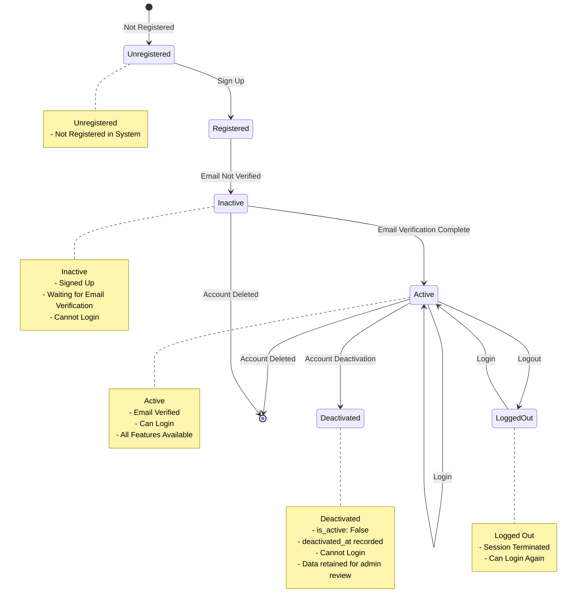
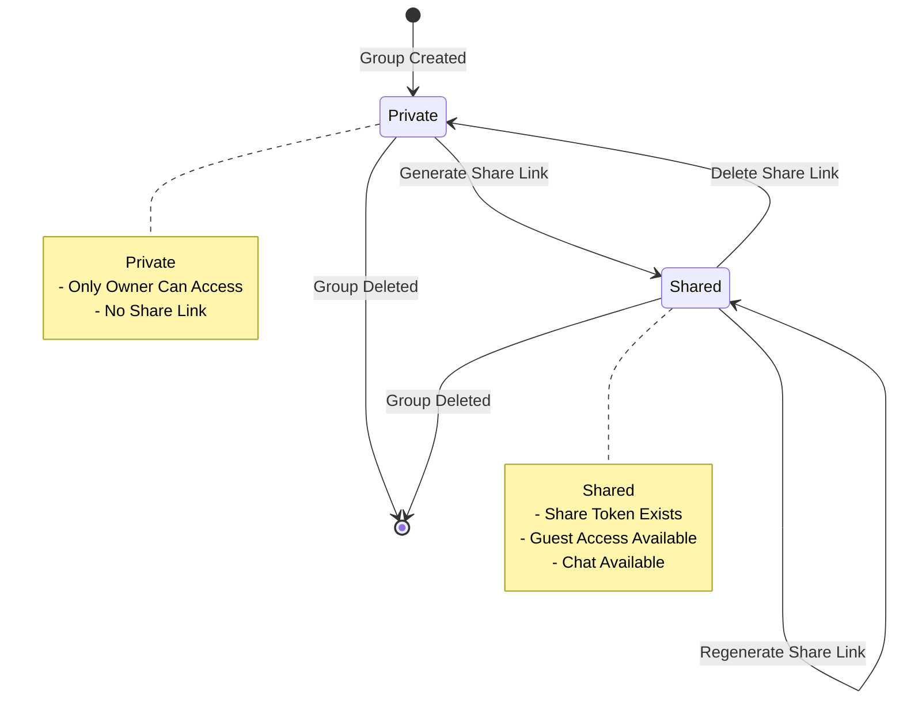
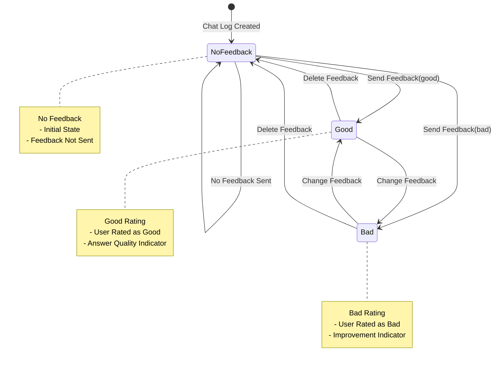
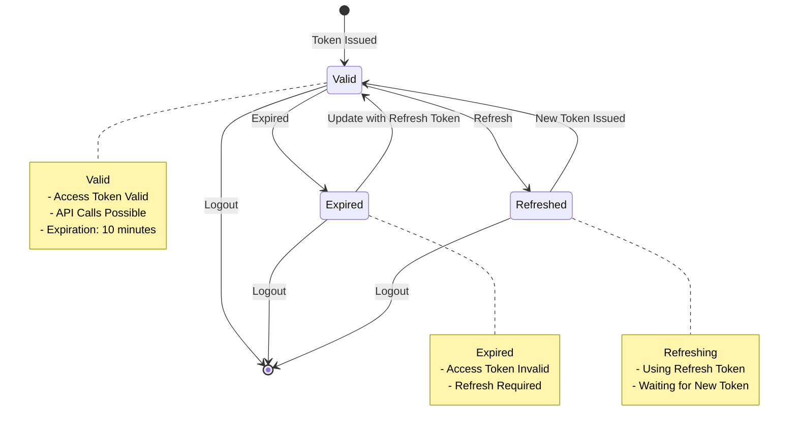
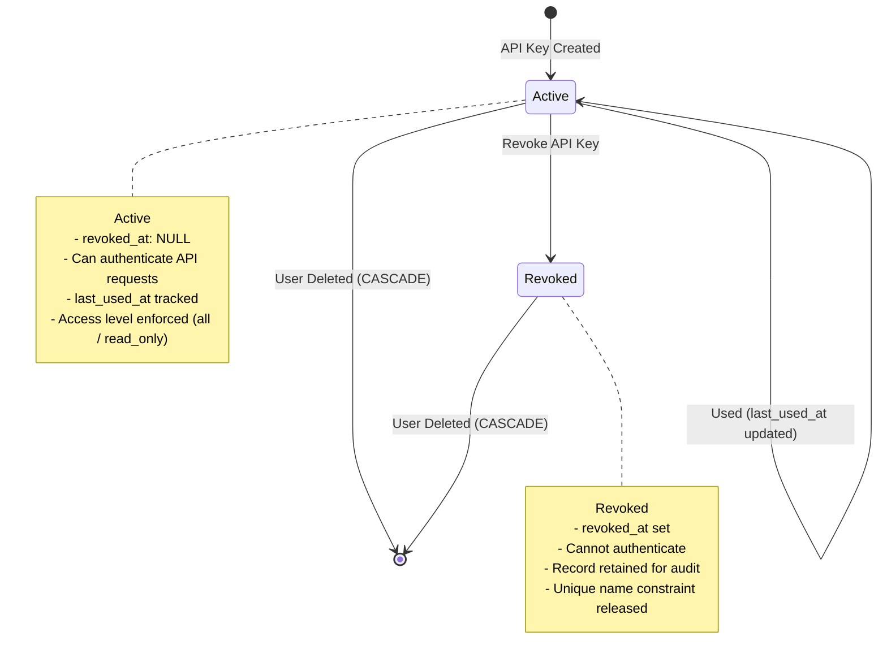

# 状態遷移図

## 概要

VideoQシステムの主要オブジェクトの状態遷移を示す図です。

## 動画の状態遷移

```mermaid
stateDiagram-v2
    [*] --> Pending: Video Upload
    
    Pending --> Processing: Celery Task Starts
    Processing --> Indexing: Transcription Success
    Indexing --> Completed: Vector Indexing Success
    Processing --> Error: Transcription Failure
    Indexing --> Error: Indexing Failure
    Completed --> Processing: Re-transcription Triggered
    Error --> Processing: Retry Triggered
    
    Completed --> [*]: Video Deleted
    Error --> [*]: Video Deleted
    Pending --> [*]: Video Deleted
    
    note right of Pending
        Initial State
        - Upload Complete
        - Waiting for Transcription
    end note
    
    note right of Processing
        Processing
        - Extracting Audio
        - Running Transcription (Whisper API or local server)
    end note

    note right of Indexing
        Indexing
        - Transcript already saved
        - Async vector indexing in progress
    end note
    
    note right of Completed
        Completed
        - Transcription Success
        - Vectorization Complete
        - Chat Available
    end note
    
    note right of Error
        Error
        - Processing Failed
        - Error Message Saved
        - Can transition back to Processing via retry/reprocess trigger
    end note
```

## ユーザーの状態遷移

```mermaid
stateDiagram-v2
    [*] --> Unregistered: Not Registered
    
    Unregistered --> Registered: Sign Up
    Registered --> Inactive: Email Not Verified
    Inactive --> Active: Email Verification Complete
    Active --> Active: Login
    Active --> LoggedOut: Logout
    LoggedOut --> Active: Login
    
    Active --> Deactivated: Account Deactivation
    Active --> [*]: Account Deleted
    Inactive --> [*]: Account Deleted
    
    note right of Unregistered
        Unregistered
        - Not Registered in System
    end note
    
    note right of Inactive
        Inactive
        - Signed Up
        - Waiting for Email Verification
        - Cannot Login
    end note
    
    note right of Active
        Active
        - Email Verified
        - Can Login
        - All Features Available
    end note
    
    note right of LoggedOut
        Logged Out
        - Session Terminated
        - Can Login Again
    end note

    note right of Deactivated
        Deactivated
        - is_active: False
        - deactivated_at recorded
        - Cannot Login
        - Data retained for admin review
    end note
```

## 動画グループ共有の状態遷移

```mermaid
stateDiagram-v2
    [*] --> Private: Group Created
    
    Private --> Shared: Generate Share Link
    Shared --> Private: Delete Share Link
    Shared --> Shared: Regenerate Share Link
    
    Private --> [*]: Group Deleted
    Shared --> [*]: Group Deleted
    
    note right of Private
        Private
        - Only Owner Can Access
        - No Share Link
    end note
    
    note right of Shared
        Shared
        - Share Token Exists
        - Guest Access Available
        - Chat Available
    end note
```

## チャットログフィードバックの状態遷移

```mermaid
stateDiagram-v2
    [*] --> NoFeedback: Chat Log Created
    
    NoFeedback --> Good: Send Feedback(good)
    NoFeedback --> Bad: Send Feedback(bad)
    NoFeedback --> NoFeedback: No Feedback Sent
    
    Good --> Bad: Change Feedback
    Bad --> Good: Change Feedback
    Good --> NoFeedback: Delete Feedback
    Bad --> NoFeedback: Delete Feedback
    
    note right of NoFeedback
        No Feedback
        - Initial State
        - Feedback Not Sent
    end note
    
    note right of Good
        Good Rating
        - User Rated as Good
        - Answer Quality Indicator
    end note
    
    note right of Bad
        Bad Rating
        - User Rated as Bad
        - Improvement Indicator
    end note
```

## 認証トークンの状態遷移

```mermaid
stateDiagram-v2
    [*] --> Valid: Token Issued
    
    Valid --> Expired: Expired
    Valid --> Refreshed: Refresh
    Refreshed --> Valid: New Token Issued
    Expired --> Valid: Update with Refresh Token
    
    Valid --> [*]: Logout
    Expired --> [*]: Logout
    Refreshed --> [*]: Logout
    
    note right of Valid
        Valid
        - Access Token Valid
        - API Calls Possible
        - Expiration: 10 minutes
    end note
    
    note right of Expired
        Expired
        - Access Token Invalid
        - Refresh Required
    end note
    
    note right of Refreshed
        Refreshing
        - Using Refresh Token
        - Waiting for New Token
    end note
```

## APIキーの状態遷移

```mermaid
stateDiagram-v2
    [*] --> Active: API Key Created

    Active --> Active: Used (last_used_at updated)
    Active --> Revoked: Revoke API Key
    Active --> [*]: User Deleted (CASCADE)

    Revoked --> [*]: User Deleted (CASCADE)

    note right of Active
        Active
        - revoked_at: NULL
        - Can authenticate API requests
        - last_used_at tracked
        - Access level enforced (all / read_only)
    end note

    note right of Revoked
        Revoked
        - revoked_at set
        - Cannot authenticate
        - Record retained for audit
        - Unique name constraint released
    end note
```

---

## Related Documentation

- [📖 ドキュメント一覧](../README.md)
- [シーケンス図](sequence-diagram.md) — 処理シーケンスの詳細
- [ER図](../database/er-diagram.md) — エンティティ関連
- [画面遷移図](../requirements/screen-transition-diagram.md) — フロントエンドの画面遷移
- [アクティビティ図](../requirements/activity-diagram.md) — 業務フロー
