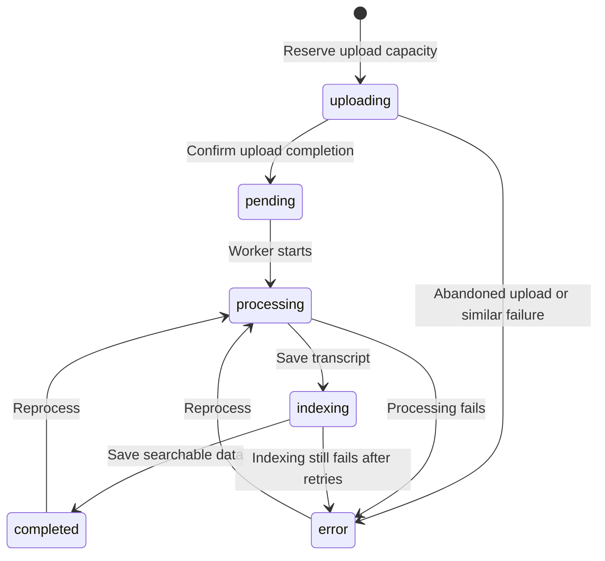

# Video states and processing completion

A video's `status` indicates progress through upload, transcription, and search preparation. Refer to it when implementing waiting states or investigating stalled processing.

## Normal flow

```mermaid
stateDiagram-v2
    [*] --> uploading: Reserve upload capacity
    uploading --> pending: Confirm upload completion
    uploading --> error: Abandoned upload or similar failure
    pending --> processing: Worker starts
    processing --> indexing: Save transcript
    processing --> error: Processing fails
    indexing --> completed: Save searchable data
    indexing --> error: Indexing still fails after retries
    error --> processing: Reprocess
    completed --> processing: Reprocess
```

This diagram shows processing states, not a user-facing button for every arrow. Some registration paths, such as YouTube imports, skip file upload.

| Value | What it means or waits for | Where to check |
|---|---|---|
| `uploading` | File upload and completion notification | Browser, storage, API |
| `pending` | Transcription to start | Queue delivery, worker |
| `processing` | Audio-to-text conversion and related work | Worker, Whisper |
| `indexing` | Building searchable subtitle data | Worker, embedding API, DB |
| `completed` | Video is ready for search | Add it to a course and ask questions |
| `error` | A stage failed | Error details and relevant logs |

Also inspect individual implementations for paths such as reindexing. Normal transition definitions are in [video_status.py](https://github.com/yukiharada1228/videoq/blob/main/apps/worker/worker_python/video_status.py); indexing completion is handled in [tasks/indexing.py](https://github.com/yukiharada1228/videoq/blob/main/apps/worker/worker_python/tasks/indexing.py).

**Related:** [Stalled processing](../guides/troubleshooting.md).
