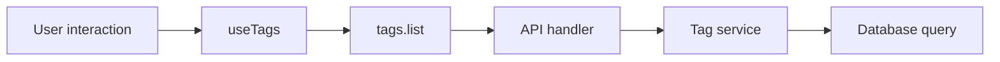

# Find your way around the code

VideoQ has three main parts: `web` displays the UI, `api` responds to requests, and `worker` runs time-consuming tasks.

## Directories to learn first

| Location | Responsibility | Example changes |
|---|---|---|
| `apps/web/` | React screens and user interactions | Video lists, forms, chat UI |
| `apps/api/` | Authentication, authorization, business logic, and DB access | Fetching videos, editing courses, checking usage |
| `packages/trpc/` | Procedure names and input/output types shared by the UI and API | Adding fields or operations to the API |
| `apps/worker/` | Asynchronous Python processing | Transcription, indexing, PLOG generation |
| `docs/` | English documentation | Updating instructions and design explanations |
| `apps/docs/` | Documentation site configuration and Japanese translations | Menus, search, styles, translations |
| `infra/` | Production infrastructure configuration and deployment documentation | Reviewing the operational setup |

Node.js dependencies use the root `package-lock.json`. The Python worker uses `apps/worker/pyproject.toml` and `uv.lock`.

## Trace one operation from end to end

Start with fetching the tag list, which is smaller than the video processing pipeline.

| Step | File | What to look for |
|---|---|---|
| 1 | [useTags.ts](https://github.com/yukiharada1228/videoq/blob/main/apps/web/src/hooks/useTags.ts) | Where the UI fetches and updates data |
| 2 | [routers/tags.ts](https://github.com/yukiharada1228/videoq/blob/main/packages/trpc/src/routers/tags.ts) | Inputs, outputs, and login requirements for `tags.list` |
| 3 | [media-library.ts](https://github.com/yukiharada1228/videoq/blob/main/apps/api/src/trpc/handlers/media-library.ts) | Calling the service with the user ID |
| 4 | [tags/service.ts](https://github.com/yukiharada1228/videoq/blob/main/apps/api/src/features/tags/service.ts) | Coordinating tag operations |
| 5 | [tag-repository.ts](https://github.com/yukiharada1228/videoq/blob/main/apps/api/src/repositories/tag-repository.ts) | Reading the DB within the user's scope |

A **contract** is the input/output agreement between the caller and the API. Types flow from the shared contract, so type checking reveals which callers are affected by a change.

## Where to read next

- **Frontend:** [App.tsx](https://github.com/yukiharada1228/videoq/blob/main/apps/web/src/App.tsx) → `pages/` → `hooks/`.
- **API:** [app.ts](https://github.com/yukiharada1228/videoq/blob/main/apps/api/src/app.ts) → `trpc/context.ts` → `trpc/handlers/`.
- **Video processing:** [tasks/registry.py](https://github.com/yukiharada1228/videoq/blob/main/apps/worker/worker_python/tasks/registry.py) → `tasks/transcription.py` → `tasks/indexing.py`.
- **Database:** [schema/index.ts](https://github.com/yukiharada1228/videoq/blob/main/apps/api/src/db/schema/index.ts) → `modern.ts` and `better-auth.ts`.

Cloudflare **Workers** is the API runtime. `apps/worker` is the **Python video processing service**. They are separate programs with similar names.

**Read next:** [Make your first change](first-change.md). For the deployment layout, see the [system overview](../architecture/system-configuration-diagram.md).
