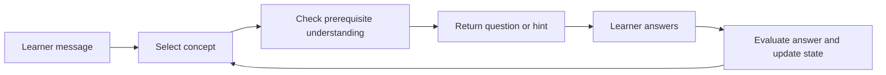

# PLOG and study mode

PLOG (Prerequisite-aware Learning-Object Graph) is **data connecting concepts to the concepts they require as prerequisites**. VideoQ's study mode uses this graph together with questions and hints to guide learning.

For example, “vectors → dot product → similarity” describes an order that covers prerequisites before moving on. This illustrates the mechanism; it does not guarantee that generated orders are always correct.

## What is stored?

| Data | Meaning | Storage |
|---|---|---|
| Concepts | Units of content to learn from a video | `plog_concepts` |
| Edges | Relationships between concepts, such as prerequisites | `plog_edges` |
| Learning objects | Initial questions, progressive hints, example misconceptions, and more | `plog_learning_objects` |
| Build jobs | Records of generation in progress, completion, and failure | `plog_build_jobs` |

## Current generation pipeline

After building the search index, the Python worker runs `build_plog`:

1. Use an LLM to extract concepts, questions, hints, and related content from the transcript.
2. Generate concept embeddings and save concepts and learning objects.
3. Create `prerequisite_of` edges connecting the extracted concepts in sequence.

The current implementation is a simplified generator that connects concepts in a chain. It does not implement every validation step or hierarchical summary from the paper. The existence of tables such as `plog_summary_nodes` does not mean the current pipeline populates them.

[pipeline/plog_build.py](https://github.com/yukiharada1228/videoq/blob/main/apps/worker/worker_python/pipeline/plog_build.py) is the implementation source of truth.

## How study mode uses it

The first question uses saved text. Subsequent answer evaluation and support generation use an LLM. Temporary progress is stored in a `STUDY_SESSION` Durable Object with a TTL. Leases and revisions control concurrent requests within the same session.

This is separate from permanently storing a learner's full history as grades. Do not confuse the `learner_concept_states` table definition with the current study session storage.

## What to check after generation

Review concepts, relationships, and questions on the video detail screen, and edit, merge, or delete them as needed. Regeneration replaces existing concepts, edges, learning objects, and related data, so consider its effect on manually edited videos.

Study mode requires a usable learning order. Empty concepts, missing ordering edges, or cycles can lead to `PLOG_NOT_READY`. Q&A can be used independently of PLOG readiness.

## Where to look

- [tasks/build_plog.py](https://github.com/yukiharada1228/videoq/blob/main/apps/worker/worker_python/tasks/build_plog.py): Job retrieval and generation status.
- [plog-study.ts](https://github.com/yukiharada1228/videoq/blob/main/apps/api/src/lib/plog-study.ts): Study mode processing.
- [plog-runtime.ts](https://github.com/yukiharada1228/videoq/blob/main/apps/api/src/lib/plog-runtime.ts): Graph and learning-order calculations.
- [study-session.ts](https://github.com/yukiharada1228/videoq/blob/main/apps/api/src/durable-objects/study-session.ts): Temporary state and concurrency control.

**Related:** [Video states](../design/state-diagram.md), [Prompt design](../architecture/prompt-engineering.md).
