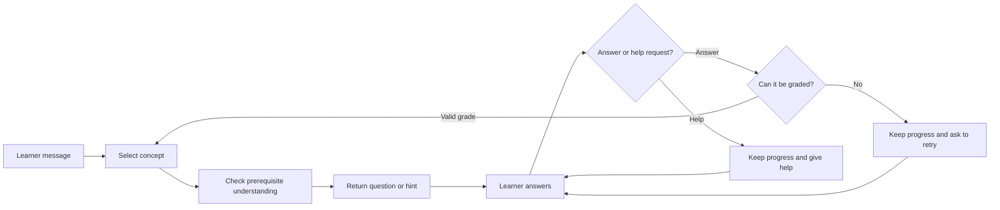

# PLOG and study mode

PLOG (Prerequisite-aware Learning-Object Graph) stores **concepts, a suggested presentation order, and explicitly configured prerequisite relationships**. VideoQ distinguishes the order in which concepts are presented from a claim that understanding one concept is necessary for another. Study mode uses this graph together with questions and hints.

For the difference between answering a question and guiding learning, start with [How AI builds an answer](../concepts/how-ai-works.md).

For the 12-hour progress lifetime, behavior after reloading or switching modes, and **Start over**, see [Resuming study and starting over](study-sessions.md).

For example, independent topics A and B may be presented in that order without A being a prerequisite for B. A “vectors → dot product” prerequisite is a separate relationship to set after checking the lecture; extraction order alone does not establish it.

## What is stored?

| Data | Meaning | Storage |
|---|---|---|
| Concepts | Units of content to learn from a video | `plog_concepts` |
| Edges | Presentation order, prerequisites, and other relationships between concepts | `plog_edges` |
| Learning objects | Initial questions, progressive hints, example misconceptions, and more | `plog_learning_objects` |
| Build jobs | Records of generation in progress, completion, and failure | `plog_build_jobs` |

## Current generation pipeline

After initial search indexing, the Python worker runs `build_plog`. Transcript edits and search reindexing do not trigger this handoff; see [the update scope table](../architecture/transcription-and-search.md#update-scope).

The build performs these steps:

1. Use an LLM to extract concepts, questions, hints, and related content from the transcript.
2. Generate concept embeddings and save concepts and learning objects.
3. Create `presentation_order` edges connecting the concepts in the order returned by the model, with provenance `generated`. This is an ordering proposal, not a prerequisite claim.

The current implementation is a simplified generator that connects concepts in a chain. It does not implement every validation step or hierarchical summary from the paper. The existence of tables such as `plog_summary_nodes` does not mean the current pipeline populates them.

### What the generator actually asks the model

The input contains the first 40 transcript scenes, at most 200 characters from each, plus the first 6,000 characters of the transcript. The prompt requests **up to 12 concepts**, each with a label, introduction time, source quote, opening question, hints, and possible misconceptions. The request for 12 is a prompt instruction; the parser does not enforce that maximum.

The model returns JSON. The worker checks that there is a concept array and that each concept has a nonempty label. An explicit empty array is accepted and replaces old artifacts, although it leaves no concepts for study mode. Invalid JSON or invalid required structure fails generation.

The worker embeds the concept labels, stores the results, and connects adjacent concepts in the returned order. It does not independently infer or verify prerequisites. Because the input is truncated, the result may miss material later in a long video.

[pipeline/plog_build.py](https://github.com/yukiharada1228/videoq/blob/main/apps/worker/worker_python/pipeline/plog_build.py) is the implementation source of truth.

## Relationship meanings and expected study paths

All arrows run from the source to the target. Three types participate in the study order; only two impose prerequisite checks.

| Relationship | Meaning | Study behavior |
|---|---|---|
| Presentation order (`presentation_order`) | Suggest presenting A before B | Used to choose the next uncovered concept. Does not redirect a question about B back to A or add B to the concepts withheld while studying A |
| Prerequisite (`prerequisite_of`) | Understanding A is required before B | An unreached direct prerequisite A redirects a question about B to A; downstream dependent concepts are withheld from supporting explanations |
| Builds on (`builds_on`) | B builds on A | Has the same prerequisite-gating behavior as `prerequisite_of`, not merely a presentation preference |
| Analogy, example, contrast | Descriptive relationships | Do not set the study order, gate progress, or withhold concepts |

**Independent topics A and B:** the generated A → B presentation edge supports a normal A-then-B path. A learner who asks to start with B can receive B's opening question without first mastering A. After B is mastered, the remaining uncovered A may be offered; this is course coverage, not a prerequisite judgment.

**Vectors and dot products:** after checking that understanding vectors is required, set vectors → dot product to Prerequisite and record the supporting lecture passage. A question about dot products redirects to vectors while vectors are unreached. After mastery of vectors, the path advances to dot products. A newly generated presentation edge alone does not trigger that redirect.

### Generated, edited, and verified are different

| UI provenance | What is known | What it does not guarantee |
|---|---|---|
| Generated | The current generator saved this relationship | Semantic dependency, correctness, or human review |
| Manually created/edited | The owner saved the relationship or a concept merge rewired it | Independent verification or educational validity |
| Unknown origin (legacy or unspecified) | Provenance was not recorded in the current format | Whether the relationship was generated, edited, or reviewed |

There is **no separate verification/approval workflow or verified badge**. Adding a quote or saving an edit is not verification. The API exposes this history as `provenance`; it does not use provenance to decide whether an edge participates in study.

The historical database field `validation_status` stores `generated` or `edited` for new writes. Older `accepted` and `validated` values appear as unknown origin: `accepted` was used when storing generated chains, and `validated` was used for manual creation, but neither records a reviewer or proves the relationship's meaning. An edited generated edge is shown as edited; a complete edit/review audit trail is not stored.

### When a generated graph can be used

A completed build with concept embeddings and a usable ordering path can be used immediately, without a human approval step. Presentation order, prerequisites, and builds-on edges **together must be acyclic (a DAG)**. A single concept needs no edge. For multiple concepts, the learning path contains concepts connected to those ordering edges; descriptive edges alone do not create a path. Empty graphs or unusable paths produce `PLOG_NOT_READY`. “Ready” means a build completed, not that a person checked its content.

The new relationship type uses the existing text fields, so it requires no database schema migration. Deploy the API and web support before enabling the updated Python generator: an older runtime does not recognize `presentation_order`. Existing edges are not silently reclassified because old generated and edited relationships cannot be reliably distinguished.

### Check and repair a relationship

1. Open the video's Learning graph and inspect Concept relationships: source, target, relationship type, provenance, and quote. Check the relevant transcript/video passage.
2. For independent topics, edit the relationship to Presentation order. For a genuine prerequisite, choose Prerequisite or Builds on and record supporting evidence. Both prerequisite types use source → target direction.
3. Correct the endpoints or delete a relationship with no useful meaning. Retain presentation edges if independent concepts should remain in the suggested path. If reversing an edge creates a cycle, remove or change the conflicting edge first; saves that introduce a cycle are rejected.
4. Save, then inspect the refreshed type, provenance, and quote. Use a fresh study session to check B-first behavior in the examples above; an existing session's progress may affect routing.
5. Review legacy `prerequisite_of` chains explicitly: they continue to gate study until edited, deleted, or replaced. Changing an independent A → B edge to Presentation order removes that gate. Rebuild only if replacing the entire graph is intended, because it discards manual concepts, relationships, and hints as well.

## How study mode uses it

The first question uses saved text. Subsequent answer evaluation and support generation can use an LLM; some paths use fixed rules and saved hints. Temporary progress is stored in a `STUDY_SESSION` Durable Object with a TTL. Leases and revisions control concurrent requests within the same session.

This is separate from permanently storing a learner's full history as grades. Do not confuse the `learner_concept_states` table definition with the current study session storage.

## Follow a study turn

Suppose an illustrative graph contains “vectors → dot product.” Asking about the dot product may first produce a stored question about vectors if that prerequisite has not been reached. The exact wording depends on the generated or edited learning objects.

1. **Load the graph and session.** The API reads concepts, ordering edges, saved questions/hints, and the current concept's progress.
2. **Classify the message when a concept is active.** Answer submissions go to the grading model; recognized help requests bypass grading. If no concept is active yet, this step is skipped and the saved opening question starts the study turn.
3. **Choose the target concept.** It compares the message embedding with concept-label embeddings, while applying rules that keep a short or confused reply on the active concept. It can redirect to an unmet direct prerequisite.
4. **Choose the response path.** A newly activated concept uses its saved opening question. A request to reveal the answer uses a saved hint and a template. Other support uses the model with the selected concept, hint, grade, and nearby material.
5. **Save progress.** Valid grades update the reached state, last grade, and hint index; routing can change the active concept. Help requests and ungradable turns keep all these fields unchanged. A response's wording alone does not update them.

Concept routing uses a minimum cosine similarity of 0.25. For a normal reply to switch away from an active concept, the alternative must score at least 0.55 and exceed the active score by at least 0.12; replies shorter than 12 characters and recognized requests for help/answers stay on the active concept. These are code thresholds, not confidence probabilities. A concept activated immediately after mastery is kept for that turn.

## How grading changes the next step

With an active concept, the following message categories control whether grading runs:

| Message category | Examples | Response and progress |
|---|---|---|
| Answer submission | `0`, “My answer is 0” | Ask the model to assess meaning, regardless of length; only a valid grade changes progress |
| Explanation or hint request | “Why does it change?”, “Explain this term”, “Give me a hint” / 「なんで〜？」「ヒントを教えて」 | No grading or topic rerouting; explain the point or return the current saved hint without advancing it |
| Direct answer request | “Tell me the answer” / 「答えをそのまま教えて」 | No grading; refuse to reveal the answer and return the current saved hint; keep progress |
| Ungradable | Provider failure, invalid JSON, missing/unknown grade or missing/empty reason, or model result `ungradable` | Keep progress, display “I could not grade this reply,” and ask the learner to resend the answer |

Help detection uses fixed phrases and question markers, not semantic certainty. Bare 「教えて」 means help, not a demand for the full answer. Recognized confusion is also a help request. Mixed answers/questions and unrecognized wording can be misclassified; ask explicitly for a hint or explanation, or submit the answer separately. The model can return `ungradable` for a help request missed by these checks or insufficient context. No character-count fallback assigns a grade.

The grading model receives the concept label, saved opening question, previous tutor message, and learner's reply. A previous message may be a hint or explanation; retry notices are skipped to retain the question being retried. This call does not include the full transcript or support-generation scene context. The model must return JSON with a recognized `grade` and a nonempty `reason`.

| Grade | Meaning | Program action |
|---|---|---|
| `mastery` | The answer addresses the question well enough to move on | Mark the concept and recognized near-duplicates reached; activate the next uncovered concept or finish |
| `partial` | A relevant, partly correct but incomplete answer | Advance the hint index, stopping at the last saved hint; ask for an encouraging nudge addressing what is missing |
| `miss` | An attempted answer is incorrect or unrelated | Advance the hint index with the same limit; ask for a simpler nudge addressing the error |

A valid grade and its short reason appear in the assistant response, including when moving on or finishing. Help requests are labeled “not graded”; ungradable turns are explicitly distinguished from incorrect answers. These messages follow the ordinary chat-history rules. Only the last valid grade is stored in the temporary progress record, not an `ungradable` grade or an assessment reason.

Target selection runs after a valid grade. A sufficiently clear change of topic can move to another concept even after `partial` or `miss`, subject to the routing rules above. Help requests and ungradable turns skip that routing entirely. A retry is a new message in the same study session; it leaves the failed attempt visible and can update progress only if grading succeeds.

These are fallible AI assessments for study progression, not verified grades or a complete measure of understanding. Both `partial` and `miss` keep the concept unreached; their meaning and requested support differ even though both advance the hint index. They are separate from the [RAGAS metrics used to evaluate generated answers](../architecture/prompt-engineering.md).

## What the support model reads

For an ordinary supporting response, the model receives the study policy, target concept, opening question, possible misconceptions, relevant material, labels of downstream concepts to withhold, the current hint, the current answer grade and reason if grading succeeded, and the latest learner reply. Explanation requests instead carry an explicit “not graded” instruction; an old grade is not reused to judge the new question.

The material includes up to four subtitle scenes whose start times are within 90 seconds of the concept's introduction, plus nearby summaries if present. The current generator does not populate those hierarchical summaries. It also initially saves no playback waypoints, so study responses are not guaranteed to include a playable citation; the citation path uses a configured learning object's first waypoint when one exists.

These subtitle scenes are parsed directly from the video's stored transcript when Study loads its supporting material; they do not come from Q&A's scene search index. After a subtitle edit is saved, the next read can use corrected nearby text even if search reindexing is pending or has failed. Saved PLOG questions and hints remain unchanged until edited or rebuilt, so support can mix new transcript text with old learning material. A response already in progress may still use the transcript it loaded earlier.

For a hint request or “tell me the answer,” the response uses the refusal/help template and saved hint instead of generating a new support message. Model-generated support also passes a phrase-based reveal check that can replace it with that template. This is a heuristic, not a semantic proof that an answer was withheld.

Study mode generates its response before sending the complete text as a stream chunk. It does not currently stream individual generated tokens as ordinary Q&A can.

## What to check after generation

Review concepts, relationships, and questions on the video detail screen, and edit, merge, or delete them as needed. Regeneration replaces existing concepts, edges, learning objects, and related data, so consider its effect on manually edited videos.

Study mode requires a usable learning order across presentation, prerequisite, and builds-on edges. Empty concepts, multiple concepts with no ordering path, or cycles can lead to `PLOG_NOT_READY`. A single concept can form a usable path without an edge. Q&A can be used independently of PLOG readiness.

### Rebuilding during active Study {#rebuild-and-active-study}

A rebuild replaces the video's concepts and their IDs. It deletes the DB's `learner_concept_states` for those old concepts, but does **not** clear the current `STUDY_SESSION` Durable Object. Study reads only ready graphs and matches progress by concept ID: old IDs no longer match the rebuilt video, so their reached state, active concept, and hint position do not carry over to the new concepts. Progress on unchanged videos in the course can remain.

While the latest build is `pending`, `running`, or `failed`, that video's graph is excluded from new Study turns. A course with no other usable graph cannot start Study; one with other ready graphs can still use those. An already running response may finish using the graph it loaded before the rebuild. Rebuilding does not rewrite visible messages or saved chat history.

Plan a rebuild between learning sessions when possible. After it is `ready`, inspect the new questions and hints and [verify them in a fresh session](#verify-in-fresh-session). Switching Q&A → Study clears visible dialogue but retains the session ID and any remaining progress. Do not present the rebuilt path as a seamless continuation of the old one.

For a small subtitle correction, reviewing and editing the affected learning objects can preserve the remaining manual work. See [the freshness policy and verification steps](../architecture/transcription-and-search.md#update-scope); `ready` by itself does not mean the graph matches the latest transcript.

### Verify edits in a fresh Study session {#verify-in-fresh-session}

Manual edits retain concept IDs and their session progress. To check opening questions and hints after either an edit or a rebuild, start a fresh verification session:

1. Open the course or the share URL used for the check and select **Study**.
2. Select **Start over** and confirm. This clears the displayed conversation and draft and selects an empty progress session for this tab and route. Saved chat history remains available to the course owner.
3. Ask about the target concept. If prerequisites appear first, work through them before checking the target's saved opening question and subsequent hints against the edited learning graph.

To preserve the original tab's progress, keep it open and paste the same URL into a tab created with the browser's **New Tab** command (`Ctrl+T` / `Cmd+T`), then perform the steps above there. Duplicating or restoring a tab, or opening a link with an opener, can copy its session ID; see [session behavior and starting over](study-sessions.md).

Reloading or switching Q&A → Study does not start fresh. Reusing the original session can skip the opening question or grade the verification message as a reply to an earlier question, even when that earlier dialogue is no longer visible.

## Where to look

- [tasks/build_plog.py](https://github.com/yukiharada1228/videoq/blob/main/apps/worker/worker_python/tasks/build_plog.py): Job retrieval and generation status.
- [plog-study.ts](https://github.com/yukiharada1228/videoq/blob/main/apps/api/src/lib/plog-study.ts): Study mode processing.
- [plog-runtime.ts](https://github.com/yukiharada1228/videoq/blob/main/apps/api/src/lib/plog-runtime.ts): Graph and learning-order calculations.
- [study-session.ts](https://github.com/yukiharada1228/videoq/blob/main/apps/api/src/durable-objects/study-session.ts): Temporary state and concurrency control.

**Related:** [Video states](../design/state-diagram.md), [Prompt design](../architecture/prompt-engineering.md).
