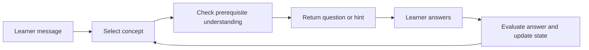

# PLOG and study mode

PLOG (Prerequisite-aware Learning-Object Graph) is **data connecting concepts to the concepts they require as prerequisites**. VideoQ's study mode uses this graph together with questions and hints to guide learning.

For the difference between answering a question and guiding learning, start with [How AI builds an answer](../concepts/how-ai-works.md).

For example, “vectors → dot product → similarity” describes an order that covers prerequisites before moving on. This illustrates the mechanism; it does not guarantee that generated orders are always correct.

## What is stored?

| Data | Meaning | Storage |
|---|---|---|
| Concepts | Units of content to learn from a video | `plog_concepts` |
| Edges | Relationships between concepts, such as prerequisites | `plog_edges` |
| Learning objects | Initial questions, progressive hints, example misconceptions, and more | `plog_learning_objects` |
| Build jobs | Records of generation in progress, completion, and failure | `plog_build_jobs` |

## Current generation pipeline

After initial search indexing, the Python worker runs `build_plog`. Transcript edits and search reindexing do not trigger this handoff; see [the update scope table](../architecture/transcription-and-search.md#update-scope).

The build performs these steps:

1. Use an LLM to extract concepts, questions, hints, and related content from the transcript.
2. Generate concept embeddings and save concepts and learning objects.
3. Create `prerequisite_of` edges connecting the extracted concepts in sequence.

The current implementation is a simplified generator that connects concepts in a chain. It does not implement every validation step or hierarchical summary from the paper. The existence of tables such as `plog_summary_nodes` does not mean the current pipeline populates them.

### What the generator actually asks the model

The input contains the first 40 transcript scenes, at most 200 characters from each, plus the first 6,000 characters of the transcript. The prompt requests **up to 12 concepts**, each with a label, introduction time, source quote, opening question, hints, and possible misconceptions. The request for 12 is a prompt instruction; the parser does not enforce that maximum.

The model returns JSON. The worker checks that there is a concept array and that each concept has a nonempty label. An explicit empty array is accepted and replaces old artifacts, although it leaves no concepts for study mode. Invalid JSON or invalid required structure fails generation.

The worker embeds the concept labels, stores the results, and connects adjacent concepts in the returned order. The model does not independently validate every prerequisite relationship, and an edge marked `accepted` is not evidence of a human review. Because the input is truncated, the result may miss material later in a long video.

[pipeline/plog_build.py](https://github.com/yukiharada1228/videoq/blob/main/apps/worker/worker_python/pipeline/plog_build.py) is the implementation source of truth.

## How study mode uses it

The first question uses saved text. Subsequent answer evaluation and support generation can use an LLM; some paths use fixed rules and saved hints. Temporary progress is stored in a `STUDY_SESSION` Durable Object with a TTL. Leases and revisions control concurrent requests within the same session.

This is separate from permanently storing a learner's full history as grades. Do not confuse the `learner_concept_states` table definition with the current study session storage.

## Follow a study turn

Suppose an illustrative graph contains “vectors → dot product.” Asking about the dot product may first produce a stored question about vectors if that prerequisite has not been reached. The exact wording depends on the generated or edited learning objects.

1. **Load the graph and session.** The API reads concepts, ordering edges, saved questions/hints, and the current concept's progress.
2. **Grade a reply if a concept is active.** It reads the learner's latest message and the previous assistant question. This step is skipped when there is no active concept yet.
3. **Choose the target concept.** It compares the message embedding with concept-label embeddings, while applying rules that keep a short or confused reply on the active concept. It can redirect to an unmet direct prerequisite.
4. **Choose the response path.** A newly activated concept uses its saved opening question. A request to reveal the answer uses a saved hint and a template. Other support uses the model with the selected concept, hint, grade, and nearby material.
5. **Save progress.** The program updates the active concept, reached state, last grade, and hint index. A response's wording alone does not update these fields.

Concept routing uses a minimum cosine similarity of 0.25. For a normal reply to switch away from an active concept, the alternative must score at least 0.55 and exceed the active score by at least 0.12; replies shorter than 12 characters and recognized requests for help/answers stay on the active concept. These are code thresholds, not confidence probabilities. A concept activated immediately after mastery is kept for that turn.

## How grading changes the next step

The grading model receives the concept label, the previous tutor question (or saved opening question), and the learner's reply. It is asked to return JSON with `grade` and `reason`. This grading call does not include the full transcript or the support-generation scene context.

| Grade | Program action |
|---|---|
| `mastery` | Mark the concept and recognized near-duplicates as reached, then activate the next uncovered concept in the learning order; finish if none remain |
| `partial` | Keep working on the concept and advance the hint index, stopping at the last saved hint |
| `miss` | Also advance the hint index; the support prompt asks for a simpler nudge |

Target selection runs after grading. A sufficiently clear change of topic can therefore move to another concept even after `partial` or `miss`, subject to the routing rules above.

Before calling the grading model, fixed checks classify an empty reply, recognized confusion, or a request for the answer as `miss`. If grading fails or returns an unusable grade, replies shorter than eight characters fall back to `miss`; others fall back to `partial`. This fallback keeps the interaction moving, but does not establish the learner's actual understanding.

These grades control study progression. They are separate from the [RAGAS metrics used to evaluate generated answers](../architecture/prompt-engineering.md).

## What the support model reads

For an ordinary supporting response, the model receives the study policy, target concept, opening question, possible misconceptions, relevant material, labels of downstream concepts to withhold, the current hint, the last grade if available, and the latest learner reply.

The material includes up to four subtitle scenes whose start times are within 90 seconds of the concept's introduction, plus nearby summaries if present. The current generator does not populate those hierarchical summaries. It also initially saves no playback waypoints, so study responses are not guaranteed to include a playable citation; the citation path uses a configured learning object's first waypoint when one exists.

For “tell me the answer,” the response uses the refusal/help template and saved hint instead of generating a new support message. Model-generated support also passes a phrase-based reveal check that can replace it with that template. This is a heuristic, not a semantic proof that an answer was withheld.

Study mode generates its response before sending the complete text as a stream chunk. It does not currently stream individual generated tokens as ordinary Q&A can.

## What to check after generation

Review concepts, relationships, and questions on the video detail screen, and edit, merge, or delete them as needed. Regeneration replaces existing concepts, edges, learning objects, and related data, so consider its effect on manually edited videos.

Study mode requires a usable learning order. Empty concepts, multiple concepts with no ordering path, or cycles can lead to `PLOG_NOT_READY`. A single concept can form a usable path without an edge. Q&A can be used independently of PLOG readiness.

### Rebuilding during active Study {#rebuild-and-active-study}

A rebuild replaces the video's concepts and their IDs. It deletes the DB's `learner_concept_states` for those old concepts, but does **not** clear the current `STUDY_SESSION` Durable Object. Study reads only ready graphs and matches progress by concept ID: old IDs no longer match the rebuilt video, so their reached state, active concept, and hint position do not carry over to the new concepts. Progress on unchanged videos in the course can remain.

While the latest build is `pending`, `running`, or `failed`, that video's graph is excluded from new Study turns. A course with no other usable graph cannot start Study; one with other ready graphs can still use those. An already running response may finish using the graph it loaded before the rebuild. Rebuilding does not rewrite visible messages or saved chat history.

Plan a rebuild between learning sessions when possible. After it is `ready`, inspect the new questions and hints, switch Q&A → Study to clear the old visible dialogue, and start a new question sequence about the desired concept. Switching modes does not reset all session progress. Do not present the rebuilt path as a seamless continuation of the old one.

For a small subtitle correction, reviewing and editing the affected learning objects can preserve the remaining manual work. See [the freshness policy and verification steps](../architecture/transcription-and-search.md#update-scope); `ready` by itself does not mean the graph matches the latest transcript.

## Where to look

- [tasks/build_plog.py](https://github.com/yukiharada1228/videoq/blob/main/apps/worker/worker_python/tasks/build_plog.py): Job retrieval and generation status.
- [plog-study.ts](https://github.com/yukiharada1228/videoq/blob/main/apps/api/src/lib/plog-study.ts): Study mode processing.
- [plog-runtime.ts](https://github.com/yukiharada1228/videoq/blob/main/apps/api/src/lib/plog-runtime.ts): Graph and learning-order calculations.
- [study-session.ts](https://github.com/yukiharada1228/videoq/blob/main/apps/api/src/durable-objects/study-session.ts): Temporary state and concurrency control.

**Related:** [Video states](../design/state-diagram.md), [Prompt design](../architecture/prompt-engineering.md).
