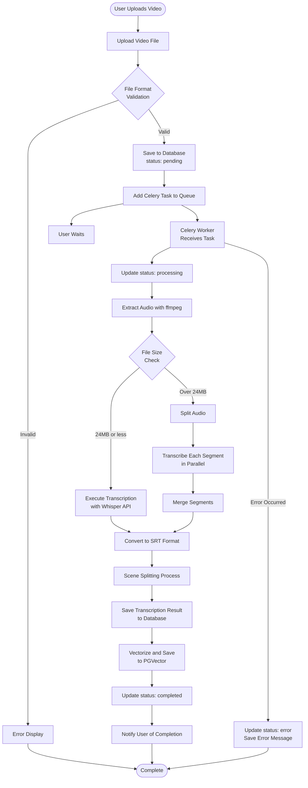
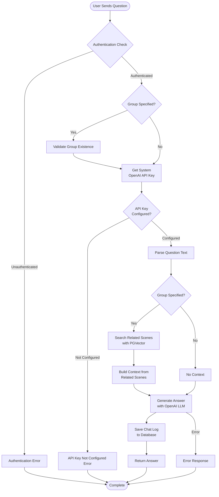
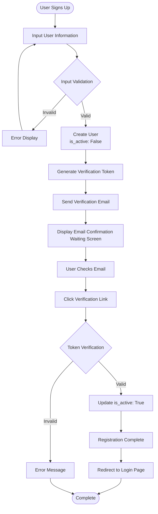
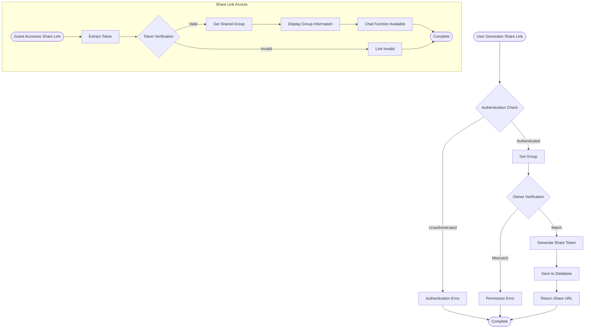
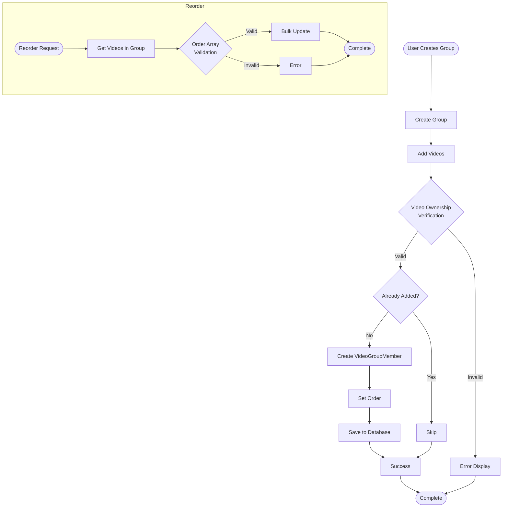

# Activity Diagram

## Overview

This diagram represents the main business flows of the TalkVid system.

## 1. Flow from Video Upload to Transcription Completion

## 2. Chat Processing Flow (RAG)

## 3. User Registration Flow

## 4. Group Sharing Flow

## 5. Video Group Management Flow

