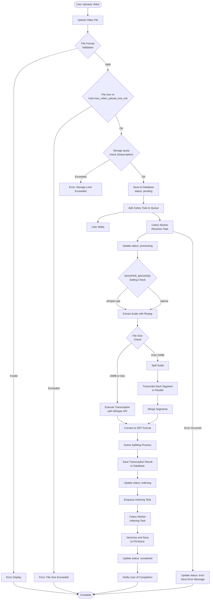
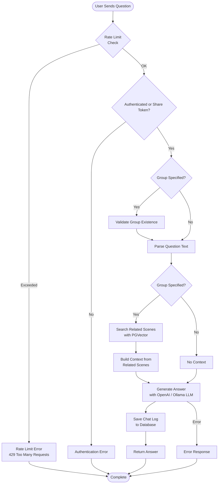
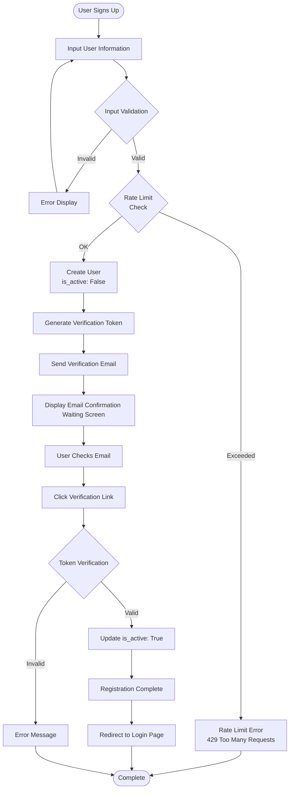
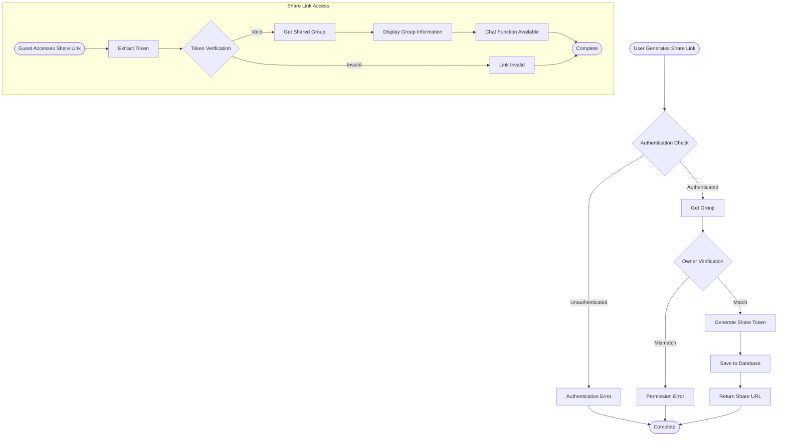
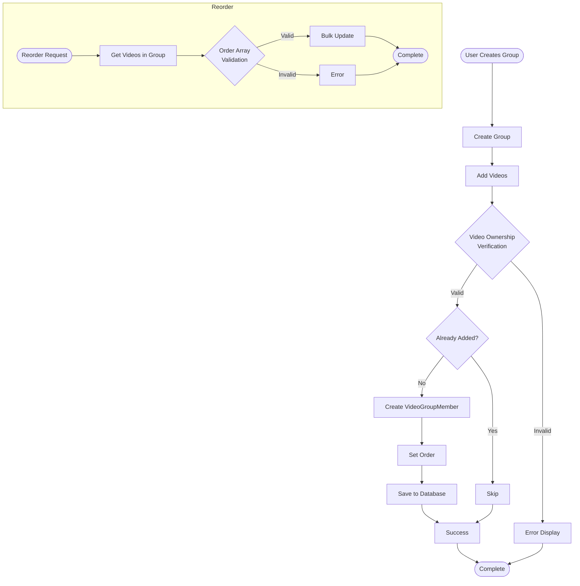
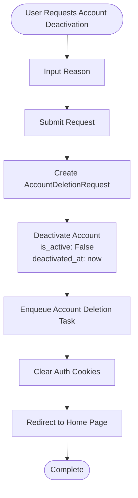
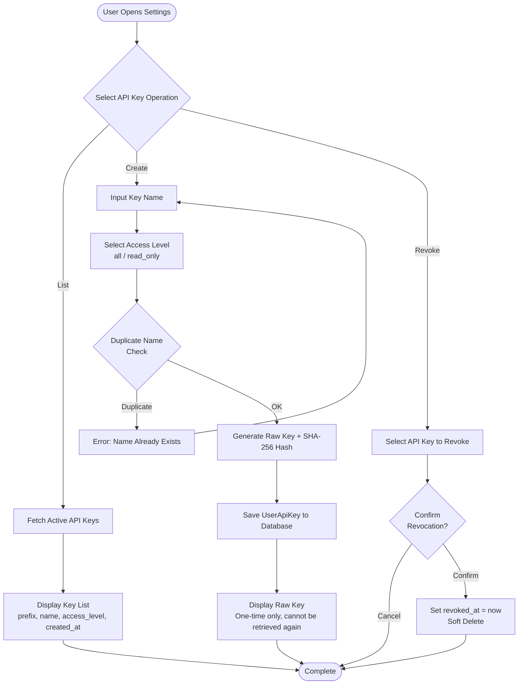
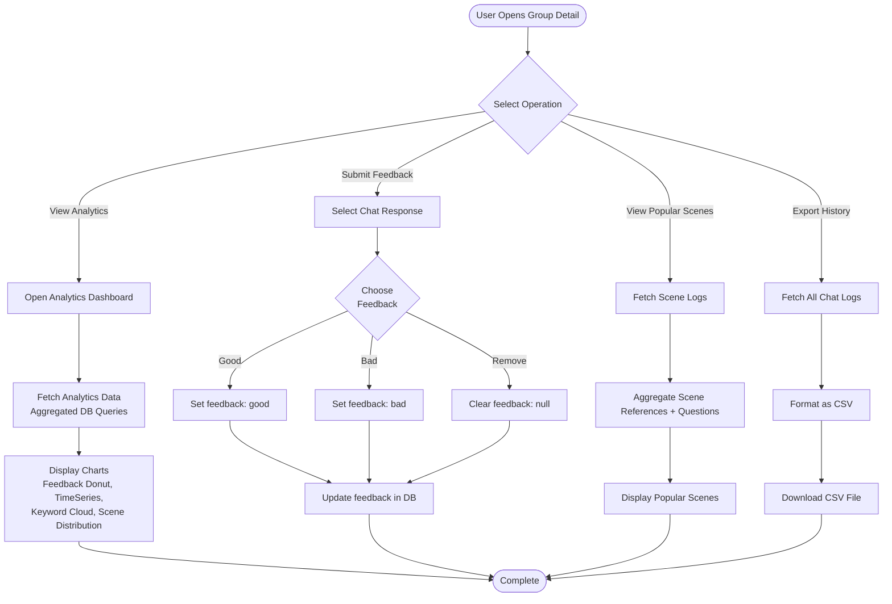

# アクティビティ図

## 概要

VideoQシステムの主要な業務フローを示す図です。

## 1. 動画アップロードから文字起こし完了までのフロー

```mermaid
flowchart TD
    Start([User Uploads Video]) --> Upload[Upload Video File]
    Upload --> Validate{"File Format<br>Validation"}
    Validate -->|Invalid| Error1[Error Display]
    Validate -->|Valid| CheckFileSize{"File size vs<br>User.max_video_upload_size_mb"}
    CheckFileSize -->|Exceeded| ErrorLimit[Error: File Size Exceeded]
    CheckFileSize -->|OK| CheckStorage{"Storage quota<br>check (Subscription)"}
    CheckStorage -->|Exceeded| ErrorStorage[Error: Storage Limit Exceeded]
    CheckStorage -->|OK| Save[Save to Database<br/>status: pending]
    Save --> Queue[Add Celery Task to Queue]
    Queue --> Wait[User Waits]
    
    Queue --> Worker[Celery Worker<br/>Receives Task]
    Worker --> UpdateStatus1[Update status: processing]
    UpdateStatus1 --> CheckBackend{"WHISPER_BACKEND<br>Setting Check"}
    CheckBackend -->|whisper.cpp| Extract[Extract Audio with ffmpeg]
    CheckBackend -->|openai| Extract[Extract Audio with ffmpeg]
    Extract --> CheckSize{"File Size<br>Check"}
    CheckSize -->|24MB or less| Transcribe1[Execute Transcription<br/>with Whisper API]
    CheckSize -->|Over 24MB| Split[Split Audio]
    Split --> Transcribe2[Transcribe Each Segment<br/>in Parallel]
    Transcribe2 --> Merge[Merge Segments]
    Merge --> CreateSRT[Convert to SRT Format]
    Transcribe1 --> CreateSRT
    CreateSRT --> SceneSplit[Scene Splitting Process]
    SceneSplit --> SaveTranscript[Save Transcription Result<br/>to Database]
    SaveTranscript --> UpdateIndexing[Update status: indexing]
    UpdateIndexing --> QueueIndexing[Enqueue Indexing Task]
    QueueIndexing --> IndexWorker[Celery Worker<br/>Indexing Task]
    IndexWorker --> Vectorize[Vectorize and Save<br/>to PGVector]
    Vectorize --> UpdateStatus2[Update status: completed]
    UpdateStatus2 --> Notify[Notify User of Completion]
    Notify --> End([Complete])
    
    Error1 --> End
    ErrorLimit --> End
    Worker -->|Error Occurred| UpdateError[Update status: error<br/>Save Error Message]
    UpdateError --> End
```

## 2. チャット処理フロー（RAG）

```mermaid
flowchart TD
    Start([User Sends Question]) --> RateLimit{"Rate Limit<br>Check"}
    RateLimit -->|Exceeded| ErrorRateLimit[Rate Limit Error<br/>429 Too Many Requests]
    ErrorRateLimit --> End
    RateLimit -->|OK| Auth{Authenticated or Share Token?}
    Auth -->|No| Error1[Authentication Error]
    Auth -->|Yes| GetGroup{Group Specified?}
    
    GetGroup -->|Yes| ValidateGroup[Validate Group Existence]
    GetGroup -->|No| ParseQuery[Parse Question Text]
    ValidateGroup --> ParseQuery
    ParseQuery --> VectorSearch{Group Specified?}
    
    VectorSearch -->|Yes| SearchVectors[Search Related Scenes<br/>with PGVector]
    VectorSearch -->|No| NoContext[No Context]
    
    SearchVectors --> BuildContext[Build Context from<br/>Related Scenes]
    BuildContext --> CallLLM[Generate Answer<br/>with OpenAI / Ollama LLM]
    NoContext --> CallLLM
    
    CallLLM --> SaveLog[Save Chat Log<br/>to Database]
    SaveLog --> ReturnAnswer[Return Answer]
    ReturnAnswer --> End([Complete])

    Error1 --> End
    CallLLM -->|Error| Error2[Error Response]
    Error2 --> End
```

## 3. ユーザー登録フロー

```mermaid
flowchart TD
    Start([User Signs Up]) --> Input[Input User Information]
    Input --> Validate{Input Validation}
    Validate -->|Invalid| ShowError[Error Display]
    Validate -->|Valid| RateLimitSignup{"Rate Limit<br>Check"}
    RateLimitSignup -->|Exceeded| ErrorRateLimitSignup[Rate Limit Error<br/>429 Too Many Requests]
    ErrorRateLimitSignup --> End
    RateLimitSignup -->|OK| CreateUser[Create User<br/>is_active: False]
    CreateUser --> GenerateToken[Generate Verification Token]
    GenerateToken --> SendEmail[Send Verification Email]
    SendEmail --> ShowMessage[Display Email Confirmation Waiting Screen]
    ShowMessage --> Wait[User Checks Email]
    
    Wait --> ClickLink[Click Verification Link]
    ClickLink --> VerifyToken{Token Verification}
    VerifyToken -->|Invalid| Error1[Error Message]
    VerifyToken -->|Valid| ActivateUser[Update is_active: True]
    ActivateUser --> Success[Registration Complete]
    Success --> Redirect[Redirect to Login Page]
    Redirect --> End([Complete])
    
    ShowError --> Input
    Error1 --> End
```

## 4. グループ共有フロー

```mermaid
flowchart TD
    Start([User Generates Share Link]) --> CheckAuth{Authentication Check}
    CheckAuth -->|Unauthenticated| Error1[Authentication Error]
    CheckAuth -->|Authenticated| GetGroup[Get Group]
    GetGroup --> ValidateOwner{Owner Verification}
    ValidateOwner -->|Mismatch| Error2[Permission Error]
    ValidateOwner -->|Match| GenerateToken[Generate Share Token]
    GenerateToken --> SaveToken[Save to Database]
    SaveToken --> ReturnURL[Return Share URL]
    ReturnURL --> End([Complete])
    
    Error1 --> End
    Error2 --> End
    
    subgraph ShareAccess[Share Link Access]
        Guest([Guest Accesses Share Link]) --> ExtractToken[Extract Token]
        ExtractToken --> ValidateToken{Token Verification}
        ValidateToken -->|Invalid| Error3[Link Invalid]
        ValidateToken -->|Valid| GetSharedGroup[Get Shared Group]
        GetSharedGroup --> ShowGroup[Display Group Information]
        ShowGroup --> AllowChat[Chat Function Available]
        AllowChat --> End2([Complete])
        Error3 --> End2
    end
```

## 5. 動画グループ管理フロー

```mermaid
flowchart TD
    Start([User Creates Group]) --> CreateGroup[Create Group]
    CreateGroup --> AddVideos[Add Videos]
    AddVideos --> ValidateVideos{"Video Ownership<br>Verification"}
    ValidateVideos -->|Invalid| Error1[Error Display]
    ValidateVideos -->|Valid| CheckDuplicate{Already Added?}
    CheckDuplicate -->|Yes| Skip[Skip]
    CheckDuplicate -->|No| CreateMember[Create VideoGroupMember]
    CreateMember --> SetOrder[Set Order]
    SetOrder --> Save[Save to Database]
    Save --> Success[Success]
    Success --> End([Complete])
    
    Skip --> Success
    Error1 --> End
    
    subgraph Reorder[Reorder]
        ReorderStart([Reorder Request]) --> GetVideos[Get Videos in Group]
        GetVideos --> ValidateOrder{"Order Array<br>Validation"}
        ValidateOrder -->|Invalid| Error2[Error]
        ValidateOrder -->|Valid| UpdateOrder[Bulk Update]
        UpdateOrder --> ReorderEnd([Complete])
        Error2 --> ReorderEnd
    end
```

## 6. アカウント無効化フロー

```mermaid
flowchart TD
    Start([User Requests Account Deactivation]) --> InputReason[Input Reason]
    InputReason --> Submit[Submit Request]
    Submit --> CreateRequest[Create AccountDeletionRequest]
    CreateRequest --> Deactivate[Deactivate Account<br/>is_active: False<br/>deactivated_at: now]
    Deactivate --> EnqueueTask[Enqueue Account Deletion Task]
    EnqueueTask --> ClearSession[Clear Auth Cookies]
    ClearSession --> Redirect[Redirect to Home Page]
    Redirect --> End([Complete])
```

## 7. APIキー管理フロー

```mermaid
flowchart TD
    Start([User Opens Settings]) --> SelectAction{Select API Key Operation}

    SelectAction -->|List| ListKeys[Fetch Active API Keys]
    ListKeys --> DisplayKeys[Display Key List<br/>prefix, name, access_level, created_at]
    DisplayKeys --> End([Complete])

    SelectAction -->|Create| InputName[Input Key Name]
    InputName --> SelectAccess[Select Access Level<br/>all / read_only]
    SelectAccess --> ValidateName{"Duplicate Name<br>Check"}
    ValidateName -->|Duplicate| ErrorDup[Error: Name Already Exists]
    ErrorDup --> InputName
    ValidateName -->|OK| GenerateKey[Generate Raw Key + SHA-256 Hash]
    GenerateKey --> SaveKey[Save UserApiKey to Database]
    SaveKey --> ShowRawKey[Display Raw Key<br/>One-time only, cannot be retrieved again]
    ShowRawKey --> End

    SelectAction -->|Revoke| SelectKey[Select API Key to Revoke]
    SelectKey --> ConfirmRevoke{"Confirm<br>Revocation?"}
    ConfirmRevoke -->|Cancel| End
    ConfirmRevoke -->|Confirm| SetRevoked[Set revoked_at = now<br/>Soft Delete]
    SetRevoked --> End
```

## 8. チャット分析・フィードバックフロー

```mermaid
flowchart TD
    Start([User Opens Group Detail]) --> SelectAction{Select Operation}

    SelectAction -->|View Analytics| OpenDashboard[Open Analytics Dashboard]
    OpenDashboard --> FetchAnalytics[Fetch Analytics Data<br/>Aggregated DB Queries]
    FetchAnalytics --> DisplayCharts[Display Charts<br/>Feedback Donut, TimeSeries,<br/>Keyword Cloud, Scene Distribution]
    DisplayCharts --> End([Complete])

    SelectAction -->|Submit Feedback| SelectResponse[Select Chat Response]
    SelectResponse --> ChooseFeedback{"Choose<br>Feedback"}
    ChooseFeedback -->|Good| SetGood[Set feedback: good]
    ChooseFeedback -->|Bad| SetBad[Set feedback: bad]
    ChooseFeedback -->|Remove| ClearFeedback[Clear feedback: null]
    SetGood --> SaveFeedback[Update feedback in DB]
    SetBad --> SaveFeedback
    ClearFeedback --> SaveFeedback
    SaveFeedback --> End

    SelectAction -->|View Popular Scenes| FetchScenes[Fetch Scene Logs]
    FetchScenes --> AggregateScenes[Aggregate Scene References + Questions]
    AggregateScenes --> DisplayPopular[Display Popular Scenes]
    DisplayPopular --> End

    SelectAction -->|Export History| FetchAllLogs[Fetch All Chat Logs]
    FetchAllLogs --> FormatCSV[Format as CSV]
    FormatCSV --> DownloadCSV[Download CSV File]
    DownloadCSV --> End
```

## Related Documentation

- [📖 ドキュメント一覧](../README.md)
- [ユースケース図](use-case-diagram.md) — ユーザー操作一覧
- [画面遷移図](screen-transition-diagram.md) — フロントエンドの画面遷移
- [フローチャート](../architecture/flowchart.md) — 処理フローの詳細
- [BPMN](../architecture/bpmn.md) — ビジネスプロセス
- [シーケンス図](../design/sequence-diagram.md) — 処理シーケンスの詳細
