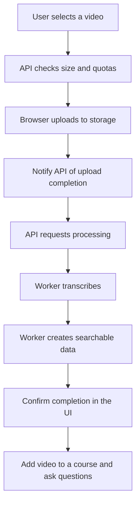
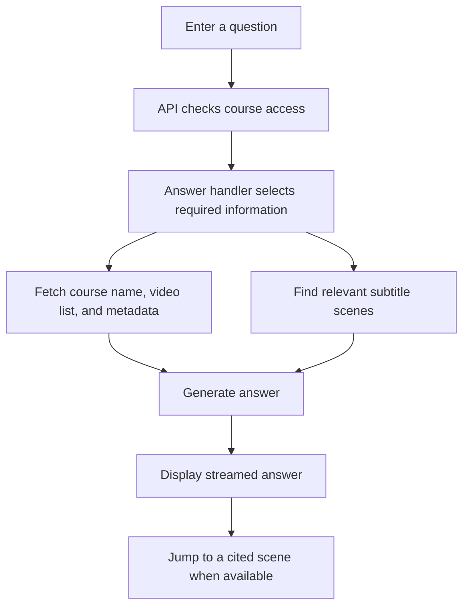

# User actions and system behavior

These diagrams connect UI actions to internal processing. Before reading the implementation, use them to see where users wait and what lets them continue.

## Make a video ready for questions

```mermaid
flowchart TD
    Select[User selects a video] --> Validate[API checks size and quotas]
    Validate --> Upload[Browser uploads to storage]
    Upload --> Confirm[Notify API of upload completion]
    Confirm --> Queue[API requests processing]
    Queue --> Transcribe[Worker transcribes]
    Transcribe --> Index[Worker creates searchable data]
    Index --> Ready[Confirm completion in the UI]
    Ready --> Course[Add video to a course and ask questions]
```

After upload, users still wait for transcription and search preparation. Distinguish upload failures from processing failures in the UI.

## Answer a question

```mermaid
flowchart TD
    Ask[Enter a question] --> Access[API checks course access]
    Access --> Agent[Answer handler selects required information]
    Agent --> Meta[Fetch course name, video list, and metadata]
    Agent --> Search[Find relevant subtitle scenes]
    Meta --> Answer[Generate answer]
    Search --> Answer
    Answer --> Display[Display streamed answer]
    Display --> Citation[Jump to a cited scene when available]
```

Some questions can be answered using metadata alone. Questions about lesson content refer to subtitles. See [prompt design](../architecture/prompt-engineering.md) for tools and limits.

## How study mode differs

In addition to answering open questions, study mode uses PLOG concepts, prerequisites, questions, and hints. Video processing completion and learning-graph readiness are separate states.

**Related:** [Video states](../design/state-diagram.md), [PLOG and study mode](../plog/README.md), [Flow by responsibility](../architecture/bpmn.md).
