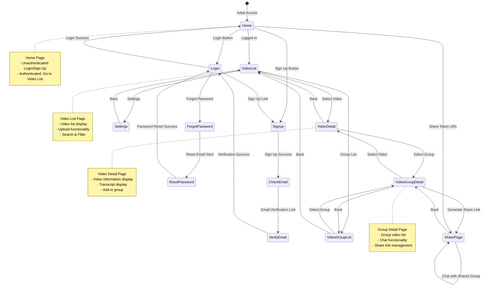

# Screen Transition Diagram

## Overview

This diagram represents the frontend screen transitions of the VideoQ application.

## Screen Transition Diagram

## Screen List

### Authentication Related
- **Home** (`/`): Home page
- **Login** (`/login`): Login page
- **Signup** (`/signup`): Sign up page
- **CheckEmail** (`/signup/check-email`): Email confirmation waiting page
- **VerifyEmail** (`/verify-email`): Email verification page
- **ForgotPassword** (`/forgot-password`): Password reset request page
- **ResetPassword** (`/reset-password`): Password reset page

### Video Management
- **VideoList** (`/videos`): Video list page
- **VideoDetail** (`/videos/[id]`): Video detail page

### Group Management
- **VideoGroupList** (`/videos/groups`): Group list page
- **VideoGroupDetail** (`/videos/groups/[id]`): Group detail page

### Sharing
- **SharePage** (`/share/[token]`): Share page (no authentication required)

### Settings
- **Settings** (`/settings`): Settings page

## Transition Conditions

### Transitions Based on Authentication Status
- **Unauthenticated User**: Home → Login/Signup → After authentication → VideoList
- **Authenticated User**: Home → VideoList (direct transition)

### Transitions via Share Links
- **Share Token URL**: Direct access to SharePage (no authentication required)

### Error Handling
- Authentication Error: Any page → Login
- 404 Error: Non-existent resource → Appropriate error page
- Permission Error: Inaccessible resource → Error message display
