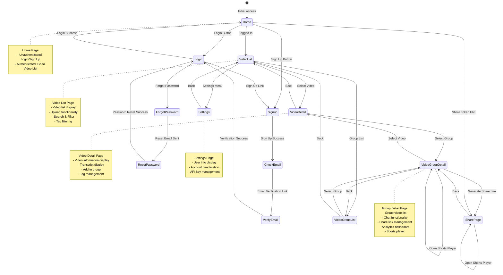

# 画面遷移図

## 概要

VideoQアプリケーションのフロントエンドの画面遷移を示す図です。

## 画面遷移図

```mermaid
stateDiagram-v2
    [*] --> Home: Initial Access
    
    Home --> Login: Login Button
    Home --> Signup: Sign Up Button
    
    Login --> Home: Login Success
    Login --> ForgotPassword: Forgot Password
    Login --> Signup: Sign Up Link
    
    Signup --> CheckEmail: Sign Up Success
    CheckEmail --> VerifyEmail: Email Verification Link
    VerifyEmail --> Login: Verification Success
    
    ForgotPassword --> ResetPassword: Reset Email Sent
    ResetPassword --> Login: Password Reset Success
    
    Home --> VideoList: Logged In
    VideoList --> VideoDetail: Select Video
    VideoList --> VideoGroupList: Group List
    
    VideoDetail --> VideoList: Back
    VideoDetail --> VideoGroupDetail: Select Group
    
    VideoGroupList --> VideoGroupDetail: Select Group
    VideoGroupList --> VideoList: Back
    
    VideoGroupDetail --> VideoGroupList: Back
    VideoGroupDetail --> VideoDetail: Select Video
    VideoGroupDetail --> SharePage: Generate Share Link

    VideoGroupDetail --> VideoGroupDetail: Open Analytics Dashboard
    VideoGroupDetail --> VideoGroupDetail: Open Shorts Player
    
    SharePage --> VideoGroupDetail: Back

    Home --> SharePage: Share Token URL
    SharePage --> SharePage: Chat with Shared Group
    SharePage --> SharePage: Open Shorts Player

    VideoList --> Settings: Settings Menu
    Settings --> VideoList: Back
    
    note right of Home
        Home Page
        - Unauthenticated: Login/Sign Up
        - Authenticated: Go to Video List
    end note
    
    note right of VideoList
        Video List Page
        - Video list display
        - Upload functionality
        - Search & Filter
        - Tag filtering
    end note
    
    note right of VideoDetail
        Video Detail Page
        - Video information display
        - Transcript display
        - Add to group
        - Tag management
    end note
    
    note right of VideoGroupDetail
        Group Detail Page
        - Group video list
        - Chat functionality
        - Share link management
        - Analytics dashboard
        - Shorts player
    end note

    note right of Settings
        Settings Page
        - User info display
        - Account deactivation
        - API key management
    end note
```

## 画面一覧

### 認証関連
- **Home** (`/` または `/:locale`): ホームページ（例: `/`、`/en`、`/ja`）
- **Login** (`/login` または `/:locale/login`): ログインページ
- **Signup** (`/signup` または `/:locale/signup`): サインアップページ（`ENABLE_SIGNUP=true` の場合のみ）
- **CheckEmail** (`/signup/check-email` または `/:locale/signup/check-email`): メール確認待ちページ
- **VerifyEmail** (`/verify-email` または `/:locale/verify-email`): メール確認ページ
- **ForgotPassword** (`/forgot-password` または `/:locale/forgot-password`): パスワードリセットリクエストページ
- **ResetPassword** (`/reset-password` または `/:locale/reset-password`): パスワードリセットページ

### 動画管理
- **VideoList** (`/videos` または `/:locale/videos`): 動画一覧ページ
- **VideoDetail** (`/videos/:id` または `/:locale/videos/:id`): 動画詳細ページ

### グループ管理
- **VideoGroupList** (`/videos/groups` または `/:locale/videos/groups`): グループ一覧ページ
- **VideoGroupDetail** (`/videos/groups/:id` または `/:locale/videos/groups/:id`): グループ詳細ページ

### 共有
- **SharePage** (`/share/:token` または `/:locale/share/:token`): 共有ページ（認証不要）

### 設定
- **Settings** (`/settings` または `/:locale/settings`): 設定ページ（アカウント情報、無効化、APIキー管理）

**注記**: このプロジェクトはReact Router + react-i18next（Next.js / next-intl ではない）でロケール対応ルーティングを実装しています（`frontend/src/App.tsx`）。
- デフォルトロケール（`en`）はプレフィックスなし: `/videos`
- その他のロケールは `/:locale` プレフィックスを使用: `/ja/videos`
- `/:locale` が欠落しており、ユーザーの優先ロケールがデフォルトでない場合、アプリは自動的に `/:locale/...` にリダイレクトします

## 遷移条件

### 認証状態による遷移
- **未認証ユーザー**: Home → Login/Signup → 認証後 → VideoList
- **認証済みユーザー**: Home → VideoList（直接遷移）

### 機能フラグ
- `ENABLE_SIGNUP=false` の場合、`/api/auth/signup/` が無効化され、サインアップフローは利用不可になります。

### 共有リンクによる遷移
- **共有トークンURL**: SharePageへの直接アクセス（認証不要）

### APIキーによる遷移
- **APIクライアント**: 画面遷移なし — APIキーはサーバー間連携用であり、ブラウザベースのアクセスではありません

### エラーハンドリング
- 認証エラー: 任意のページ → Login
- 404エラー: 存在しないリソース → 適切なエラーページ
- 権限エラー: アクセス不可なリソース → エラーメッセージ表示

## ページ内インタラクション（ルート変更なし）

以下のインタラクションは、新しいルートに移動せず、ページ内（モーダル、パネル、ドロワー）で発生します:

### VideoGroupDetail
- **分析ダッシュボード**: グループ詳細ページ内のモーダル/パネルとして開く
- **ショートプレイヤー**: グループ詳細ページからフルスクリーンオーバーレイで開く
- **チャットパネル**: グループの動画とチャットするためのインラインパネル

### VideoDetail
- **タグ管理**: タグセレクターと作成ダイアログはインラインモーダル
- **グループに追加**: 動画をグループに追加するモーダル

### VideoList
- **動画アップロード**: 新しい動画をアップロードするモーダル
- **タグフィルターパネル**: タグでフィルタリングするためのインラインパネル

### Settings
- **APIキー作成**: 設定ページ内の新規APIキー作成フォーム
- **APIキー失効**: 設定ページ内の確認ダイアログ
- **アカウント無効化**: 設定ページ内のフォームと確認ダイアログ

---

## Related Documentation

- [📖 ドキュメント一覧](../README.md)
- [ユースケース図](use-case-diagram.md) — ユーザー操作一覧
- [アクティビティ図](activity-diagram.md) — 主要な業務フロー
- [コンポーネント図](../design/component-diagram.md) — フロントエンドコンポーネント構成
- [状態遷移図](../design/state-diagram.md) — 状態遷移の詳細
