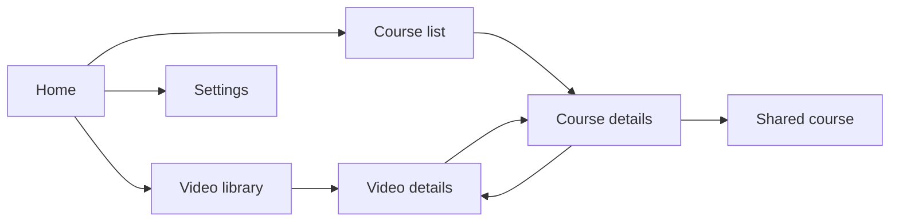

# Screens and navigation

Use this map when adding or editing screens. [App.tsx](https://github.com/yukiharada1228/videoq/blob/main/apps/web/src/App.tsx) is the source of truth for URL definitions.

## Common screens

| URL | Screen | Main use |
|---|---|---|
| `/` | Home | App entry point |
| `/videos` | Video library | Registration, search, and tag organization |
| `/videos/:id` | Video details | Playback and transcript editing |
| `/videos/courses` | Course list | Creating and selecting courses |
| `/videos/courses/:id` | Course details | Organizing videos, chat, sharing, and analytics |
| `/settings` | Settings | Profile, external API keys, and related settings |
| `/pricing` | Pricing | Reviewing and changing plans |
| `/admin` | Administration | Users, quotas, and reindexing |
| `/share/:token` | Shared course | Accessing a shared course |
| `/course-invitations/:token` | Invitation | Reviewing a course invitation |

`:id` and `:token` are placeholders for actual IDs and tokens.

## Main navigation paths

```mermaid
flowchart LR
    Home[Home] --> Videos[Video library]
    Home --> Courses[Course list]
    Videos --> Video[Video details]
    Courses --> Course[Course details]
    Video --> Course
    Course --> Video
    Course --> Share[Shared course]
    Home --> Settings[Settings]
```

This is an overview of common navigation. Each screen and the API check login status and access to the target data.

## Authentication screens

| URL | Purpose |
|---|---|
| `/login` / `/signup` | Login / account registration |
| `/signup/check-email` / `/verify-email` | Waiting for email verification / handling the verification link |
| `/forgot-password` / `/reset-password` | Password reset |
| `/change-email` | Email change confirmation |
| `/consent` | Authorizing external client access |

In the **VideoQ app**, Japanese generally has no prefix and English uses `/en/...`. Requests to `/ja/...` are replaced with the canonical Japanese URL. The documentation site uses a separate convention: English at `/` and Japanese at `/ja/`.

## Choosing a layout

- `AppRouteLayout`: Ordinary screens share a header; some detail layouts omit the footer.
- `AuthRouteLayout`: Authentication-related screens, such as login, registration, and invitations.
- Shared courses: A dedicated screen layout.

Implement only the page body without duplicating the shared header. Handle loading and error displays within the body as well.

**Related:** [Change the frontend](../guides/frontend.md), [Tests and verification commands](../guides/testing.md).
