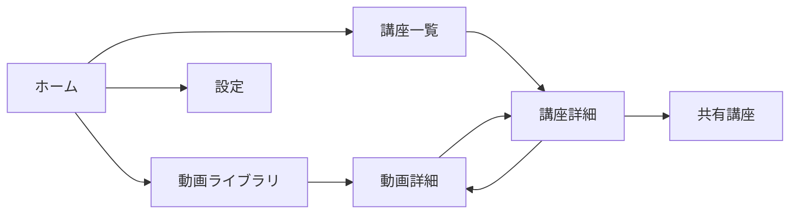

# 画面一覧と移動の流れ

画面を追加・修正するときの地図です。URLの定義は [App.tsx](https://github.com/yukiharada1228/videoq/blob/main/apps/web/src/App.tsx)を基準にします。

## よく使う画面

| URL | 画面 | 主な用途 |
|---|---|---|
| `/` | ホーム | アプリの入口 |
| `/videos` | 動画ライブラリ | 登録、検索、タグによる整理 |
| `/videos/:id` | 動画詳細 | 再生、文字起こし、PLOGの確認・編集 |
| `/videos/courses` | 講座一覧 | 講座の作成と選択 |
| `/videos/courses/:id` | 講座詳細 | 動画の整理、チャット、共有、分析 |
| `/settings` | 設定 | プロフィール、外部APIキーなど |
| `/pricing` | 料金 | プランの確認・変更 |
| `/admin` | 管理 | 利用者・利用上限・再索引 |
| `/share/:token` | 共有講座 | 共有された講座の利用 |
| `/course-invitations/:token` | 招待 | 講座への招待を確認 |

`:id` と `:token` は実際のID・トークンが入る場所です。

## 主な移動

```mermaid
flowchart LR
    Home[ホーム] --> Videos[動画ライブラリ]
    Home --> Courses[講座一覧]
    Videos --> Video[動画詳細]
    Courses --> Course[講座詳細]
    Video --> Course
    Course --> Video
    Course --> Share[共有講座]
    Home --> Settings[設定]
```

図はよく使う移動の概略です。ログインや対象データへの権限確認は、各画面とAPIで行います。

## 認証関連の画面

| URL | 用途 |
|---|---|
| `/login` / `/signup` | ログイン / アカウント登録 |
| `/signup/check-email` / `/verify-email` | メール確認待ち / 確認リンクの処理 |
| `/forgot-password` / `/reset-password` | パスワード再設定 |
| `/change-email` | メールアドレス変更の確認 |
| `/consent` | 外部クライアントへのアクセス許可 |

日本語は原則プレフィックスなし、英語は `/en/...` です。`/ja/...` でアクセスした場合は日本語の正規URLへ置き換えます。

## レイアウトの使い分け

- `AppRouteLayout`: 通常の画面。ヘッダーを共有し、詳細画面ではフッターを省く構成があります。
- `AuthRouteLayout`: ログイン・登録・招待などの認証関連画面。
- 共有講座: 専用の画面構成。

共通ヘッダーをページ内に重複して置かず、本文だけを実装します。読み込み・エラーの表示も本文側で扱います。

**関連:** [画面を変更する](../guides/frontend.md)、[テストの使い分け](../guides/testing.md)。
