# Use Case Diagram

## Overview

This diagram represents the main use cases of the Ask Video system.

## Use Case Diagram

```mermaid
graph TB
    User[User]
    Guest[Guest User]
    
    subgraph Authentication["Authentication"]
        UC1[Sign Up]
        UC2[Email Verification]
        UC3[Login]
        UC4[Logout]
        UC5[Password Reset]
        UC6[Token Refresh]
    end
    
    subgraph VideoManagement["Video Management"]
        UC7[Upload Video]
        UC8[List Videos]
        UC9[View Video Details]
        UC10[Edit Video]
        UC11[Delete Video]
        UC12[View Transcript]
    end
    
    subgraph Transcription["Transcription Processing"]
        UC13[Auto Transcription]
        UC14[Check Transcription Status]
    end
    
    subgraph GroupManagement["Group Management"]
        UC15[Create Group]
        UC16[List Groups]
        UC17[View Group Details]
        UC18[Edit Group]
        UC19[Delete Group]
        UC20[Add Video to Group]
        UC21[Remove Video from Group]
        UC22[Reorder Videos in Group]
    end
    
    subgraph Chat["Chat Features"]
        UC23[Send Chat]
        UC24[View Chat History]
        UC25[Export Chat History]
        UC26[Send Feedback]
    end
    
    subgraph Sharing["Sharing Features"]
        UC27[Generate Share Link]
        UC28[Delete Share Link]
        UC29[View Shared Group]
        UC30[Chat with Shared Group]
    end
    
    subgraph Settings["Settings"]
        UC31[View User Info]
        UC32[Set OpenAI API Key]
        UC33[Update User Info]
    end
    
    User --> UC1
    User --> UC2
    User --> UC3
    User --> UC4
    User --> UC5
    User --> UC6
    User --> UC7
    User --> UC8
    User --> UC9
    User --> UC10
    User --> UC11
    User --> UC12
    User --> UC13
    User --> UC14
    User --> UC15
    User --> UC16
    User --> UC17
    User --> UC18
    User --> UC19
    User --> UC20
    User --> UC21
    User --> UC22
    User --> UC23
    User --> UC24
    User --> UC25
    User --> UC26
    User --> UC27
    User --> UC28
    User --> UC29
    User --> UC30
    User --> UC31
    User --> UC32
    User --> UC33
    
    Guest --> UC29
    Guest --> UC30
    
    UC7 -.->|Auto Execute| UC13
    UC13 -.->|Completion Notification| UC14
    UC20 --> UC23
    UC27 --> UC29
    UC29 --> UC30
```

## Use Case Descriptions

### Authentication
- **UC1 Sign Up**: New user registration
- **UC2 Email Verification**: Email address confirmation
- **UC3 Login**: User authentication
- **UC4 Logout**: Session termination
- **UC5 Password Reset**: Password reset
- **UC6 Token Refresh**: JWT token refresh

### Video Management
- **UC7 Upload Video**: Upload video file
- **UC8 List Videos**: List uploaded videos
- **UC9 View Video Details**: Display video details
- **UC10 Edit Video**: Edit title and description
- **UC11 Delete Video**: Delete video
- **UC12 View Transcript**: View transcription results

### Transcription Processing
- **UC13 Auto Transcription**: Automatic transcription after upload (background)
- **UC14 Check Transcription Status**: Check processing status

### Group Management
- **UC15 Create Group**: Create video group
- **UC16 List Groups**: Display group list
- **UC17 View Group Details**: Display group details
- **UC18 Edit Group**: Edit group name and description
- **UC19 Delete Group**: Delete group
- **UC20 Add Video to Group**: Add video to group
- **UC21 Remove Video from Group**: Remove video from group
- **UC22 Reorder Videos in Group**: Change video order in group

### Chat Features
- **UC23 Send Chat**: Send question to AI chat
- **UC24 View Chat History**: Display past chat history
- **UC25 Export Chat History**: Export chat history as CSV
- **UC26 Send Feedback**: Provide feedback on chat response

### Sharing Features
- **UC27 Generate Share Link**: Generate share link for group
- **UC28 Delete Share Link**: Disable share link
- **UC29 View Shared Group**: View group via share link (no authentication required)
- **UC30 Chat with Shared Group**: Chat with shared group (no authentication required)

### Settings
- **UC31 View User Info**: Display current user information
- **UC32 Set OpenAI API Key**: Set OpenAI API key (encrypted storage)
- **UC33 Update User Info**: Update user information
