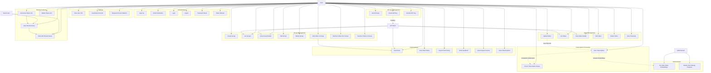

# ユースケース図

## 概要

VideoQシステムの主要なユースケースを示す図です。

## ユースケース図

```mermaid
graph TB
    User[User]
    Guest[Guest User]
    Admin[Administrator]
    ApiClient[API Client]

    subgraph Authentication["Authentication"]
        UC1[Sign Up]
        UC2[Email Verification]
        UC3[Login]
        UC4[Logout]
        UC5[Password Reset]
        UC6[Token Refresh]
    end

    subgraph VideoManagement["Video Management"]
        UC7[Upload Video]
        UC8[List Videos]
        UC9[View Video Details]
        UC10[Edit Video]
        UC11[Delete Video]
        UC12[View Transcript]
    end

    subgraph Transcription["Transcription Processing"]
        UC13[Auto Transcription]
        UC14[Check Transcription Status]
    end

    subgraph GroupManagement["Group Management"]
        UC15[Create Group]
        UC16[List Groups]
        UC17[View Group Details]
        UC18[Edit Group]
        UC19[Delete Group]
        UC20[Add Video to Group]
        UC21[Remove Video from Group]
        UC22[Reorder Videos in Group]
    end

    subgraph Chat["Chat Features"]
        UC23[Send Chat]
        UC24[View Chat History]
        UC25[Export Chat History]
        UC26[Send Feedback]
        UC32[View Popular Scenes]
        UC40[View Chat Analytics]
    end

    subgraph Sharing["Sharing Features"]
        UC27[Generate Share Link]
        UC28[Delete Share Link]
        UC29[View Shared Group]
        UC30[Chat with Shared Group]
    end

    subgraph Settings["Settings"]
        UC31[View User Info]
        UC33[Deactivate Account]
        UC34[Request Account Deletion]
    end

    subgraph ApiKeyManagement["API Key Management"]
        UC37[List API Keys]
        UC38[Create API Key]
        UC39[Revoke API Key]
    end

    subgraph Administration["Administration"]
        UC35[Re-index Video Embeddings]
        UC36[Monitor Re-indexing Progress]
    end
    
    User --> UC1
    User --> UC2
    User --> UC3
    User --> UC4
    User --> UC5
    User --> UC6
    User --> UC7
    User --> UC8
    User --> UC9
    User --> UC10
    User --> UC11
    User --> UC12
    User --> UC13
    User --> UC14
    User --> UC15
    User --> UC16
    User --> UC17
    User --> UC18
    User --> UC19
    User --> UC20
    User --> UC21
    User --> UC22
    User --> UC23
    User --> UC24
    User --> UC25
    User --> UC26
    User --> UC27
    User --> UC28
    User --> UC29
    User --> UC30
    User --> UC31
    User --> UC32
    User --> UC33
    User --> UC34
    User --> UC37
    User --> UC38
    User --> UC39
    User --> UC40
    
    Guest --> UC29
    Guest --> UC30

    ApiClient --> UC8
    ApiClient --> UC9
    ApiClient --> UC16
    ApiClient --> UC17
    ApiClient --> UC23

    Admin --> UC35
    Admin --> UC36

    UC7 -.->|Auto Execute| UC13
    UC13 -.->|Completion Notification| UC14
    UC13 -.->|Creates Embeddings| UC35
    UC20 --> UC23
    UC27 --> UC29
    UC29 --> UC30
    UC38 -.->|Enables| ApiClient
```

## ユースケース詳細

### 認証
- **UC1 サインアップ**: 新規ユーザー登録
- **UC2 メール確認**: メールアドレスの確認
- **UC3 ログイン**: ユーザー認証
- **UC4 ログアウト**: セッション終了
- **UC5 パスワードリセット**: パスワードの再設定
- **UC6 トークンリフレッシュ**: JWTトークンの更新

### 動画管理
- **UC7 動画アップロード**: 動画ファイルのアップロード
- **UC8 動画一覧**: アップロード済み動画の一覧表示
- **UC9 動画詳細表示**: 動画の詳細情報を表示
- **UC10 動画編集**: タイトルと説明の編集
- **UC11 動画削除**: 動画の削除
- **UC12 文字起こし表示**: 文字起こし結果の閲覧

### 文字起こし処理
- **UC13 自動文字起こし**: アップロード後の自動文字起こし（バックグラウンド）
- **UC14 文字起こしステータス確認**: 処理状況の確認

### グループ管理
- **UC15 グループ作成**: 動画グループの作成
- **UC16 グループ一覧**: グループリストの表示
- **UC17 グループ詳細表示**: グループの詳細情報表示
- **UC18 グループ編集**: グループ名と説明の編集
- **UC19 グループ削除**: グループの削除
- **UC20 動画をグループに追加**: グループへの動画追加
- **UC21 動画をグループから削除**: グループからの動画削除
- **UC22 グループ内動画の並べ替え**: グループ内の動画順序を変更

### チャット機能
- **UC23 チャット送信**: AIチャットに質問を送信
- **UC24 チャット履歴表示**: 過去のチャット履歴を表示
- **UC25 チャット履歴エクスポート**: チャット履歴をCSVでエクスポート
- **UC26 フィードバック送信**: チャット回答へのフィードバック
- **UC32 人気シーン表示**: チャットで参照された人気シーンを表示
- **UC40 チャット分析表示**: フィードバック分布、キーワードクラウド、質問時系列、シーン分布チャートを含む分析ダッシュボードを表示

### 共有機能
- **UC27 共有リンク生成**: グループの共有リンクを生成
- **UC28 共有リンク削除**: 共有リンクを無効化
- **UC29 共有グループ表示**: 共有リンクでグループを閲覧（認証不要）
- **UC30 共有グループとチャット**: 共有グループでチャット（認証不要）

### 設定
- **UC31 ユーザー情報表示**: 現在のユーザー情報を表示
- **UC33 アカウント無効化**: ユーザーアカウントを無効化（論理削除、`is_active=False` に設定し `deactivated_at` を記録）
- **UC34 アカウント削除リクエスト**: 理由を添えてアカウント削除を申請

### APIキー管理
- **UC37 APIキー一覧**: ユーザーのアクティブなAPIキーを一覧表示
- **UC38 APIキー作成**: 名前とアクセスレベル（`all` または `read_only`）を指定してAPIキーを作成
- **UC39 APIキー失効**: APIキーを失効（論理削除）

### 管理機能
- **UC35 動画エンベディング再インデックス**: 新しいモデルで全動画のエンベディングを再生成（スーパーユーザーのみ）
- **UC36 再インデックス進捗監視**: Celeryログで再インデックスタスクの進捗を監視

**注記:**
- LLMとエンベディングの設定は環境変数（`LLM_PROVIDER`、`LLM_MODEL`、`EMBEDDING_PROVIDER`、`EMBEDDING_MODEL`）でグローバルに管理されます。
- サインアップは `ENABLE_SIGNUP` で制御されます。無効時は `POST /api/auth/signup/` がルーティングされません。
- ローカル whisper.cpp サーバー（WHISPER_BACKEND=whisper.cpp）使用時は、文字起こしにOpenAI APIキーは不要です。
- 再インデックスはグローバルな `OPENAI_API_KEY` または `OLLAMA_BASE_URL` 環境変数（`EMBEDDING_PROVIDER` に依存）を使用し、エンベディングプロバイダー（OpenAI ↔ Ollama）やモデルの切り替え時に必要です。
- APIキーはサーバー間連携を可能にします。生のキーは作成時に1回のみ表示され、SHA-256ハッシュのみが保存されます。
- `read_only` APIキーはreadスコープと `chat_write` スコープ（`POST /api/chat/`）にアクセスできますが、その他の書き込み操作はできません。

---

## Related Documentation

- [📖 ドキュメント一覧](../README.md)
- [アクティビティ図](activity-diagram.md) — 主要な業務フロー
- [画面遷移図](screen-transition-diagram.md) — フロントエンドの画面遷移
- [システム構成図](../architecture/system-configuration-diagram.md) — 全体アーキテクチャ
- [ER図](../database/er-diagram.md) — エンティティ関連
