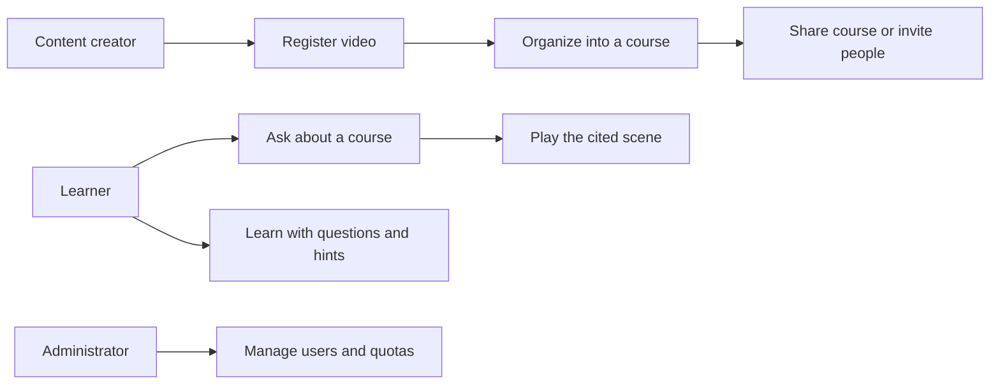

# Users and capabilities

This page organizes VideoQ features by what users want to accomplish. Use it to identify who a change serves before exploring screen or API details.

## Basic workflow

```mermaid
flowchart LR
    Owner[Content creator] --> Upload[Register video]
    Upload --> Course[Organize into a course]
    Course --> Share[Share course or invite people]
    Learner[Learner] --> Ask[Ask about a course]
    Ask --> Source[Play the cited scene]
    Learner --> Study[Learn with questions and hints]
    Admin[Administrator] --> Manage[Manage users and quotas]
```

The same person can register materials and learn from them. These roles do not require separate accounts.

## Main operations

| Goal | Operation | Expected result |
|---|---|---|
| Prepare learning materials | Upload a file or import from YouTube | Transcript and search data are ready |
| Organize materials | Add or reorder course videos and assign tags | Videos are easy to find and the question scope is clear |
| Explore content | Ask questions in course chat | Review an answer and its supporting scenes |
| Learn in sequence | Start PLOG-based study mode | Answer questions and progress with hints |
| Work with others | Use share links and course invitations | Others can access permitted courses |
| Review answer quality | Inspect history, feedback, analytics, and evaluations | Identify answers or materials to improve |
| Manage usage | Manage users, quotas, and reindexing | Operate limits and processing state |
| Connect external tools | Connect to MCP with an API key or OAuth | Run permitted operations from a client |

## Relationship to access control

Registered and edited data has an owner. Viewing through a share link or invitation differs from editing as the owner. Administrative operations are separate from ordinary use.

When changing a feature, check both the intended user and their access to the data. See [authentication and access control](../concepts/auth.md).

**Related:** [First walkthrough](../getting-started/first-walkthrough.md), [Screens and navigation](screen-transition-diagram.md).
